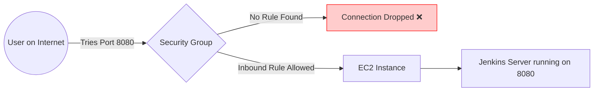

# Day 03: AWS EC2 Deep Dive

Welcome to Day 3! Today, we are learning about the most famous and widely used service in all of AWS: **Amazon EC2 (Elastic Compute Cloud)**. 

---

## 1. What is EC2 and Why do we need it?
**EC2** stands for **Elastic Compute Cloud**. Let's break that down:
- **Compute:** The actual brain of a computer (CPU, RAM, Disk space). It is a Virtual Server.
- **Elastic:** You can dynamically increase or decrease these resources whenever you want.
- **Cloud:** Hosted over the internet by AWS.

In simple terms: EC2 is where you ask a public cloud provider to give you a Virtual Machine (Virtual Server) that is elastic in nature.

### Why should I use EC2 instead of physical servers?
Imagine you buy physical servers from HP or IBM. You have to manually install the OS, run scripts to create virtual machines, perform timely upgrades, constantly monitor for security issues, and manage the physical hardware. If you have 1,000 servers, you are wasting an unbelievable amount of time.

With the Public Cloud, you eliminate the hardware management headache. AWS manages the physical servers. You just select what you want, and you use a **Pay-as-you-go** model, saving you massive amounts of time, effort, and money.

---

## 2. Types of EC2 Instances
Just like buying a laptop, different workloads require different types of hardware. If you buy servers from IBM, they will ask you if you need a memory-heavy machine or a CPU-heavy machine. AWS does the same:

1. **General Purpose:** A balance of CPU and Memory. *(We use this for basic learning because we are not developing games or training ML models today).*
2. **Compute Optimized:** High performance processors. *(Used for high-traffic web servers or machine learning).*
3. **Memory Optimized:** For applications that need to process massive amounts of data in memory (like big databases).
4. **Storage Optimized:** For massive data warehousing.
5. **Accelerated Computing:** Hardware accelerators/GPUs. *(Used for things like Bitcoin mining or heavy 3D rendering).*

AWS will charge you based entirely on the specific Instance Type and size you select.

---

## 3. Regions & Availability Zones (Real World Scenarios)
As a DevOps engineer, you must decide *where* to put your EC2 instance. (You can see the list of global regions in the top navbar of your AWS Console). 

- **Regions:** If you have a client in Europe, you should create the EC2 machine in a European Region. Why? 
  1. **Latency:** The website will load much faster for them.
  2. **Security/Data Laws:** Some European data safety laws dictate that customer data cannot leave Europe.
- **Availability Zones (AZs):** Imagine you deploy your application in Northern Virginia and it works perfectly. One fine day, a short circuit happens in that specific data center. Your application goes completely down! To prevent this downtime (and make your app highly available), AWS splits Regions into multiple isolated **Availability Zones**. You should always deploy across multiple AZs.

---

## 4. Hands-On Lab: Launching and Connecting to EC2

Let's do this practically. We will launch a server, log into it, install Jenkins, and open the firewall so the world can see it.

### Part 1: Launching the Instance
1. Go to the AWS Console, search for **EC2** (Virtual servers in the cloud), and click it.
2. Click **Instances** on the left menu, then click the orange **Launch instances** button.
3. **Name:** `My First Instance`
4. **OS (AMI):** Select **Ubuntu**. (This is the technical heart of your server). Make sure it says *Free tier eligible*.
5. **Instance Type:** Select `t2.micro` (Free tier).
6. **Key Pair (Login):** This is the combination of public and private keys that allows you to securely log in to the server.
   - Click **Create new key pair**.
   - **Name:** `awslogin`
   - **Type:** RSA
   - **Format:** `.pem`
   - Click **Create key pair**. *(A file named `awslogin.pem` will download to your computer. Keep it safe!)*
7. **Network Settings:** Leave this as default for now.
8. Click **Launch instance**. Wait a few moments until the Instance State says **Running**.

---

### Part 2: Connecting to the Server

Click on your Instance ID to open its details. Copy the **Public IPv4 address**.

#### Option A: Logging in from Mac / Linux
1. Open your terminal and navigate to where your `.pem` file downloaded.
2. Check your files and fix the permissions of your key file so it is secure:
   ```bash
   ls -ltr
   chmod 600 awslogin.pem
   ```
3. Connect via SSH:
   ```bash
   ssh -i awslogin.pem ubuntu@<your-public-ip>
   ```
4. Type `yes` when prompted. You are now inside the server!

#### Option B: Logging in from Windows (Using MobaXterm or PuTTY)
1. Download and install the free **MobaXterm Home Edition**.
2. Open it, click **Session** -> **SSH**.
3. **Remote host:** Paste your AWS Public IP address.
4. **Specify username:** Check the box and type `ubuntu`.
5. Click **Advanced SSH settings** -> Check **Use private key** -> Browse and select your `awslogin.pem` file.
6. Click **OK** and Accept the prompt. You are now inside the server!

---

### Part 3: Deploying an Application & Security Groups

Let's install Jenkins (a popular DevOps tool) to prove our server works.

1. Switch to the root user:
   ```bash
   sudo su .
   ```
2. Update the server packages (always do this first!):
   ```bash
   apt update
   ```
3. Jenkins requires Java to run. Let's install it:
   ```bash
   apt install openjdk-11-jdk -y
   java --version
   ```
4. Follow the official [Jenkins documentation](https://pkg.jenkins.io/debian-stable/) to run the commands to download and install Jenkins.
5. Verify it is running:
   ```bash
   systemctl status jenkins
   ```

**The "Aha!" Moment (Security Groups):**
By default, Jenkins runs on port `8080`. 
Open your web browser and try to visit: `http://<your-public-ip>:8080`. 
**It will fail to load!** Why? Because your application is by default not accessible to the external world. There are lots of networking and security settings blocking it. AWS uses Security Groups to manage this:
- **Inbound Rules:** Requests coming *inside* the AWS EC2 instance.
- **Outbound Rules:** Requests going *outside* to the internet.



You must explicitly edit the Inbound Rules to allow traffic.

**How to fix it:**
1. Go back to your AWS EC2 Console.
2. Click on your instance, go to the **Security** tab, and click the Security Group link.
3. Click **Edit inbound rules** -> **Add rule**.
4. **Type:** Custom TCP
5. **Port range:** `8080`
6. **Source:** Anywhere-IPv4 (`0.0.0.0/0`)
7. Click **Save rules**.

Now, go back to your web browser and refresh the page. You will successfully see the Jenkins UI! You have successfully launched, configured, and exposed your very first cloud application.
