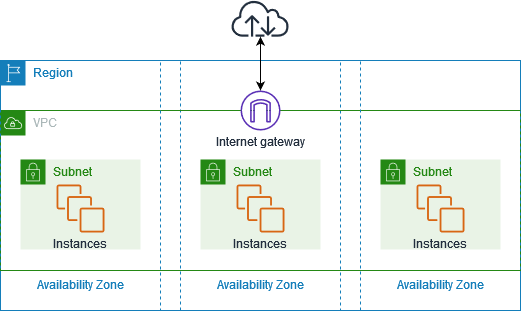
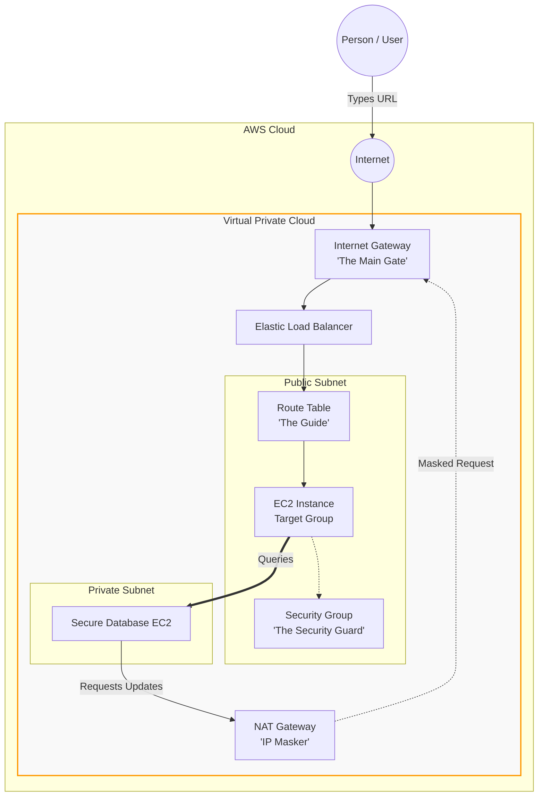
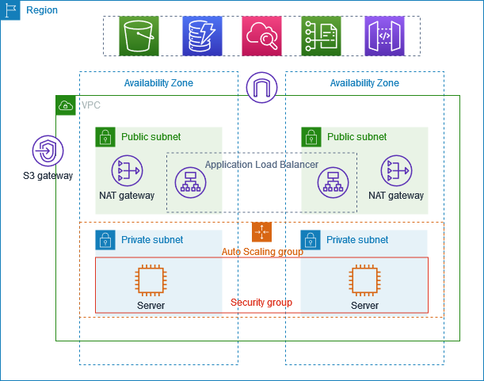

# Day 04: AWS VPC (Virtual Private Cloud) Deep Dive

Welcome to Day 4! Today we are tackling the most foundational networking concept in AWS: **VPC (Virtual Private Cloud)**. 

**What is a VPC?**
Imagine you want to set up a private, secure, and isolated area in the cloud where you can run your applications and store your data. This is where a VPC comes into play. A VPC is a virtual network that closely resembles a traditional network that you'd operate in your own data center. 

Think of it as having your own little "internet" within the bigger internet. This virtual network is completely isolated from other users' networks, so your data and applications are secure and protected. By default, when you create an AWS account, AWS will create a **default VPC** for you just to get started. However, as a DevOps engineer, you should create custom VPCs for your applications or projects.

To understand VPC deeply, we must first understand *why* AWS created it. We will start with a real-world story, map it to AWS, and then break down the technical architecture step-by-step.

---

## 1. The Real-Life Analogy: The Village and the Secured Property

**The Problem:**
Imagine a huge village where the people are too lazy (or lack the resources) to construct their own houses. A businessman named ABC sees this opportunity, buys a massive plot of land, and tells the villagers: *"Send me a request with your entire requirement and resource capacity. Fill me all the details and give it to me. I will construct your houses, maintain them, and you just pay me rent."* 
This works great! House 1, House 2, and House 3 are built next to each other on this massive open land. 

**The Security Flaw:**
However, security experts quickly realize a massive problem. Because the land is completely open, if a thief breaks into House 1, they can easily walk over and break into House 2 and House 3. If one house is compromised, *all* houses are compromised.

**The Solution:**
To fix this, the businessman introduces **"Secured Properties"**. 
Instead of open land, he builds a massive wall around the houses. He adds:
1. **The Gate:** A single entry point.
2. **The Guide:** Someone inside the gate who tells visitors which path goes to which house.
3. **The Security Guard:** A guard standing at the actual house door, checking if the visitor is explicitly allowed to enter.

If person XYZ wants to visit House A, they must pass the Gate, ask the Guide for directions, and be approved by the Security Guard. The gate ensures that only people who know the residents, or authorized relatives, can access the property. 

*(If other people want a secure property too, the businessman can just build another secure property for them, making more money!)*

---

## 2. How this relates to AWS

**Before 2013 (The Open Land):**
When AWS first started, companies (like TCS or startup.com) were maintaining their own data centers, which was a huge headache for them. If they wanted to build a new startup, they needed to build another data center. 

AWS saw this opportunity and started building their data centers throughout the world (like in Mumbai, Virginia, Europe, etc.). They told startups: *"Hey, we can host your applications. Just request 10 or 20 virtual machines, we will create them, and you pay us."* 
Inside these data centers, there are multiple physical servers. AWS created all these requested virtual servers inside their massive data centers on a single, flat, open network (known as *EC2 Classic*). The problem? If a hacker successfully breached one startup's server, they could potentially access other servers on that same massive physical network. It was a massive security headache.

**After 2013 (The Secured Property = VPC):**
AWS introduced **Virtual Private Cloud (VPC)**. 
A VPC is a logically isolated, highly secure private network in the AWS cloud dedicated entirely to *your* account. You get your own private "Secured Property". 

---

## 3. Designing a VPC: Size and Subnets

When a DevOps engineer creates a VPC (by reading documentation and requesting it from AWS), they must define its size using an **IP Address Range** (CIDR Block).

### How does the IP Math Work?
An IP address is made of 4 sections (octets), separated by dots. Each section can have a value from `0` to `255` (which is 256 possible numbers). 

If you create a VPC with the IP range `172.16.0.0/16`:
- The `/16` means the first two sections (`172.16.x.x`) are completely **locked** and cannot change.
- The last two sections (`0.0`) are unlocked and available for you to use. 
- Since the 3rd section has 256 possible numbers, and the 4th section has 256 possible numbers, the math is simple: 
  **$256 \times 256 = 65,536$ private IP addresses.**

If you chose `/24` instead (e.g., `172.16.0.0/24`), three sections are locked (`172.16.0.x`), leaving only the last section unlocked. That would give you exactly $256$ IP addresses.

### What is a Subnet?
If a massive company like TCS creates a VPC, they don't put all their applications in one giant room. They have multiple different projects. 
A **Subnet** is how we split the VPC's giant IP address pool into smaller, manageable chunks for different projects.
- **Project A:** gets Subnet 1 
- **Project B:** gets Subnet 2

Inside the VPC, we typically create **Public Subnets** and **Private Subnets**. The user will first access the public subnet inside the VPC. Each project may have multiple instances running safely isolated inside their respective subnets.

---

## 4. The Core Components of a VPC

Let's map our real-world analogy to the actual AWS components that make up a VPC:

1. **Virtual Private Cloud (VPC):** A virtual network that closely resembles a traditional network that you'd operate in your own data center. After you create a VPC, you can add subnets.
2. **Subnets:** A range of IP addresses in your VPC. A subnet must reside in a single Availability Zone. After you add subnets, you can deploy AWS resources.
3. **IP Addressing:** You can assign IP addresses, both IPv4 and IPv6, to your VPCs and subnets. 
4. **Internet Gateway (The Gate):** This is the doorway to the internet (the gate acts as a pass). If you do not attach an Internet Gateway to your VPC, nobody from the outside world can ever enter it.
5. **Route Tables (Routing / The Guide):** Use route tables to determine where network traffic from your subnet or gateway is directed. *(How should your application go? The path tells it to go to this path using the route table).*
6. **Security Groups (The Security Guard):** Acts as a virtual firewall for instances. The security group says which port you need to access, or from which IP you are coming. The security group will say: *"Only if you are coming from this IP address, IP range, or port from the internet, then only you can access the application."*
7. **NACL (Network Access Control List):** A stateless firewall that controls inbound and outbound traffic at the subnet level. It provides an additional layer of network security for your entire Subnet, rather than a single instance.
8. **Elastic Load Balancer (ELB):** When traffic enters through the Route Table, it usually hits a Load Balancer first. The ELB acts like a traffic cop, distributing incoming user requests evenly across multiple EC2 instances.
9. **NAT Gateway (The IP Masker):** Imagine you have a highly secure Database in a Private Subnet (no internet access), but it needs to temporarily connect to the internet to download a software update from Google. It is a terrible security practice to expose your private database IP to the internet. A **NAT Gateway** allows your private server to download updates while completely masking its IP address.
10. **Gateways and Endpoints:** Connects your VPC to another network (e.g., use a VPC endpoint to connect to AWS services privately without the internet).
11. **Peering Connections:** Route traffic directly between the resources in two different VPCs.
12. **Traffic Mirroring:** Copy network traffic and send it to security and monitoring appliances for deep packet inspection.
13. **Transit Gateways:** A central hub to route traffic between your VPCs, VPN connections, and AWS Direct Connect connections.
14. **VPN Connections:** Connect your VPCs securely to your on-premises corporate networks using AWS Virtual Private Network.
15. **VPC Flow Logs:** The security cameras. A flow log captures information about the IP traffic going to and from network interfaces in your VPC so you can monitor for suspicious activity.

---

## 5. The Traffic Flow Architecture

If a customer wants to access an application running inside your VPC, the request goes through a very strict path. 

Here is the exact flow of how a user reaches your application:

### The Flow Step-by-Step:
1. **User** accesses the application via the **Internet** (and resolves to the IP `172.163.1...`).
2. The request goes through the **Internet Gateway** to enter the VPC.
3. After the Internet Gateway, the request hits the **Elastic Load Balancer**.
4. To know which proper route the request needs, it goes through the **Route Table**.
5. The Route Table directs the traffic to the correct **Target Group**.
6. Finally, the **Security Group** inspects the traffic. If you are coming from an allowed IP/Port, it lets you access the application!

### The Exact Traffic Flow Sequence
Just to recap, here is the exact sequence of how a person reaches the application:

`Person access some application ----> Internet ----> 172.163.1/... (IP) ---> Internet Gateway -----> Elastic Load Balancer ------> Proper route we need -----> Route Table ----> Target Group ----> Security Groups`

---

## 🎯 Day 04 Summary
- **VPC** is your own isolated, secure slice of the AWS Cloud.
- **CIDR Blocks** define how many IP addresses your VPC has (e.g., `/16` = 65,536 IPs).
- **Subnets** divide your VPC into smaller networks for different projects.
- **Internet Gateways** let traffic in, **Route Tables** direct the traffic, and **Security Groups** filter the traffic.
- **NAT Gateways** allow private servers to safely download updates without exposing their identity to hackers.

---

## 📚 Resources
- **AWS Official Guide:** [VPC with servers in private subnets and NAT](https://docs.aws.amazon.com/vpc/latest/userguide/vpc-example-private-subnets-nat.html)
