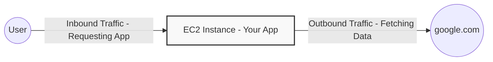
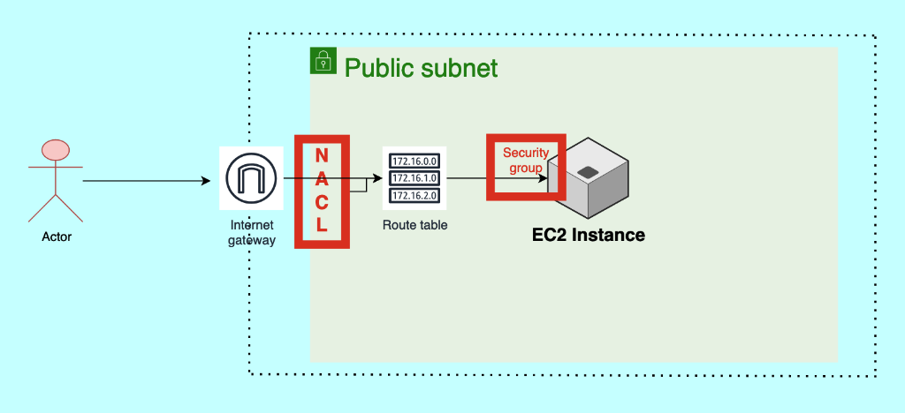

# Day 05: AWS Security Group and NACL Deep Dive (Part 2 of VPC)

Welcome to Day 5! In Day 4, we learned that a **VPC (Virtual Private Cloud)** introduces the concept of a private, isolated network in the public cloud, adding a massive layer of security to your infrastructure.

VPC is arguably the most important concept in AWS and for any DevOps Engineer. Today, we are going to do a deep dive into the two core security mechanisms inside a VPC: **Security Groups (SG)** and **Network Access Control Lists (NACL)**.

---

## 1. What is a Security Group (SG)?

A **Security Group (SG)** acts as a virtual firewall that serves at the **Instance Level** (like an EC2 instance). 

By default, AWS is highly secure and does **not** accept any incoming traffic. As a DevOps Engineer, it is your responsibility to explicitly open doors (ports) to allow specific traffic into your EC2 instance. This is done using Security Groups.

### Inbound vs Outbound Traffic

Inside a Security Group, there are two types of rules you must configure:
1. **Inbound Traffic (Incoming):** A user making a request *to* your application.
2. **Outbound Traffic (Outgoing):** Your application making a request *out* to the internet (e.g., to fetch updates from `google.com` or download a package).



### Key Security Group Rules:
- For **Inbound Traffic**, you must edit the rules and explicitly add the Port Number (e.g., 8000) or IP Address you want to allow. If you don't allow it, it is blocked!
- For **Outbound Traffic**, AWS by default **allows ALL traffic** going out. If you want to restrict your server from accessing certain external websites, you must configure outbound rules.
- **Port 25 (SMTP):** AWS intentionally throttles or blocks Port 25 (email) by default because there is a high risk of spamming activities. If you need it, you must explicitly request AWS support to open it.
- **ALLOW ONLY:** In a Security Group, you can **only** write rules that *Allow* traffic. There is no option to explicitly *Deny* an IP address.

---

## 2. What is a Network Access Control List (NACL)?

While a Security Group applies at the individual EC2 level, a **NACL applies at the Subnet Level**.

By using a NACL, a DevOps engineer can define organizational-level network traffic rules. If a rule is defined at the subnet level via a NACL, it automatically applies to *all* the instances living inside that subnet. It acts as another, higher level of security defense.

### The Primary Differences: Allow/Deny and Default Behaviors
1. **Allow vs Deny:** Unlike Security Groups, in a NACL you can write both **ALLOW** rules and **DENY** rules. If an attacker from a specific IP address is trying to hack your servers, you can add a DENY rule in the NACL to block them before they even reach your Security Group!
2. **Default Behaviors:** A newly created Security Group **denies all** inbound traffic by default. However, the default NACL created with your VPC **allows all** inbound and outbound traffic by default until you write rules to restrict it.

---

## 3. Core Differences: SG vs NACL (Crucial Interview Concepts)

When you go to a DevOps interview, you will almost certainly be asked to explain the deep technical differences between these two services. Memorize these three concepts:

### A. Stateful vs Stateless
- **Security Groups are Stateful:** If an inbound rule allows traffic (e.g., a user sending a request to port 80), the corresponding outbound traffic (the server sending the response back to the user) is **automatically allowed**, regardless of your outbound rules. It remembers the "state" of the connection.
- **NACLs are Stateless:** If an inbound rule allows traffic, the corresponding outbound traffic is **NOT** automatically allowed. You must explicitly create a separate outbound rule to allow the return traffic. 

### B. Rule Evaluation Order
- **Security Groups evaluate ALL rules:** Before allowing traffic, it looks at all your rules as a whole. The order does not matter.
- **NACLs evaluate rules in Numerical Order:** Rules are numbered (e.g., 100, 110, 200). They are evaluated strictly in ascending order from lowest to highest. If rule 100 Denies the traffic, and rule 200 Allows the traffic, it will immediately drop the traffic at rule 100 and ignore rule 200.

### C. Application Timing
- **Security Group** changes take effect **immediately**.
- **NACL** changes may take a short amount of time to propagate to all the subnets and resources.

---

## 4. Hands-On Lab: SG vs NACL in Action

Let's do this practically! We will build an architecture, deploy a Python app, open the Security Group, and then block it using a NACL.

**Our Architecture Flow:**
`Author -> Virtual Private Cloud -> Internet Gateway -> Public Subnet -> Route Table -> NACL -> Security Group -> EC2 Instance`



### Step 1: Create a Custom VPC (The Easy Way)
1. Go to the AWS Console, search for **VPC**, and click **Create VPC**.
2. **VPC settings:** Select **VPC and more**. *(This is a massive time saver! AWS will automatically create the public/private subnets in different Availability Zones (1a and 1b), Route Tables, and the Internet Gateway for you).*
3. **Name tag auto-generation:** `demo`
4. **IPv4 CIDR block:** `10.0.0.0/16` *(AWS will automatically calculate and show you the number of IPs you get).*
5. **Number of Availability Zones:** Leave as default (e.g., 2).
6. Click **Create VPC**. 

AWS will run a workflow and output a log showing it created the VPC, subnets, internet gateway, and route tables. You can click the **Resource Map** to visually see the flow it just built!

---

### Step 2: Create the EC2 Instance
1. Go to the **EC2** dashboard and click **Launch Instance**.
2. **Name:** `demo`
3. **OS:** Ubuntu
4. **Instance Type:** `t2.micro`
5. **Key pair:** Select your existing key-pair.
6. **Network settings (CRITICAL STEP):** Click **Edit**.
   - **VPC:** Do NOT use the default VPC! Select your custom `demo-vpc`.
   - **Subnet:** Select the **Public Subnet** (e.g., `demo-subnet-public-us-east-1a`).
   - **Auto-assign public IP:** **Enable** *(Without this, you won't get a public IP to connect to!)*
   - **Firewall (Security groups):** Select **Create security group**.
7. Click **Launch instance**.

---

### Step 3: Run a Python Application
1. SSH into your new EC2 instance using MobaXterm or your terminal.
2. Update the packages:
   ```bash
   sudo apt update
   ```
3. Verify Python 3 is installed:
   ```bash
   python3 --version
   ```
4. Start a simple Python web server on Port 8000:
   ```bash
   python3 -m http.server 8000
   ```

---

### Step 4: The Security Group Block (Inbound Rules)
1. Go to your browser and try to access the app: `http://<your-public-ip>:8000/`
2. **Result:** The page will NOT load! Why?
3. **Check the NACL first:** Open another AWS tab, go to **VPC $\rightarrow$ Network ACLs**, and click your `demo` VPC's NACL. Look at the inbound rules. You will see it allows ALL traffic by default! So the NACL is not the problem.
4. **The real blocker:** The EC2 instance is attached to a Security Group that only allows Port 22 (SSH) by default. The Security Group is blocking Port 8000.
5. **The Fix:**
   - Go to the EC2 console $\rightarrow$ **Security Groups**.
   - Select your SG and click **Edit inbound rules**.
   - Click **Add rule** $\rightarrow$ Type: `Custom TCP` $\rightarrow$ Port range: `8000` $\rightarrow$ Source: `Anywhere-IPv4 (0.0.0.0/0)`.
   - Click **Save rules**.
4. Refresh your browser. You will now see the simple Python HTTP server directory!

---

### Step 5: The NACL Block (The First Layer of Defense)
Imagine a company policy dictates that Port 8000 should *never* be exposed. As a DevOps Engineer, you can control this organization-wide from the NACL.

1. Keep your Python app running.
2. Open a new AWS Console tab, search for **VPC**, and click **Network ACLs** on the left menu.
3. Find the NACL that is connected to your `demo` VPC and select it.
4. Go to **Inbound rules** and click **Edit inbound rules**.
5. Click **Add new rule**:
   - **Rule number:** `100` *(Rules are evaluated in numerical order, lowest first).*
   - **Type:** `Custom TCP`
   - **Port range:** `8000`
   - **Allow/Deny:** Select **DENY**!
6. Click **Save changes**.

**The Final Test:**
Go back to your browser and refresh `http://<your-public-ip>:8000/`. 
**The request will fail!** 

Even though you explicitly allowed Port 8000 inside the Security Group, the request never reached the EC2 instance because the DevOps Engineer blocked it at the **NACL level**. The NACL acts as the very first layer of defense!

---

## 🎯 Day 05 Summary
- **Security Groups** operate at the **Instance** level. They only support **ALLOW** rules.
- **NACLs** operate at the **Subnet** level. They support both **ALLOW** and **DENY** rules.
- If a NACL denies traffic, it does not matter what the Security Group says—the traffic is dropped before it ever reaches the instance.
