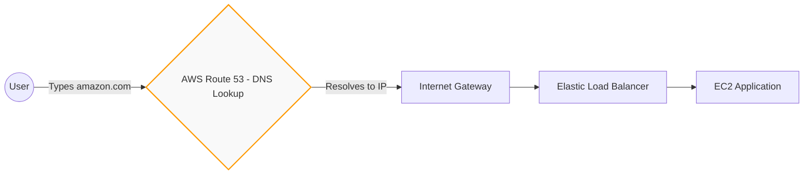

# Day 06: AWS Route 53 (DNS Deep Dive)

Welcome to Day 6! Today we are learning about **Route 53**, the service that connects the entire internet to your applications. Route 53 provides highly available and scalable **DNS (Domain Name System)** as a service.

---

## 1. What exactly is DNS?

We use DNS directly or indirectly every single day. Think about websites like `amazon.com` or `flipkart.com`. These are **Domain Names**. 

Computers and servers do not understand domain names; they only understand **IP Addresses** (e.g., `51.20.77.253`). 

**The Phonebook Analogy:**
Imagine trying to remember the 10-digit phone number of every person you know. It's impossible! Instead, you save their name in your phonebook. When you tap "Mom", your phone looks up the name and dials the actual number. 

**DNS is the phonebook of the internet.** It keeps massive records that map human-readable domain names (`amazon.com`) to machine-readable IP addresses.

### Why do we need it in AWS?
When you launch an application behind a Load Balancer, AWS gives you a dynamic IP address. This IP address might change, and even if it didn't, it is very difficult for a user to remember. 
When a user accesses `irctc.com`, DNS is the service working behind the scenes to convert that domain name into your specific Load Balancer's IP address.

---

## 2. The Architecture Flow

Before DNS, your traffic flow looked like this:
`User $\rightarrow$ Internet Gateway $\rightarrow$ Load Balancer $\rightarrow$ NAT $\rightarrow$ Subnets`

With Route 53, the user types a clean domain name, and the flow becomes:

---

## 3. The Core Components of Route 53

If you develop an application and want to make it live on the internet, you traditionally had to go to a third-party registrar like GoDaddy to buy the domain, and a company like Hostinger to host it. AWS built Route 53 to solve this natively. 

Route 53 is built on three main pillars:

### A. Domain Registration
You can buy and register brand new domain names directly inside AWS Route 53. If you already bought a domain from GoDaddy, you can easily transfer or link it to AWS.

### B. Hosted Zones
Whether you registered your domain in AWS or on GoDaddy, you *must* create a **Hosted Zone**. 
A Hosted Zone is simply a container that holds all the routing rules for your specific domain (e.g., all the rules for `yourstartup.com`).

### C. DNS Records
Inside the Hosted Zone, you create the actual **Records**. This is where the mapping happens! You create a record that says: *"When someone requests `api.yourstartup.com`, route them to the IP address of my Load Balancer."*

**The Flow:**
`Domain Registration $\rightarrow$ Hosted Zones $\rightarrow$ DNS Records`

---

## 4. Bonus Feature: Health Checks

Route 53 doesn't just blindly send users to an IP address. It is incredibly smart. 

Route 53 includes **Health Checks**. If your application is hosted across different Availability Zones (e.g., Zone A and Zone B), Route 53 will simultaneously and continuously check the health of both web servers. 

If the server in Zone A crashes, Route 53's Health Check detects it and immediately stops sending traffic to that IP address, automatically routing all your users to the healthy server in Zone B. This guarantees high availability for your application!

---

## 🎯 Day 06 Summary
- **DNS** converts human-readable domain names into machine-readable IP addresses.
- **Route 53** is AWS's native DNS service.
- You buy the name via **Domain Registration**, manage it in a **Hosted Zone**, and map it using **DNS Records**.
- Route 53 **Health Checks** ensure users are never sent to a crashed server.
