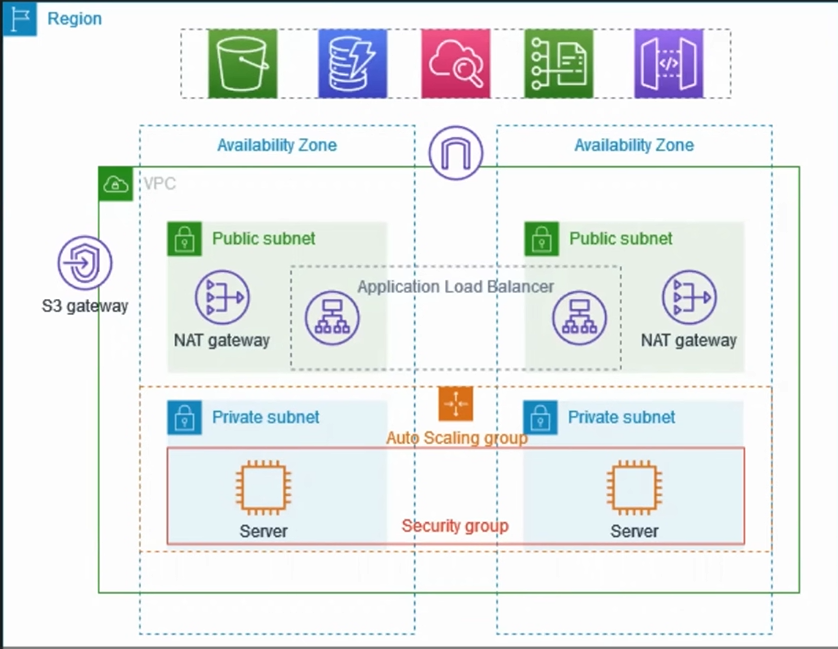

# Day 07: AWS Project Used In Production

Welcome to Day 7! Today is the day we put everything we have learned from Day 0 to Day 6 together and build a **Real-Time Production Architecture**. 

This is exactly how companies deploy their applications in the real world to ensure they are secure, highly available, and scalable.

---

## 1. Project Overview

This project demonstrates how to create a highly resilient VPC for a production environment. 
- To improve resiliency, servers are deployed across **two Availability Zones**.
- To ensure scalability, servers are managed by an **Auto Scaling Group**.
- To handle incoming traffic, users connect through an **Application Load Balancer**.
- For maximum security, the servers live entirely inside **Private Subnets** (no direct internet access).
- For outbound internet access (like downloading updates), the servers use a **NAT Gateway** deployed in both Availability Zones.



---

## 2. Core Concepts to Understand

Before we build it, let's understand the 4 new critical components in this architecture:

### 1. What is an Auto Scaling Group (ASG)?
An Auto Scaling Group automatically adjusts the number of EC2 instances you have running based on traffic. If your website goes viral, the ASG will spin up more servers (scale out). When traffic dies down, it terminates them to save money (scale in).

### 2. What is a Load Balancer?
A Load Balancer is the single entry point for all your users. Instead of giving users the IP address of one specific server, you give them the Load Balancer DNS. The Load Balancer receives the massive wave of traffic and distributes it evenly across all your healthy EC2 instances.

### 3. What is a Target Group?
A Target Group tells the Load Balancer exactly *where* to send the traffic. It acts as a logical grouping of your EC2 instances. The Load Balancer constantly checks the health of the Target Group to ensure it isn't sending users to a crashed server.

### 4. What is a Bastion Host (Jump Server)?
Because our application servers are in **Private Subnets**, they do NOT have Public IPs. This makes them incredibly secure, but it also means *you* cannot SSH directly into them from your laptop! 
A **Bastion Host** is a tiny, heavily monitored EC2 instance placed in the **Public Subnet**. You SSH into the Bastion Host first, and from inside the Bastion Host, you "jump" into your private servers.

---

## 3. Step-by-Step Implementation

Let's build this from scratch in the AWS Console.

### Step 1: Create the VPC (The Foundation)
1. Go to the AWS Console and search for **VPC**.
2. Click **Create VPC**.
3. Select **VPC and more** (this automatically builds the complex route tables and subnets).
4. **Name tag:** `aws-prod-example`
5. **IPv4 CIDR block:** `10.0.0.0/16`
6. **Number of Availability Zones:** `2`
7. **Number of Public Subnets:** `2`
8. **Number of Private Subnets:** `2`
9. **NAT Gateways:** `1 per AZ` *(This requires an Elastic IP. An Elastic IP is a static IP address that never changes. AWS automatically attaches it to the NAT gateway).*
10. Click **Create VPC**. 

*Look at the **Resource Map** once it finishes. You will see a beautiful web of routing from IGW -> Public Subnets -> NAT Gateways -> Private Subnets.*

---

### Step 2: Create a Launch Template
Before an Auto Scaling Group can spin up servers, it needs a blueprint.
1. Go to **EC2** -> **Launch Templates** -> **Create launch template**.
2. **Name:** `aws-prod-example`
3. **Description:** `Proof of concept for app deploy in aws private subnet`
4. **OS:** Ubuntu
5. **Instance Type:** `t2.micro`
6. **Key pair:** Select your `awslogin` key.
7. **Network settings:**
   - **Security group:** Create security group
   - **Name:** `aws-prod-sg`
   - **VPC:** `aws-prod-example` (Your custom VPC!)
   - **Inbound Rules:** 
     - Rule 1: Type `SSH`, Source `Anywhere`
     - Rule 2: Type `Custom TCP`, Port `8000`, Source `Anywhere`
8. Click **Create launch template**.

---

### Step 3: Create the Auto Scaling Group (ASG)
1. In the EC2 console, go to **Auto Scaling Groups** -> **Create Auto Scaling group**.
2. **Name:** `aws-prod-example-asg`
3. **Launch Template:** Select the one you just made. Click Next.
4. **Network:** 
   - **VPC:** `aws-prod-example`
   - **Subnets:** Select BOTH of the **Private Subnets**. Click Next.
5. **Load balancing:** Keep as "No load balancer" for now. Click Next.
6. **Group size:**
   - Desired capacity: `2`
   - Minimum capacity: `1`
   - Maximum capacity: `4`
7. Click Next until you reach the end, then click **Create Auto Scaling group**.
*Wait 1 minute, and check your EC2 Instances dashboard. You will see 2 brand new servers running in private subnets!*

---

### Step 4: Deploy the Bastion Host
We have 2 servers, but we can't reach them because they are private. We need a Jump Server!
1. Go to **EC2** -> **Launch Instance**.
2. **Name:** `Bastion-host`
3. **OS:** Ubuntu | **Instance Type:** `t2.micro` | **Key pair:** `awslogin`
4. **Network settings:**
   - **VPC:** `aws-prod-example`
   - **Subnet:** Select a **Public Subnet**
   - **Auto-assign public IP:** `Enable` *(Crucial!)*
   - **Security Group:** Allow SSH from Anywhere.
5. Click **Launch instance**.

---

### Step 5: Secure Copy Protocol (SCP)
To jump from the Bastion into the Private EC2, the Bastion needs a copy of your `.pem` key.

Open your local terminal (or MobaXterm) and use **SCP (Secure Copy Protocol)** to transfer your key securely over SSH:
```bash
scp -i "/path/to/awslogin.pem" "/path/to/awslogin.pem" ubuntu@<BASTION-PUBLIC-IP>:/home/ubuntu/
```
*Wait, why did we do this?*
`Local Laptop -> [SCP transfers key] -> Bastion -> [SSH using key] -> Private EC2`

**Test it:**
1. SSH into your Bastion Host.
2. Run `ls` to verify `awslogin.pem` is there.
3. SSH from the Bastion into your Private EC2 using its Private IP (`10.0.x.x`):
   ```bash
   ssh -i awslogin.pem ubuntu@<PRIVATE-EC2-IP>
   ```
You are now inside the highly secure private subnet!

---

### Step 6: Deploy the Application
While inside the Private EC2, let's create a website:
1. `vim index.html`
2. Add some simple HTML:
   ```html
   <!DOCTYPE html>
   <html>
   <head><title>My First AWS Project</title></head>
   <body>
       <h1>My First Heading</h1>
       <p>My first paragraph.</p>
   </body>
   </html>
   ```
3. Start the server on port 8000:
   ```bash
   python3 -m http.server 8000
   ```

---

### Step 7: Connect the Application Load Balancer (ALB)
The application is running, but the outside world still can't reach it. We need an Internet-Facing Load Balancer.

**Part A: Create a Target Group**
1. Go to **EC2** -> **Target Groups** -> **Create target group**.
2. **Target type:** `Instances`
3. **Name:** `aws-prod-example`
4. **Protocol:** `HTTP`, **Port:** `8000`
5. **VPC:** `aws-prod-example` -> Click Next.
6. Select your running Private EC2 instances, click **Include as pending below**, and click **Create target group**.

**Part B: Create the Load Balancer**
1. Go to **EC2** -> **Load Balancers** -> **Create load balancer**.
2. Select **Application Load Balancer** (Layer 7 for HTTP/HTTPS).
3. **Name:** `aws-prod-example-alb`
4. **Scheme:** `Internet-facing`
5. **Network mapping:** 
   - **VPC:** `aws-prod-example`
   - Select BOTH **Public Subnets** *(The ALB must be public to receive internet traffic!)*
6. **Security Groups:** Select your `aws-prod-sg`.
7. **Listeners and routing:** Protocol `HTTP`, Port `80`, Default action: Forward to your `aws-prod-example` Target Group.
8. Click **Create load balancer**.

**The Final Fix:**
The ALB is listening on Port 80, but our Security Group doesn't allow Port 80 yet!
1. Go to your `aws-prod-sg` Security Group.
2. Edit Inbound Rules -> Add `HTTP` (Port 80) from `Anywhere`.

---

## 🎉 The Final Test
Go back to your Load Balancer dashboard, copy the **DNS Name**, and paste it into your browser. 

You should instantly see your `index.html` website! 

**You have successfully deployed a highly available, scalable, and secure application architecture exactly as it is done in Enterprise Production environments!**
