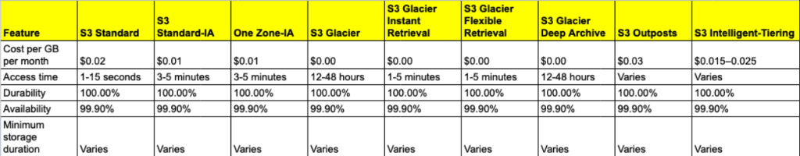

# Day 10: AWS S3 Advanced Concepts & Management

Welcome to Day 10! Yesterday, we got our hands dirty creating an S3 bucket and hosting a static website. Today, we are taking a theoretical Deep Dive into the **Advanced Concepts, Management, and Administration** of Amazon S3. 

This guide covers everything you need to know about S3 for advanced architectural designs and interviews.

---

## 1. Quick Recap: The Core of S3

**What is it?** Simple Storage Service (S3) is a highly scalable, highly secure cloud storage service that allows you to store and retrieve infinite amounts of data from anywhere on the web.

**What is a Bucket?** Think of an S3 bucket as a top-level root folder that holds your data. Each bucket must have a **globally unique name** across the entire AWS ecosystem.

**Why use it?** 
- High Durability and Availability (The famous "11 9s")
- Scalability (No capacity constraints)
- Security (Encryption, auditing, and access control)
- Performance & Cost-Effectiveness

---

## 2. Creating and Configuring Buckets

### Naming and Regions
When creating a bucket, the name must be **3-63 characters long**, contain only lowercase letters, numbers, periods, and hyphens (standard DNS naming conventions). 

You must also choose a **Region**. While S3 is a global service, the physical data lives in the region you select. Choosing a region close to your users reduces latency, and picking specific regions helps comply with government data regulations.

### Bucket Configurations
- **Versioning:** Protects against accidental deletions or overwrites. If you upload a new file with the exact same name, S3 keeps the old one hidden as a previous version instead of permanently destroying it.
- **Permissions:** You define who can perform actions on the bucket using **IAM Policies** and **Bucket Policies** for fine-grained control.

---

## 3. Uploading & Managing Objects

Everything stored in S3 is called an **Object**. 

### Object Keys and Metadata
When you upload a file, it is assigned a **Key** (the full path and filename, e.g., `images/profile.jpg`). 
Each object also has **Metadata**—hidden information about the file such as `content-type` (is it an image or text?), cache controls, and custom tags you can define.

### Server-Side Encryption (SSE)
You can encrypt objects at rest using three main Server-Side Encryption (SSE) methods:
1. **SSE-S3:** AWS completely manages the encryption keys for you.
2. **SSE-KMS:** Uses the AWS Key Management Service. Gives you control over key rotation and auditing.
3. **SSE-C:** You provide your own custom encryption keys.

### Handling Large Data
- **Multipart Uploads:** If you are uploading a massive file (e.g., 50GB), S3 breaks it into chunks and uploads them in parallel. If a chunk fails, it simply retries that chunk instead of starting from zero.
- **S3 Batch Operations:** Allows you to perform bulk actions (copying, tagging, restoring) across millions of objects automatically.

### Lifecycle Management
You don't want to pay premium prices for old data! Lifecycle Rules automatically transition objects to cheaper storage classes (or delete them) after a certain number of days.

---

## 4. Advanced S3 Features

### S3 Storage Classes
S3 offers different "tiers" of storage. If you don't need to access a file very often, you can move it to a colder tier to save massive amounts of money.

1. **S3 Standard:** For frequently accessed data.
2. **S3 Standard-IA (Infrequent Access):** For data accessed less often, but requires rapid access when needed.
3. **S3 One Zone-IA:** Like Standard-IA, but stored in only one Availability Zone (cheaper, but less resilient).
4. **S3 Glacier Flexible Retrieval / Deep Archive:** For long-term backups. Incredibly cheap, but takes hours to retrieve the data.
5. **S3 Intelligent-Tiering:** Uses machine learning to automatically move your files between tiers based on how often people download them!

### Replication
You can automatically copy every file uploaded to your bucket to another bucket:
- **Cross-Region Replication (CRR):** Copies data to a completely different part of the world for disaster recovery.
- **Same-Region Replication (SRR):** Copies data within the same region for log aggregation or compliance.

### Event Notifications
You can tell S3: *"Whenever a new file is uploaded, do X."*
For example, a user uploads a profile picture, which triggers an **AWS Lambda** function to automatically crop and compress the image, or sends a notification to an **SQS** queue.

---

## 5. Security, Compliance & Monitoring

**Data Encryption:**
- **At Rest:** Ensure Server-Side Encryption (SSE) is enabled.
- **In Transit:** Enforce SSL/TLS connections for all uploads and downloads.

**Logging & Monitoring:**
- **Server Access Logging:** Captures detailed records of every single request made to your bucket.
- **CloudWatch:** Monitors S3 metrics and sets alarms (e.g., alert me if bucket storage exceeds 1 TB).
- **CloudTrail:** Used for deep auditing and debugging IAM/Bucket Policy access issues.

---

## 6. Management and Administration Tools

While the AWS Console is great for beginners, DevOps Engineers manage S3 programmatically using:
- **AWS CLI:** The Command Line Interface is used to write scripts that manage buckets automatically.
- **AWS SDKs:** Software Development Kits (like Boto3 for Python) allow your application code to interact directly with S3.
- **IAM Roles:** For advanced access control, you assign IAM roles directly to EC2 instances so they can access S3 securely without hardcoding passwords.

---

## 7. Troubleshooting & Recovery

**Common Errors:**
- **Access Denied (403):** Usually caused by conflicting IAM Roles or restrictive Bucket Policies. Check your JSON statements!
- **Bucket Not Found (404):** The bucket name is wrong, or it was deleted.
- **Exceeded Bucket Quota:** Caused when your account has hit the hard limit for the maximum number of buckets allowed (default is 100 per account).

**Disaster Recovery & Data Consistency:**
If an object is accidentally deleted, you can recover it **IF** Bucket Versioning is enabled. Alternatively, if you set up Cross-Region Replication, you can retrieve the backup from your secondary region. S3 guarantees **strong read-after-write consistency**, meaning as soon as you upload a new file, it is completely durable and immediately available for downloading globally.

---

## 8. S3 Interview Cheatsheet (Advanced Concepts)

If you are interviewing for a Senior DevOps or Cloud Architect role, you **must** know these advanced S3 concepts:

1. **S3 Pre-Signed URLs:** 
   - **What it is:** A way to generate a temporary, time-limited link (e.g., expires in 15 minutes) to let a user download or upload a private file *without* making the whole bucket public.
   - **Use Case:** A streaming app where only authenticated users get a temporary link to download a movie file.

2. **VPC Endpoints for S3 (Gateway Endpoints):**
   - **What it is:** Normally, an EC2 instance in a private subnet must use a NAT Gateway to reach S3 over the public internet. A VPC Endpoint allows private, internal routing directly to S3 without ever touching the public internet.
   - **Use Case:** Highly secure corporate or banking environments where data cannot leave the private AWS network.

3. **CORS (Cross-Origin Resource Sharing):**
   - **What it is:** If you host a static website on S3 (`my-site.s3.amazonaws.com`), and your Javascript tries to fetch data from a completely different API URL (`api.example.com`), the web browser will block it for security reasons. You have to configure CORS rules on your bucket to explicitly allow these cross-origin requests.

4. **S3 Transfer Acceleration:**
   - **What it is:** Uses AWS's global network of Edge Locations. Instead of a user in India uploading a 50GB file over the slow public internet all the way to a bucket in the US, they upload it to a local Edge Location in India. AWS then rushes it over their ultra-fast private fiber network to the US.

5. **MFA Delete:**
   - **What it is:** An extreme security feature that requires a physical Multi-Factor Authentication (MFA) code from your phone before anyone (even the root administrator) is allowed to permanently delete an object.
