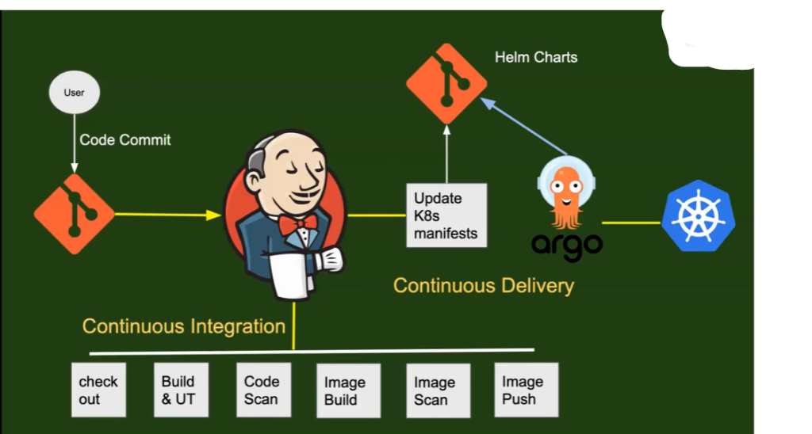
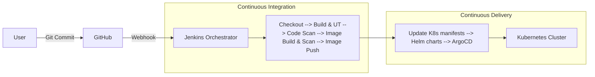
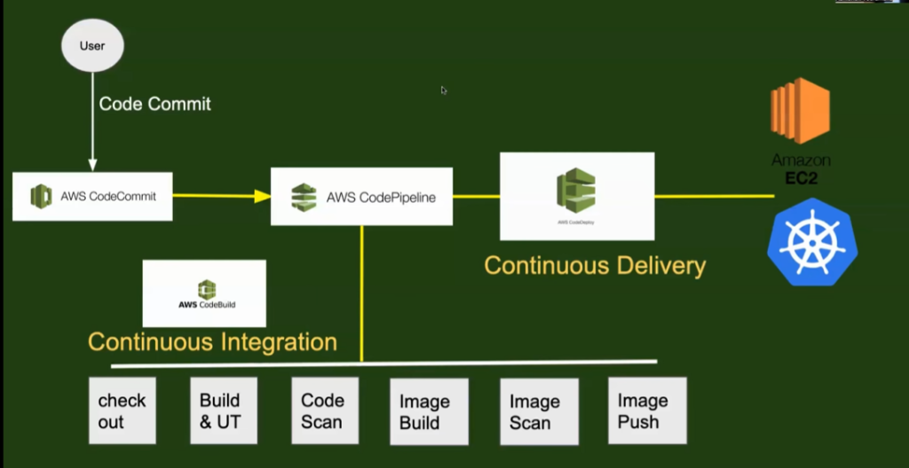
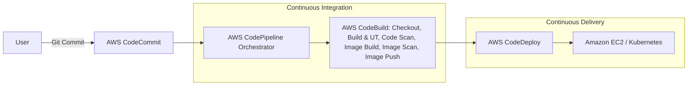
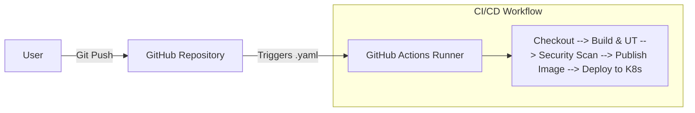

# Day-14: AWS CodePipeline & CI/CD Orchestrators Comparison

## Overview of CI/CD Orchestration
In a CI/CD workflow, there are multiple stages: fetching code, building it, running tests, scanning for security vulnerabilities, building Docker images, and deploying to a server (like Kubernetes or EC2). 

An **Orchestrator** is the tool that coordinates all these steps automatically. When someone commits code, the orchestrator triggers the pipeline, runs the stages in order, and reports success or failure.

Today, we will master **AWS CodePipeline** by comparing it with **Jenkins** (Open Source) and **GitHub Actions** (GitHub Managed).

---

## 1. Jenkins (Open Source Orchestrator)

Jenkins is one of the most popular open-source automation servers. It requires you to set up your own server (EC2 instance), install plugins, and manage the infrastructure yourself.

### How Jenkins Works with CI/CD:
1. **User** makes a code change.
2. The user runs a **Git Commit** to push code to **GitHub**.
3. GitHub triggers a **Webhook** which sends a signal to the **Jenkins Orchestrator**.
4. Jenkins starts the **Continuous Integration (CI)** process: Checkout -> Build & Unit Tests (UT) -> Code Scan -> Image Build -> Image Scan -> Image Push.
5. Jenkins triggers the **Continuous Delivery (CD)** process: Update Kubernetes Manifests -> Helm Charts -> ArgoCD -> Deployed to Kubernetes.

**Jenkins Architecture Flow:**

### High-Level Block Diagram (Jenkins)

---

## 2. AWS CodePipeline (AWS Managed Orchestrator)

**AWS CodePipeline** is a fully managed continuous delivery service that helps you automate your release pipelines for fast and reliable application and infrastructure updates. Because it is managed by AWS, there are no servers to provision or maintain.

### How AWS CodePipeline Works:
1. **User** makes a code change and pushes it to **AWS CodeCommit**.
2. **AWS CodePipeline** detects the change automatically and acts as the orchestrator.
3. CodePipeline triggers **AWS CodeBuild** for the Continuous Integration stages: Checkout, Build & UT, Code Scan, Image Build, Image Scan, Image Push.
4. After CI is complete, CodePipeline triggers **AWS CodeDeploy** for Continuous Delivery to Kubernetes (Amazon EKS) or EC2 instances.

**AWS CodePipeline Flow:**

### High-Level Block Diagram (AWS CodePipeline)

---

## 3. GitHub Actions (GitHub Managed Orchestrator)

**GitHub Actions** is deeply integrated directly into your GitHub repositories. It allows you to automate workflows without needing external tools like Jenkins or AWS CodePipeline.

### How GitHub Actions Works:
1. **User** makes a code change and pushes it to **GitHub**.
2. A `.yaml` workflow file inside the repository triggers **GitHub Actions** automatically.
3. GitHub Actions spins up a temporary runner (server) to execute the CI/CD steps (Checkout, Build, Test, Security Scan, Push Image, and Deploy).
4. Once completed, the runner is destroyed.

### High-Level Block Diagram (GitHub Actions)

---

## Summary Comparison: Open Source vs. Managed

| Feature | Jenkins | AWS CodePipeline | GitHub Actions |
| :--- | :--- | :--- | :--- |
| **Type** | Open Source | AWS Managed | GitHub Managed |
| **Hosting** | You manage the server (e.g., EC2) | Fully Managed (Serverless) | Fully Managed (Runners) |
| **Maintenance** | High (Requires plugin updates, OS patching) | Zero Maintenance | Zero Maintenance |
| **Cost** | Free software, but you pay for the EC2 server | Pay-per-use (Active pipelines) | Free tier available, pay for extra minutes |
| **Ecosystem** | Massive plugin ecosystem | Tightly integrated with AWS | Tightly integrated with GitHub |
| **Best For** | Complex, custom pipelines across multiple environments | Pure AWS-based infrastructure | Teams heavily relying on GitHub |

### Conclusion
By understanding how Jenkins functions, it is very easy to map those concepts directly to **AWS CodePipeline**. Tomorrow, we will dive into creating these pipelines and executing these CI/CD flows practically using AWS CodeBuild and CodeDeploy!
