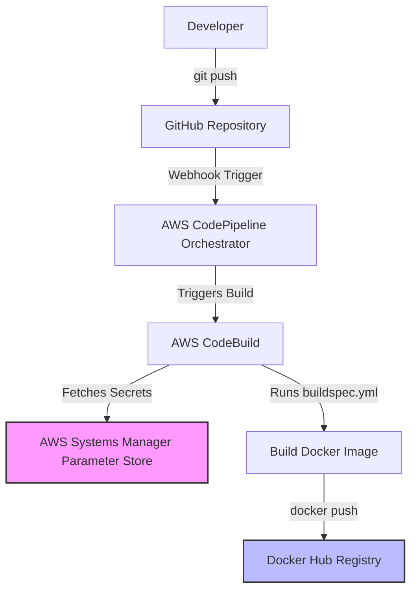

# Day-15: AWS End-to-End CI/CD Realtime Project

## Introduction
Today, we are going to build an end-to-end **Continuous Integration (CI)** pipeline in AWS using a real-world approach. We will use a sample Python Flask service, configure AWS CodeBuild, secure our credentials in Systems Manager, and automate the trigger using AWS CodePipeline.

To follow along with this project, we have created a `simple-python-app` directory in our repository containing all the necessary code files: `Dockerfile`, `app.py`, `appspec.yml`, `requirements.txt`, `buildspec.yml`, and the deploy scripts in the `scripts/` folder.

---

## 1. Setting Up the CI Build Process (AWS CodeBuild)

CodeBuild is the AWS service that will check out our code, run tests, build the Docker image, and push it to a registry (like Docker Hub).

### Step-by-Step CodeBuild Creation
1. Log in to the **AWS Management Console** using an IAM User (preferably not the root user).
2. Search for **CodeBuild** and click on **Create build project**.
3. **Project Name:** `sample-python-flask-service`
4. **Description:** `A simple python flask service build pipeline`
5. **Source:**
   * **Source provider:** Select `GitHub`. (It also supports Amazon S3, CodeCommit, BitBucket, and GitHub Enterprise).
   * Choose to connect to a repository in your GitHub account.
   * **Repository URL:** Enter your repository URL (e.g., `https://github.com/iam-veeramalla/aws-devops-zero-to-hero` or your fork).
6. **Environment:**
   * **Environment image:** `Managed image`
   * **Operating system:** `Ubuntu`
   * **Runtime(s):** `Standard`
   * **Image:** Select the `latest` image available.
   * **Service role:** Select `New service role` (or you can create one manually from the IAM section and select it here).
7. **Buildspec:**
   * You can use a buildspec file or insert build commands.
   * Select **Insert build commands**.
   * You can edit the YAML code according to your requirement (we will update this later).
8. Click **Create build project**.

When you click **Start build**, it will get the code from your GitHub and start building, but we need to update our buildspec with actual commands and configure credentials first!

---

## 2. Managing Sensitive Information (AWS Systems Manager)

In the real world, you never hardcode usernames and passwords into your code or YAML files. We will use AWS Systems Manager Parameter Store.

### Storing Docker Hub Credentials
1. Search for **Systems Manager** in the AWS Console.
2. In the sidebar, click on **Parameter Store** > **Create parameter**.
3. Create the Username Parameter:
   * **Name:** `/myapp/docker-credentials/username` (Using a path-like structure helps organize your parameters when managing lots of projects).
   * **Tier:** `Standard`
   * **Type:** `SecureString`
   * **KMS Key Source:** `My current account`
   * **Value:** Your Docker Hub username.
4. Repeat this to create parameters for the password (`/myapp/docker-credentials/password`) and the URL (`/myapp/docker-registry/url` = `docker.io`).

In our buildspec, we can reference these securely:
```yaml
env:
  parameter-store:
    DOCKER_REGISTRY_USERNAME: /myapp/docker-credentials/username
```
*Like this, you have to use your credentials!*

Now go back to your CodeBuild project, click **Edit** -> **Buildspec**, and paste the full `buildspec.yml` code. Click **Update buildspec**.

Click on **Start build**. You will get some issues and errors like permission and access issues to the IAM user. Let's fix them step by step.

---

## 3. Fixing IAM Permissions (Access Errors)

When CodeBuild runs, it uses the IAM Service Role we created earlier. Right now, that role does not have permission to read from the Systems Manager Parameter Store.

1. Go to the **IAM Console** > **Roles**.
2. Find the newly created CodeBuild service role (e.g., `codebuild-sample-python-flask-service-service-role`).
3. Click **Add permissions** > **Attach policies**.
4. Search for `SSM`. Select **AmazonSSMFullAccess** (or a more restrictive custom policy in a real production environment).
5. Click **Add permissions**.

Now, if you go back to CodeBuild and click **Start build**, it will pass the SSM step, but you will get Docker issues!

### Fixing Docker Privilege Errors
By default, AWS CodeBuild does not allow you to create Docker images.
1. Go back to the CodeBuild project.
2. Click on **Edit** -> **Environment**.
3. Expand **Override image** (Additional configuration).
4. Go down until you see the **Privileged** button.
5. **Check that box** (Enable this flag if you want to build Docker images).
6. Click **Update environment**.

Click **Start build** again. Read the build logs; you can see what is happening step by step and understand what AWS is doing. It will install dependencies, build the Docker image, and successfully push it to Docker Hub! 

*(You have successfully completed Continuous Integration!)*

---

## 4. Automating with AWS CodePipeline (End-to-End CI)

Currently, we have to click "Start build" manually. We want this to happen automatically whenever code is pushed. For this, we need AWS CodePipeline as our Orchestrator.

1. Search for **CodePipeline** in the AWS Console.
2. Click **Create pipeline**.
3. **Pipeline name:** `sample-python-app`
4. **Service role:** `New service role`. Click **Next**.
5. **Source stage:**
   * **Source provider:** `GitHub (Version 2)`
   * Click **Connect to GitHub** and authorize AWS.
   * **Repository name:** Select your repository.
   * **Branch name:** Select the branch (e.g., `main`).
   * **Output format:** `CodePipeline default`. Click **Next**.
6. **Build stage:**
   * **Build provider:** `AWS CodeBuild`.
   * **Region:** Select your region.
   * **Project name:** Select `sample-python-flask-service`.
   * **Build type:** `Single build`. Click **Next**.
7. **Deploy stage:**
   * For now, click **Skip deploy stage** (we will configure deployments later).
8. Verify everything and click **Create pipeline**.

### Visualizing the Realtime Project Flow


Now, try to make some changes in your repository and push them to GitHub. Check and verify that the source updates in CodePipeline and CodeBuild automatically triggers. 

After the build, you can go to Docker Hub and verify that a new Docker image has been successfully created. 

This is an end-to-end continuous integration pipeline!

---

## AWS Continuous Integration Demo (High-Level Summary)

*If you prefer a higher-level summary of the workflow, here is the step-by-step breakdown of the Continuous Integration Demo:*

### 1. Set Up GitHub Repository
The first step in our CI journey is to set up a GitHub repository to store our Python application's source code. If you already have a repository, feel free to skip this step. Otherwise, let's create a new repository on GitHub by following these steps:
- Go to github.com and sign in to your account.
- Click on the "+" button in the top-right corner and select "New repository."
- Give your repository a name and an optional description.
- Choose the appropriate visibility option based on your needs.
- Initialize the repository with a README file.
- Click on the "Create repository" button to create your new GitHub repository.

Great! Now that we have our repository set up, we can move on to the next step.

### 2. Create an AWS CodePipeline
In this step, we'll create an AWS CodePipeline to automate the continuous integration process for our Python application. AWS CodePipeline will orchestrate the flow of changes from our GitHub repository to the deployment of our application. Let's go ahead and set it up:
- Go to the AWS Management Console and navigate to the AWS CodePipeline service.
- Click on the "Create pipeline" button.
- Provide a name for your pipeline and click on the "Next" button.
- For the source stage, select "GitHub" as the source provider.
- Connect your GitHub account to AWS CodePipeline and select your repository.
- Choose the branch you want to use for your pipeline.
- In the build stage, select "AWS CodeBuild" as the build provider.
- Create a new CodeBuild project by clicking on the "Create project" button.
- Configure the CodeBuild project with the necessary settings for your Python application, such as the build environment, build commands, and artifacts.
- Save the CodeBuild project and go back to CodePipeline.
- Continue configuring the pipeline stages, such as deploying your application using AWS Elastic Beanstalk or any other suitable deployment option.
- Review the pipeline configuration and click on the "Create pipeline" button to create your AWS CodePipeline.

Awesome job! We now have our pipeline ready to roll. Let's move on to the next step to set up AWS CodeBuild.

### 3. Configure AWS CodeBuild
In this step, we'll configure AWS CodeBuild to build our Python application based on the specifications we define. CodeBuild will take care of building and packaging our application for deployment. Follow these steps:
- In the AWS Management Console, navigate to the AWS CodeBuild service.
- Click on the "Create build project" button.
- Provide a name for your build project.
- For the source provider, choose "AWS CodePipeline."
- Select the pipeline you created in the previous step.
- Configure the build environment, such as the operating system, runtime, and compute resources required for your Python application.
- Specify the build commands, such as installing dependencies and running tests. Customize this based on your application's requirements.
- Set up the artifacts configuration to generate the build output required for deployment.
- Review the build project settings and click on the "Create build project" button to create your AWS CodeBuild project.

Fantastic! With AWS CodeBuild all set up, we're now ready to witness the magic of continuous integration in action.

### 4. Trigger the CI Process
In this final step, we'll trigger the CI process by making a change to our GitHub repository. Let's see how it works:
- Go to your GitHub repository and make a change to your Python application's source code. It could be a bug fix, a new feature, or any other change you want to introduce.
- Commit and push your changes to the branch configured in your AWS CodePipeline.
- Head over to the AWS CodePipeline console and navigate to your pipeline.
- You should see the pipeline automatically kick off as soon as it detects the changes in your repository.
- Sit back and relax while AWS CodePipeline takes care of the rest. It will fetch the latest code, trigger the build process with AWS CodeBuild, and deploy the application if you configured the deployment stage.
