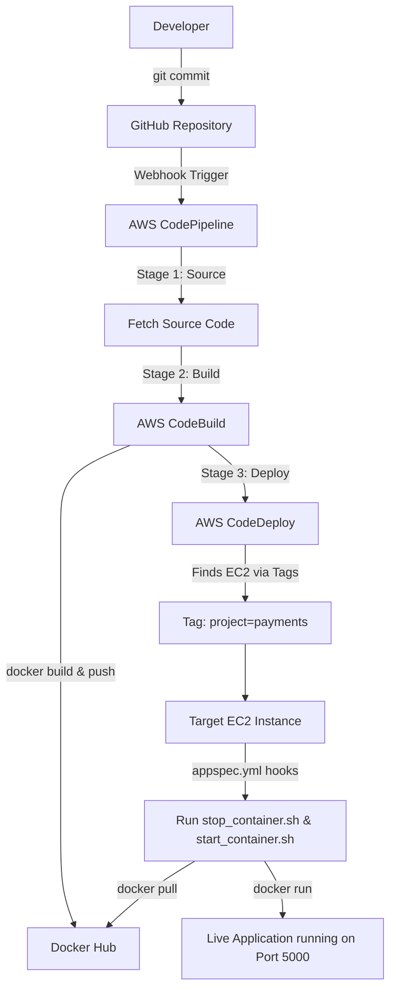

# Day-16: AWS Ultimate CI/CD Pipeline (CodeDeploy)

## Introduction
In the last class, we completed the **Continuous Integration (CI)** part using AWS CodeBuild. Today, we complete the **Continuous Deployment (CD)** part end-to-end! We will deploy our Python application to an EC2 instance using **AWS CodeDeploy**.

---

## 1. Create the CodeDeploy Application
1. Go to the AWS Management Console and search for **CodeDeploy**.
2. Go to the CodeDeploy page and click on **Create application**.
3. **Application name:** `sample-application-name`
4. **Compute platform:** Select `EC2/On-premises`.
5. Click **Create application**.

---

## 2. Provision and Tag the Target EC2 Instance
CodeDeploy needs a server to deploy our code onto. We will create an Ubuntu EC2 instance for this.

1. Search for **EC2** in AWS.
2. Click on **Instances** -> **Launch instances**.
3. **Name:** `sample-python-application`
4. **OS:** Ubuntu
5. **Instance type:** `t2.micro`
6. **Key pair:** Select your existing key pair (e.g., `aws_login.pem`).
7. **Network settings:** Ensure **Auto-assign public IP** is set to `Enable`.
8. Click **Launch instance**.

### The Importance of Tags in AWS
When working in a real organization, management requires you to tag resources (S3, EC2, etc.) for **cost optimization** and **tracking**. CodeDeploy also uses tags to know *which* servers to deploy to!

1. Go to your EC2 instance.
2. Under the **Tags** tab, click **Manage tags**.
3. Add a new tag:
   * **Key:** `project`
   * **Value:** `payments`
4. Click **Save**.

---

## 3. Install the CodeDeploy Agent on EC2
CodeDeploy communicates with your server using an agent. We must install it manually.

1. SSH into your EC2 instance using your terminal or MobaXterm:
   ```bash
   ssh -i ~/Downloads/aws_login.pem ubuntu@<your-ec2-public-ip>
   ```
2. Run the following commands to install the agent:
   ```bash
   # Update packages
   sudo apt update

   # Install Ruby and wget (required for the agent)
   sudo apt install ruby-full wget -y

   # Download the agent installer (Use your specific region's bucket if not us-east-1)
   wget https://aws-codedeploy-us-east-1.s3.us-east-1.amazonaws.com/latest/install

   # Make it executable
   chmod +x ./install

   # Install the agent
   sudo ./install auto

   # Verify the agent is running
   sudo service codedeploy-agent status
   ```

---

## 4. Setup IAM Roles for EC2 and CodeDeploy
CodeDeploy needs permission to talk to EC2, and EC2 needs permission to pull artifacts.

### Create the CodeDeploy Service Role
1. Search for **IAM** and go to **Roles** -> **Create role**.
2. **Trusted entity type:** AWS service
3. **Use case:** EC2
4. Search for the AWS service: **CodeDeploy**. Select it.
5. Click Next.
6. **Role name:** `ec2-codedeploy-role`
7. Click **Create role**.

### Attach the Role to EC2
1. Go back to your EC2 Instance.
2. Click **Actions** -> **Security** -> **Modify IAM role**.
3. Select the `ec2-codedeploy-role` from the dropdown and click **Update IAM role**.
4. **Important:** Go back to your EC2 terminal and restart the agent so it picks up the new permissions:
   ```bash
   sudo service codedeploy-agent restart
   sudo service codedeploy-agent status
   ```

*(Note: In a strict production environment, you might create two separate roles—one for the CodeDeploy service to talk to EC2, and one for the EC2 instance to read from S3/GitHub. For this demo, ensure your role has both `AWSCodeDeployRole` and `AmazonEC2FullAccess` if needed).*

---

## 5. Create the Deployment Group
1. Go back to your CodeDeploy Application (`sample-application-name`).
2. Click **Create deployment group**.
3. **Deployment group name:** `sample-python-application`
4. **Service role:** Select your `ec2-codedeploy-role`.
5. **Deployment type:** `In-place`
6. **Environment configuration:** Select `Amazon EC2 instances`.
7. **Tag group:** 
   * **Key:** `Name`
   * **Value:** `sample python` (or use the `project: payments` tag we created earlier. Ensure this matches the tags on your EC2 instance!).
8. Click **Create deployment group**.

---

## 6. Real-World Debugging: Fixing Deployment Failures

### Attempt 1: Manual Deployment (Failure)
1. In your Deployment Group, click **Create deployment**.
2. **Revision type:** Select `My application is stored in GitHub`.
3. Enter your GitHub Token to authenticate.
4. **Repository name:** `SIVAGORAM/devops-zero-to-hero`
5. **Commit ID:** Provide the latest commit ID.
6. Click **Create deployment**.

**Error 1: Missing appspec.yml at the root level**
If your deployment fails, click **View details**. CodeDeploy expects the `appspec.yml` file to be at the exact **root level** of your repository. 
**Fix:** Move `appspec.yml` and the `scripts/` folder out of any subdirectories directly to the root of your repository in GitHub and commit the changes.

### Attempt 2: Docker Not Found (Failure)
You delete the failed deployment and try again. It fails again!
**Error 2: Docker command not found**
The EC2 instance is brand new; it doesn't have Docker installed to run your application!
**Fix:** SSH into your EC2 instance and install Docker:
```bash
sudo apt install docker.io -y
```

### Attempt 3: Port Already in Use (Failure)
When you run the pipeline multiple times, it might fail because port 5000 is already in use by the previous deployment's container.
**Error 3: Port 5000 is already allocated**
**Fix:** We need to update `stop_container.sh` to forcefully remove any existing containers before starting a new one.

```bash
#!/bin/bash
set -e

# Stop the running container (if any)
containerid=$(docker ps -q)
if [ -n "$containerid" ]; then
    docker rm -f $containerid
fi
```

---

## 7. The Ultimate End-to-End CodePipeline
Now that CodeDeploy is working flawlessly, let's connect it to our existing CodePipeline to automate the whole process!

1. Search for **CodePipeline** and click on your existing pipeline (from Day 15).
2. Click **Edit**.
3. Scroll down below the Build section and click **+ Add stage**.
4. **Stage name:** `Code-Deploy`. Click Add stage.
5. Inside the new stage, click **+ Add action group**.
6. **Action name:** `code-deploy`
7. **Action provider:** `AWS CodeDeploy`
8. **Input artifacts:** `BuildArtifact`
9. **Application name:** `sample-application-name`
10. **Deployment group:** `sample-python-application`
11. Click **Done**, then click **Save**.

### Verify End-to-End Success
Make a change to your code in GitHub and push it. 
1. **GitHub** triggers CodePipeline.
2. **CodeBuild** builds the Docker image and pushes to Docker Hub.
3. **CodeDeploy** fetches the code, logs into EC2, runs `stop_container.sh` to kill old apps, and runs `start_container.sh` to pull and run the new Docker image.

Verify on your EC2 instance:
```bash
sudo docker ps
```
You will see your application happily running!

---

## Architecture Flow Diagram


