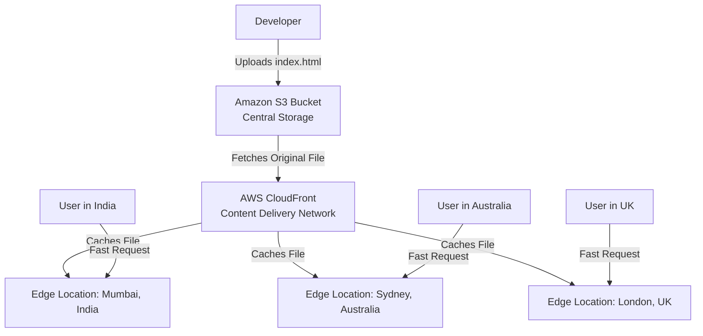

# Day-20: AWS CloudFront (Content Delivery Network)

## Introduction to CloudFront & CDNs
Welcome to Day 20! Today we are diving into **AWS CloudFront**, which is Amazon's managed service for a **CDN (Content Delivery Network)**.

### What is a CDN and what problem does it solve?
We interact with CDNs every single day when we use platforms like YouTube, Snapchat, or Instagram. Most video-sharing and social media platforms rely heavily on CDNs internally for fast streaming.

**The Problem: Latency and Bad UX**
Imagine a popular image-sharing platform (like Instagram). Let's say their central storage servers are located in the **USA**. 
* A user in Australia uploads a photo. It is saved in the USA.
* A user in **India** opens their phone and wants to view that photo.
* The request from India has to travel across the ocean, through multiple hops and routers, reach the USA server, and then travel all the way back to India.
* This massive physical distance causes **high latency**, slow loading times, and a terrible user experience (UX).

**The CDN Solution: Edge Locations**
Instead of forcing every user to fetch images from the central USA location, a CDN stores **cached copies** of those images in local data centers around the world, known as **Edge Locations**.
* There is an edge location copy in Australia, one in Mumbai (India), one in Europe, etc.
* When the user in India requests the photo, the CDN intercepts the request and says, *"I have a copy of this right here in the Mumbai edge location! You don't need to travel to the USA."*
* The user downloads the photo instantly from the local server.

---

## Why Combine AWS CloudFront with Amazon S3?

We already learned how to host a static website directly out of an S3 bucket. While that is easy, **it is not a good practice for production.** 

If you use AWS CloudFront in combination with S3, you solve three major problems:
1. **Security:** You can completely **Block All Public Access** on your S3 bucket. Users cannot access your S3 bucket directly. Only CloudFront is allowed to fetch files from it.
2. **Cost Optimization:** Every time a user downloads a file directly from S3, AWS charges you for Data Transfer and GET requests. By putting CloudFront in front, the files are cached at Edge Locations. Users download the cached copies, drastically reducing your direct S3 data transfer costs!
3. **Latency:** Users get lightning-fast load times because the website is served from the edge location nearest to their physical city.

---

## Architecture Flow Diagram

Here is how the S3 + CloudFront architecture looks in the real world:

---

## Hands-On Lab: Secure S3 Hosting via CloudFront

Let's put this into practice! We will create a private S3 bucket and use CloudFront to serve it securely.

### Step 1: Create a Secure S3 Bucket
1. Go to the AWS Console and search for **S3**.
2. Click **Create bucket**.
3. **Bucket name:** `my-demo-website-cf-<your-name>` *(must be globally unique)*.
4. **Region:** Select your nearest region.
5. **Block Public Access settings:** Ensure **Block all public access** is **CHECKED**. We do not want anyone accessing this directly!
6. **Bucket Versioning:** Enable it.
7. Click **Create bucket**.

### Step 2: Enable Static Website Hosting
1. Go into your newly created bucket.
2. Click on the **Properties** tab and scroll all the way down.
3. Under **Static website hosting**, click **Edit** and choose **Enable**.
4. **Index document:** `index.html`
5. **Error document:** `error.html`
6. Click **Save changes**.
7. Go to the **Objects** tab and upload a simple `index.html` file (e.g., `<h1>Welcome to my CDN-powered website!</h1>`).

### Step 3: Create the CloudFront Distribution
Now we create the CDN to securely serve our private bucket.
1. Search for **CloudFront** in the AWS Console.
2. Click **Create Distribution**.
3. **Origin domain:** Select your S3 bucket from the dropdown.
4. **Origin Access:** We need to securely connect them. Select **Legacy access identities**.
5. Click **Create new OAI (Origin Access Identity)**. 
6. **Bucket policy:** Select **Yes, update the bucket policy**. *(CloudFront will automatically write the JSON security policy for your S3 bucket!)*
7. **Viewer protocol policy:** Select **Redirect HTTP to HTTPS** *(Best practice for security).*
8. **Web Application Firewall (WAF):** For this demo, you can turn this **Off** to save costs.
9. **Price class:** Select **Use all edge locations (best performance)**. *(Note: Be careful with pricing classes in real production environments!)*
10. **Default root object:** Type `/index.html`.
11. Click **Create Distribution**.

*(Note: It will take a few minutes for the status to change from "Deploying" to "Enabled" as AWS copies your website to every edge location in the world).*

### Step 4: Verify the Auto-Updated S3 Policy
Let's see the magic CloudFront performed in the background!
1. Go back to your **S3 Bucket**.
2. Click on the **Permissions** tab and scroll down to **Bucket policy**.
3. You will see a JSON code block that CloudFront automatically generated. It explicitly states that *only* the CloudFront OAI is allowed to `s3:GetObject` from your bucket. 

Once CloudFront finishes deploying, copy the **Distribution domain name** (e.g., `d1234abcd.cloudfront.net`) and paste it into your browser. Your secure, globally cached, high-speed website is now live!

> [!CAUTION]
> **Don't Forget Cleanup:** Once you are done testing, go back to CloudFront, click on your distribution, click **Disable**, wait for it to disable, and then click **Delete**. Otherwise, you may incur charges!
