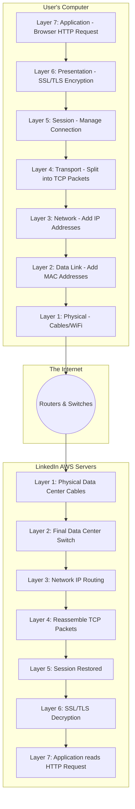
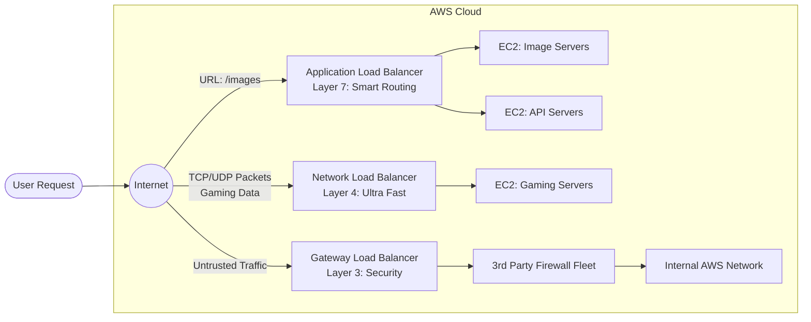

# Day-27: AWS Load Balancers (ALB vs NLB vs GWLB) & The OSI Model

Welcome to Day 27! Today we are tackling a critical networking concept that every DevOps Engineer must master: **Load Balancing** and the **OSI Model**. 

By the end of this module, you will understand exactly how traffic flows from a user's browser to a server, and how different types of Load Balancers (ALB, NLB, GWLB) operate at different layers of that flow.

---

## 1. The Scaling Problem: Why Do We Need a Load Balancer?

Imagine you are an application developer. You deploy your app on a single EC2 instance. Initially, you have 5-10 users. Your single server handles this perfectly.

Suddenly, your app goes viral, and 1,000+ users try to access it simultaneously. Your single EC2 instance crashes due to CPU and memory overload! 

**The Solution:** You launch 3 more EC2 instances. But how do you ensure the 1,000 users are distributed evenly across the 4 servers so no single server gets overwhelmed? 
**Answer:** You place a **Load Balancer** in front of them!

The Load Balancer uses algorithms (like the **Round Robin** algorithm) to distribute incoming traffic equally across all healthy EC2 instances, ensuring a highly available and fault-tolerant application.

---

## 2. Understanding the OSI Model (How the Internet Works)

To understand *which* load balancer to choose, you must first understand how traffic travels across the internet. Traffic flows through 7 conceptual layers known as the **OSI (Open Systems Interconnection) Model**.

Let's trace a real-time example: A user typing `linkedin.com/sivagoram` to view a profile.

### The 7 Layers Explained:
* **Layer 7 (Application):** The user types the URL. This generates an HTTP/HTTPS request.
* **Layer 6 (Presentation):** The request is encrypted (SSL/TLS) for security.
* **Layer 5 (Session):** A session is established between the client and server.
* **Layer 4 (Transport):** **(CRITICAL)** The massive HTTP request is split into small TCP/UDP packets or "chunks" so it can travel efficiently.
* **Layer 3 (Network):** IP addresses are added to the packets so routers know where to send them globally.
* **Layer 2 (Data Link):** MAC addresses are added for local switch routing inside the data center.
* **Layer 1 (Physical):** The actual physical cables (fiber optics) transmitting the data.

Once the packets reach the LinkedIn server, they travel *up* the layers (L1 to L7) to be reassembled into the HTTP request!

---

## 3. Types of AWS Load Balancers

Because traffic flows through these layers, AWS offers different Load Balancers designed to operate at specific layers. 

### A. Application Load Balancer (ALB)
* **Operates at:** Layer 7 (Application Layer).
* **What it does:** It understands the HTTP/HTTPS request! Because it operates at the top layer, it can actually "read" what the user is asking for.
* **Smart Routing:** It can route traffic based on the URL path, host, or domain.
  * `amazon.com/login` $\rightarrow$ Routes to Auth Servers.
  * `amazon.com/payments` $\rightarrow$ Routes to Payment Servers.
* **Pros/Cons:** It is incredibly smart and flexible, but because it has to inspect the deep HTTP data (Layer 7), it is slightly slower (latency is involved) and more costly.

### B. Network Load Balancer (NLB)
* **Operates at:** Layer 4 (Transport Layer).
* **What it does:** It DOES NOT understand HTTP or URLs. It only looks at the raw TCP/UDP packets (IP and Port numbers) and routes them as fast as physically possible.
* **Real-Time Examples:** Live Video Streaming (YouTube, Twitch), multiplayer gaming servers, or massive IoT data ingestion. 
* **Pros/Cons:** It is ultra-fast (ultra-low latency), capable of handling millions of requests per second, and cheaper. However, it cannot do smart URL routing.

### C. Gateway Load Balancer (GWLB)
* **Operates at:** Layer 3 (Network Layer).
* **What it does:** Used strictly for deploying, scaling, and managing **Virtual Appliances** like third-party Firewalls (e.g., Palo Alto, Cisco) or Deep Packet Inspection systems.
* **Real-Time Example:** A highly secure bank mandates that *all* traffic entering their cloud must be inspected by a proprietary security firewall before it is allowed to hit the ALB or EC2 instances. The GWLB routes all traffic through that firewall fleet first.

---

## 4. Visual Comparison Summary

### When to use what? (The Cheat Sheet)
* **Building a web app/API?** $\rightarrow$ Use **ALB** (Layer 7).
* **Building a low-latency game or streaming video?** $\rightarrow$ Use **NLB** (Layer 4).
* **Need to route traffic through a custom Security Firewall?** $\rightarrow$ Use **GWLB** (Layer 3).

---

## 5. Zero to Hero Insights (Advanced Load Balancing)

To truly master AWS Load Balancers for interviews and real-world architectures, you must understand these advanced concepts:

### A. Target Groups & Health Checks
A load balancer is useless if it sends a user's request to a crashed server! 
Load balancers do not send traffic directly to EC2 instances; they send traffic to a **Target Group**. The Target Group constantly performs **Health Checks** (e.g., pinging the `/index.html` file every 10 seconds). If a server fails the health check, the load balancer stops sending traffic to it until it recovers.

### B. Cross-Zone Load Balancing
By default, if you have 10 instances in Availability Zone A, and 2 instances in Availability Zone B, the load balancer might split the traffic 50/50 between the *zones*. This would crush the 2 instances in Zone B!
**Cross-Zone Load Balancing** solves this by distributing traffic evenly across all *instances* globally, ignoring the zone boundaries. (This is enabled by default for ALB, but disabled by default for NLB).

### C. Sticky Sessions (Session Affinity)
Imagine a user adds an item to their shopping cart on Server A. If they click "Checkout" and the load balancer sends their next request to Server B, their cart will be empty! 
**Sticky Sessions** tell the Application Load Balancer to bind a user's session to a specific EC2 instance using a cookie. All subsequent requests from that user will always go to the same server.

### D. What about the Classic Load Balancer (CLB)?
You might see the Classic Load Balancer in the AWS Console. It is a legacy load balancer created in 2009 that operates at both Layer 4 and Layer 7. **Never use it for modern applications.** AWS strongly recommends migrating all CLBs to ALBs or NLBs.
