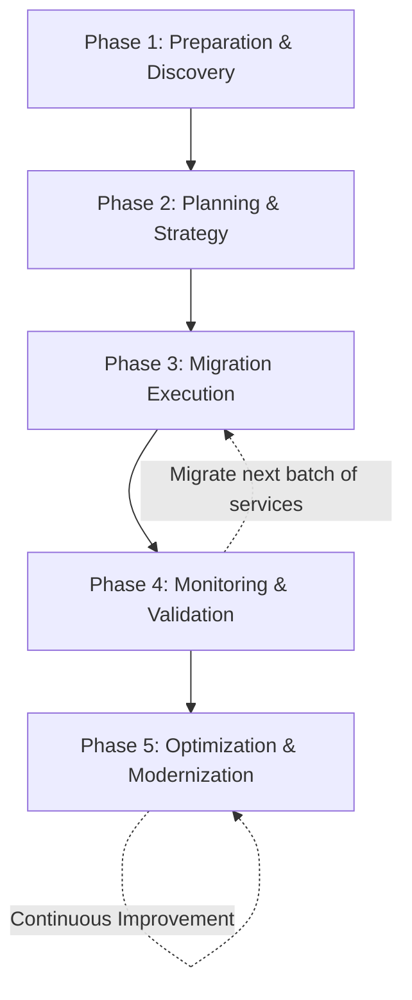

# Day 28: AWS Cloud Migration Strategies and Tools

Migrating an enterprise application from an on-premises data center to the AWS Cloud is one of the most critical and high-paying skills a DevOps Engineer can possess. This guide covers the end-to-end lifecycle of a cloud migration, the famous "7 Rs" strategies, and real-world project scenarios to help you ace your architectural interviews.

---

## The 5 Phases of Cloud Migration

Any successful cloud migration, whether it's a small startup or a Fortune 500 enterprise, follows a strict 5-phase lifecycle.

### 1. Preparation & Discovery
Before touching any servers, you must understand exactly what you currently have.
* **The Goal:** Inventory all servers, databases, and network dependencies.
* **Real-World Scenario:** Your organization has a massive legacy Monolithic application. In this phase, the DevOps team and Developers analyze the codebase to determine if it should remain a Monolith during the initial move, or if it needs to be decoupled into 200 microservices so they can be deployed independently into Docker containers (ECS/EKS).

### 2. Planning
This is a one-time, highly strategic activity where you map out the journey.
* **The Goal:** Categorize applications into "Critical" and "Non-Critical" buckets, define the migration phases, and choose a specific migration strategy (the 7 Rs) for each application.
* **Real-World Scenario:** You decide to migrate the 50 "Non-Critical" microservices first (Phase 1) to test the waters, leaving the mission-critical financial database for the final phase (Phase 4).

### 3. Migrate
The actual physical movement of data and virtual machines to AWS.
* **The Goal:** Execute the plan using AWS Migration tools (like AWS Server Migration Service, Database Migration Service, or AWS Snowball for petabytes of data).

### 4. Monitor
Once the first batch of 20 microservices is migrated, you do not immediately migrate the rest.
* **The Goal:** You pause and heavily monitor the newly migrated services using **Amazon CloudWatch** and **Datadog/New Relic**. You check for latency issues, dropped database connections, and application errors.
* **The Iteration:** Once the first batch proves stable for 2 weeks, you loop back to Phase 3 and migrate the next batch.

### 5. Optimize
Moving to the cloud is just the beginning. 
* **The Goal:** After everything is migrated and running stably, you focus on Cost Optimization, Scalability, High Availability, and Performance Efficiency.
* **Real-World Scenario:** You migrated an on-premises Oracle database to an EC2 instance (Rehost). Now, in the Optimization phase, you migrate that EC2 database into a fully managed Amazon Aurora PostgreSQL database (Refactor) to massively reduce licensing costs and improve scalability.

> **💡 Interview Tip:** During the optimization phase, interviewers love to hear you mention the **AWS Well-Architected Framework**. Tell them you will review the migrated architecture against its 6 pillars: Operational Excellence, Security, Reliability, Performance Efficiency, Cost Optimization, and Sustainability.

---

## The AWS Cloud Adoption Framework (CAF)
Before diving into technical strategies, enterprises use AWS CAF to ensure the entire business is ready for the cloud. It breaks migration readiness into 6 Perspectives:
1. **Business:** Do we have the ROI and business case?
2. **People:** Is our HR training our staff on AWS?
3. **Governance:** How do we handle cloud billing and project portfolios?
4. **Platform:** Which cloud architecture patterns are we using?
5. **Security:** How do we enforce IAM and encryption?
6. **Operations:** How do we monitor logs and manage incidents in the cloud?

---

## The AWS Migration Acceleration Program (MAP)
If you are interviewing for a Senior/Lead role, mentioning MAP will score massive points. MAP is a comprehensive and proven cloud migration program based upon AWS's experience migrating thousands of enterprise customers. 

More importantly, it provides **financial incentives (AWS Credits)** to help companies offset the massive double-bubble cost (paying for both on-prem hardware and AWS infrastructure simultaneously) during a migration. It follows a strict 3-step methodology:
1. **Assess:** Evaluating readiness and building the financial TCO (Total Cost of Ownership).
2. **Mobilize:** Building the AWS Landing Zone, upskilling the team, and migrating a few pilot applications.
3. **Migrate & Modernize:** Executing the migration at scale across the entire enterprise portfolio.

---

## The 7 R's of Cloud Migration Strategies

When planning a migration, every single application must be assigned one of the following 7 strategies. Interviewers *will* ask you to define these and provide examples.

### 1. Rehost (Lift and Shift)
* **What it is:** Moving the application exactly as it is, without making any changes to the code or architecture.
* **Real-World Example:** Taking a Windows IIS Web Server running on a physical Dell server in your data center, and using AWS Application Migration Service (MGN) to copy it directly into an Amazon EC2 instance.
* **Pros:** Extremely fast migration; minimal risk.
* **Cons:** Does not take advantage of cloud-native features (like auto-scaling or managed services).

### 2. Replatform (Lift, Tinker, and Shift)
* **What it is:** Making a few small cloud optimizations to achieve tangible benefits, but without changing the core architecture of the application.
* **Real-World Example:** You have a MySQL database running on an on-premises server. Instead of just migrating it to an EC2 instance (Rehost), you migrate the data into **Amazon RDS for MySQL**. The application code stays exactly the same, but you now get automated backups and patching from AWS.

### 3. Repurchase (Drop and Shop)
* **What it is:** Completely abandoning your legacy application and purchasing a modern Software-as-a-Service (SaaS) solution instead.
* **Real-World Example:** Your company maintains a highly customized, on-premises CRM system built in 2005. The code is a nightmare to maintain. Instead of migrating it to AWS, you shut it down and migrate the customer data into **Salesforce**.

### 4. Refactor / Rearchitect
* **What it is:** Completely rewriting or decoupling the application to take full advantage of cloud-native features (Serverless, Microservices, Auto-scaling).
* **Real-World Example:** Taking a massive, slow, monolithic Java application, breaking it down into 20 independent Node.js microservices, and deploying them to **AWS Lambda** and **Amazon API Gateway**. 
* **Pros:** Massive long-term cost savings, extreme agility, and infinite scalability.
* **Cons:** The most expensive and time-consuming migration strategy upfront.

### 5. Relocate
* **What it is:** Moving infrastructure to the cloud without purchasing new hardware, rewriting applications, or modifying your existing operations.
* **Real-World Example:** Your on-premises data center runs entirely on VMware vSphere. You use **VMware Cloud on AWS** to relocate those virtual machines directly into the AWS cloud. Your sysadmins continue to use the exact same VMware vCenter console they are used to.

### 6. Retire
* **What it is:** Identifying IT assets that are no longer useful and simply turning them off.
* **Real-World Example:** During the Discovery phase, you realize a specific internal reporting tool hasn't had a single user log into it in over 14 months. Instead of spending money to migrate it, you archive the data and shut the server down permanently. (Typically, 10% to 20% of an enterprise portfolio is retired during a migration).

### 7. Retain (Revisit)
* **What it is:** Doing absolutely nothing. Leaving the application exactly where it is in the on-premises data center.
* **Real-World Example:** An application runs on an ancient IBM Mainframe that AWS does not support, or an application handles highly classified government data that strict compliance laws dictate must remain on physical servers owned by the company. You "retain" them on-prem and revisit them in a few years.

---

## Essential AWS Migration Tools

Interviewers will expect you to know *how* to execute the 7 Rs. These are the core tools provided by AWS to facilitate migrations:

### 1. AWS Application Discovery Service (ADS)
* **Use Case:** Used in the **Preparation & Planning** phase.
* **How it works:** You install an agent on your on-premises servers. It monitors CPU usage, memory, and crucially, network connections. It maps out exactly which servers are talking to which databases, ensuring you don't accidentally migrate a web server while leaving its database behind.

### 2. AWS Migration Evaluator
* **Use Case:** Building a business case for leadership.
* **How it works:** It analyzes your on-premises compute footprint and generates a highly accurate Total Cost of Ownership (TCO) projection, showing executives exactly how much money migrating to AWS will save them.

### 3. AWS Application Migration Service (MGN)
* **Use Case:** The primary tool for **Rehosting (Lift and Shift)**.
* **How it works:** (Replaces the older CloudEndure Migration tool). You install an agent on your physical or virtual servers. It performs continuous, block-level replication of your entire hard drive directly into an AWS staging area. When you are ready to cut over, it launches an exact replica EC2 instance in minutes.

### 4. AWS Database Migration Service (DMS)
* **Use Case:** The primary tool for **Replatforming** databases.
* **How it works:** It replicates data from a source database (e.g., On-Premises Oracle) to a target database (e.g., Amazon Aurora) securely and with near-zero downtime. It supports both homogeneous (Oracle to Oracle) and heterogeneous (Oracle to PostgreSQL) migrations.
* **Bonus Tool:** If changing database engines (heterogeneous), you must use the **AWS Schema Conversion Tool (SCT)** first to convert the stored procedures and table schemas.

### 5. AWS DataSync
* **Use Case:** Migrating massive File Systems.
* **How it works:** It automates the transfer of data between on-premises storage (NFS/SMB file shares) and AWS (Amazon S3, Amazon EFS, or Amazon FSx). It is up to 10 times faster than open-source tools because it uses a custom network protocol to accelerate the transfer.

### 6. AWS Snow Family
* **Use Case:** Offline data transfer for petabyte-scale data.
* **How it works:** If you have 50 Terabytes of data, migrating it over a standard 1 Gbps internet connection could take months. Instead, AWS ships you a physical, ruggedized hard drive (Snowcone, Snowball Edge, or a literal 18-wheeler truck called Snowmobile). You copy the data locally, ship it back to AWS, and they plug it directly into S3.

### 7. AWS Migration Hub
* **Use Case:** Centralized tracking and dashboarding.
* **How it works:** When you use ADS, MGN, and DMS, it can be difficult to track the overall progress of hundreds of servers. Migration Hub provides a single pane of glass to view the status of all migrations across all AWS and partner tools in one place.

---

## Top 5 Cloud Migration Pitfalls (And How to Avoid Them)

Interviewers love asking, "What can go wrong?" Knowing these pitfalls proves you have real-world experience, not just textbook knowledge.

1. **Migrating "Zombies" (Not Rightsizing):** Companies often do a pure Lift-and-Shift of a 64GB RAM on-premise server, even though it only uses 4GB. **Solution:** Always run the AWS Migration Evaluator first to rightsize instances *before* migrating.
2. **Ignoring Software Licensing Constraints:** Many enterprise licenses (like Microsoft SQL or Oracle) are tied to physical CPU cores. Moving them to standard EC2 shared tenancy can violate the license. **Solution:** Use **Amazon EC2 Dedicated Hosts** to comply with "Bring Your Own License" (BYOL) rules.
3. **Underestimating Data Transfer Costs:** While migrating data *into* AWS is free, getting data *out* (or between AZs/Regions) costs money. **Solution:** Architect carefully to ensure "chatty" microservices that talk to each other frequently remain in the same Availability Zone.
4. **The "Big Bang" Migration:** Attempting to migrate all 500 servers over a single weekend. If it fails, the entire company goes down. **Solution:** Always use an iterative, phased approach (migrating the least critical apps first).
5. **Neglecting Security and IAM:** Assuming the on-premises firewall policies will translate perfectly to AWS. **Solution:** Treat AWS as a brand-new perimeter. Implement least-privilege IAM roles and use Security Groups from day one.

---

## Advanced Architecture: The Strangler Fig Pattern
If you tell an interviewer you are going to "Refactor a Monolith," they will immediately ask, "How?" The industry-standard answer is the **Strangler Fig Pattern**.

Instead of trying to rewrite the entire monolithic application at once (which takes years and often fails), you slowly "strangle" it:
1. You put an **Amazon API Gateway** (or Application Load Balancer) in front of the legacy monolith.
2. You pick one small feature (e.g., the "Billing" module) and rewrite it as a modern microservice (e.g., using AWS Lambda and DynamoDB).
3. You configure the API Gateway to route all `/billing` traffic to the new Lambda function, while all other traffic continues to route to the old monolith.
4. Over months, you systematically extract more features until the old monolith handles zero traffic and can be safely retired.

---

## Interview Mastery: The Migration Scenario

**Interview Question:** *"We have a legacy monolithic e-commerce application connected to a self-hosted Oracle database on-premises. Our Black Friday traffic crashes the site every year. We have 6 months until the next Black Friday. How would you migrate us to AWS?"*

**The "Zero to Hero" Answer:**

> *"Given the strict 6-month deadline, a full **Refactor** into microservices is too risky and time-consuming. I would propose a phased approach.*
>
> *First, during the **Preparation & Planning** phase, I would map out all dependencies using AWS Application Discovery Service. Because our immediate goal is surviving Black Friday, I would use the **Rehost (Lift and Shift)** strategy for the monolithic application code, migrating it to EC2 instances using AWS MGN. However, to solve the traffic issue, I would place those EC2 instances inside an Auto Scaling Group behind an Application Load Balancer.*
>
> *For the database, I would use the **Replatform** strategy. I would use the AWS Database Migration Service (DMS) to migrate the self-hosted Oracle DB into **Amazon RDS for Oracle**. This immediately gives us Multi-AZ high availability and allows us to quickly scale up the instance size right before Black Friday.*
> 
> *After we successfully survive Black Friday, we enter the **Optimize** phase. We will then spend the next year slowly **Refactoring** the monolith—strangling it by extracting features (like the shopping cart) into standalone microservices deployed on Amazon EKS or AWS Lambda."*
