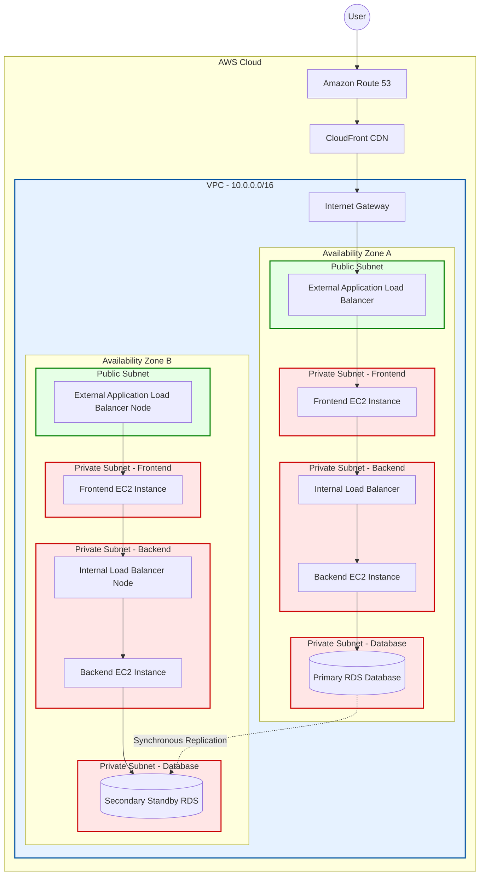
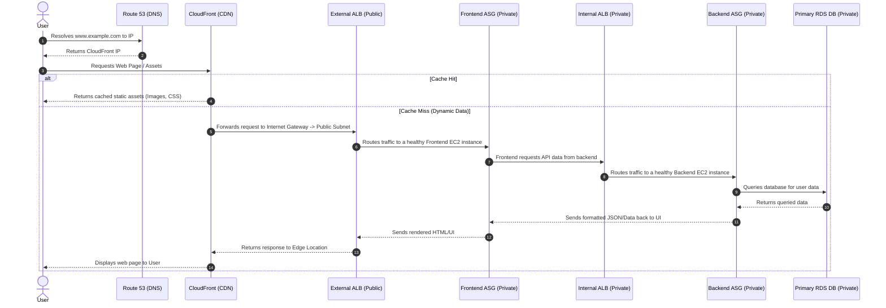

# Day 30: Three-Tier Architecture Implementation on AWS

Understanding how to design and implement a highly available, secure, and scalable **Three-Tier Architecture** is arguably the most fundamental skill for any Cloud Engineer or AWS Architect. This is the blueprint for how 90% of traditional enterprise applications are deployed in the cloud.

---

## 🎯 Interview Strategy: Read the Room
Before you start drawing diagrams on a whiteboard in an interview, you must understand what the role requires:
> **💡 The Golden Rule:** 
> * If the Job Description explicitly asks for **EC2, Auto Scaling, and traditional infrastructure**, explain the 3-Tier EC2 model (this document).
> * If the Job Description explicitly asks for **Containers, Docker, and Kubernetes**, you must explain the 3-Tier architecture using **Amazon EKS (Elastic Kubernetes Service)** instead. 
> 
> *Always tailor your architectural answer to the tools the company actually uses.*

---

## What is a 3-Tier Architecture?

To understand this, let's look at the most famous e-commerce site in the world: **Amazon.com**.

When you search for a product on Amazon, your request flows through three distinct layers:
1. **Tier 1: Presentation Tier (Frontend)**
   * This is the User Interface (UI). It's what the customer sees in their browser (HTML/CSS/React). It takes the user's input (e.g., searching for "Laptop").
2. **Tier 2: Logic Tier (Backend)**
   * This is the "brain" of the application (Java/Python/Node.js). It takes the search request from the frontend, processes the business logic, and realizes it needs to fetch product data.
3. **Tier 3: Data Tier (Database)**
   * This is where the actual data lives (MySQL/PostgreSQL). It authenticates the backend's request, queries the database for "Laptops", and sends the data back to the backend.

The backend then sends that data back to the frontend, and the user finally sees the laptop on their screen.

*(Note: Some simple applications, like a basic web-based Calculator that doesn't save user history, only require a Frontend and a Backend. This is called a **2-Tier Architecture**).*

---

## The AWS Implementation Strategy

To build this securely in AWS, we **never** put our servers on the public internet. We use a **Virtual Private Cloud (VPC)** with strict subnet routing.

### The Network Topology
* **VPC:** A private, isolated network with a defined CIDR block (e.g., `10.0.0.0/16`).
* **Public Subnet:** Used *only* for the Internet-facing Elastic Load Balancer (ELB) and NAT Gateways.
* **Private Subnet 1 (Frontend):** Houses the EC2 instances running the UI.
* **Private Subnet 2 (Backend):** Houses the EC2 instances running the application logic.
* **Private Subnet 3 (Database):** Houses the highly sensitive Amazon RDS databases.

### High Availability (Multi-AZ) & Auto Scaling
To ensure the application never goes down, we deploy the architecture across **Two Availability Zones (AZs)**:
* **Auto Scaling Groups (ASG):** Wrap the Frontend and Backend EC2 instances in ASGs. If traffic spikes, the ASG will automatically spin up more EC2 instances (Scale Out) and distribute them evenly across both AZs.
* **RDS Multi-AZ:** We provision a **Primary RDS** database in AZ-A, and a synchronous standby **Secondary RDS** database in AZ-B. If the primary database crashes, AWS automatically fails over to the secondary database without data loss.

---

## 🏗️ Architectural Block Diagram

Below is the visual blueprint of how this architecture is constructed within AWS.

---

## 🔄 The User Traffic Flow (Step-by-Step)

If an interviewer asks you to *"trace a user request from the browser to the database,"* this is the exact flow you must explain:

### Flow Breakdown for Interviews:
1. **DNS & Edge:** The user types the URL. **Route 53** resolves the domain and points the user to a **CloudFront CDN** edge location. This speeds up the loading of static assets (images/CSS) without hitting your servers.
2. **Public Entry:** Dynamic requests pass through the Internet Gateway and hit the **External Application Load Balancer (ALB)** sitting in the Public Subnet.
3. **Frontend Tier:** The External ALB distributes the traffic to the **Frontend Auto Scaling Group (EC2)** sitting securely in a Private Subnet.
4. **Backend Tier:** The Frontend instances do *not* talk directly to the Backend instances. They send requests to an **Internal ALB**. The Internal ALB distributes the load to the **Backend Auto Scaling Group (EC2)**.
5. **Database Tier:** Finally, the Backend EC2 instances securely query the **Primary RDS Database** in the deepest private subnet.
6. **The Return:** The database returns the data to the backend, the backend formats it for the frontend, and the frontend sends the final rendered website back to the user's browser.

---

## 🔒 Advanced Interview Follow-Ups

If you successfully explain the 3-Tier architecture, the interviewer will immediately try to test your depth with these three follow-up questions:

### 1. "How do you secure this architecture?" (Security Group Chaining)
**The Trap:** Junior engineers will say they allow IP addresses. 
**The Zero-to-Hero Answer:** You must use **Security Group Chaining**. 
* The **External ALB** Security Group allows inbound port 443 (HTTPS) from `0.0.0.0/0` (the internet).
* The **Frontend EC2** Security Group allows inbound traffic *only* from the External ALB's Security Group ID.
* The **Backend EC2** Security Group allows inbound traffic *only* from the Frontend EC2's Security Group ID.
* The **RDS Database** Security Group allows inbound traffic on port 3306 (MySQL) or 5432 (PostgreSQL) *only* from the Backend EC2's Security Group ID.
* **Why this matters:** This makes it physically impossible for a hacker to bypass the frontend and query your database directly.

### 2. "How do your private EC2 instances download security updates if they don't have internet access?"
**The Zero-to-Hero Answer:** You provision a **NAT Gateway** in the *Public Subnet*. You then update the Route Tables of the Private Subnets to point `0.0.0.0/0` outbound traffic to the NAT Gateway. This allows the private instances to initiate outbound connections to the internet (to download patches) while preventing the internet from initiating inbound connections to the instances.

### 3. "Our database is getting crushed by read requests. How do we fix it without upgrading the RDS instance size?"
**The Zero-to-Hero Answer:** Introduce a caching layer in the Database Tier using **Amazon ElastiCache (Redis or Memcached)**. The backend will first query ElastiCache. If the data is there (Cache Hit), it returns immediately. If not (Cache Miss), it queries RDS and then writes the result to ElastiCache for future requests. This drastically reduces the load on the primary database.

### 4. "How do you SSH into your backend servers to troubleshoot if they are in a Private Subnet?"
**The Trap:** Junior engineers will say they temporarily attach a public IP address.
**The Zero-to-Hero Answer:** You deploy a **Bastion Host (Jump Box)** in the Public Subnet. You SSH into the Bastion Host from your local machine, and from there, you SSH into the private EC2 instances. 
* *Bonus points:* Tell the interviewer you prefer to use **AWS Systems Manager (SSM) Session Manager** instead of a Bastion Host, because SSM doesn't require opening port 22 (SSH) at all, making it significantly more secure.

### 5. "How do your private backend servers download files from an S3 bucket securely?"
**The Trap:** Junior engineers will say the traffic goes through the NAT Gateway. While this works, it means your private traffic is going out over the public internet to reach S3, which is a security risk and incurs high NAT data processing fees.
**The Zero-to-Hero Answer:** You provision an **AWS VPC Endpoint (Gateway Endpoint)** for S3. This creates a private, secure tunnel inside the AWS network directly from your VPC to S3, bypassing the public internet entirely and reducing bandwidth costs.

### 6. "How do you protect your application from SQL Injection and cross-site scripting (XSS)?"
**The Zero-to-Hero Answer:** You attach an **AWS WAF (Web Application Firewall)** to the External Application Load Balancer (ALB) or to the CloudFront distribution. WAF inspects the incoming HTTP headers and body, blocking malicious payloads before they ever reach the EC2 instances.

### 7. "How does your Auto Scaling Group know when to scale out?"
**The Trap:** Most people just say "when CPU usage is high." While correct, it's basic.
**The Zero-to-Hero Answer:** The ASG is triggered by **Amazon CloudWatch Alarms**. While we can scale on CPU or Memory (Target Tracking Policies), for advanced decoupling, we can scale based on the number of messages in an **Amazon SQS Queue**. If the queue gets backed up with too many requests, CloudWatch triggers the ASG to launch more backend instances to process the backlog.
