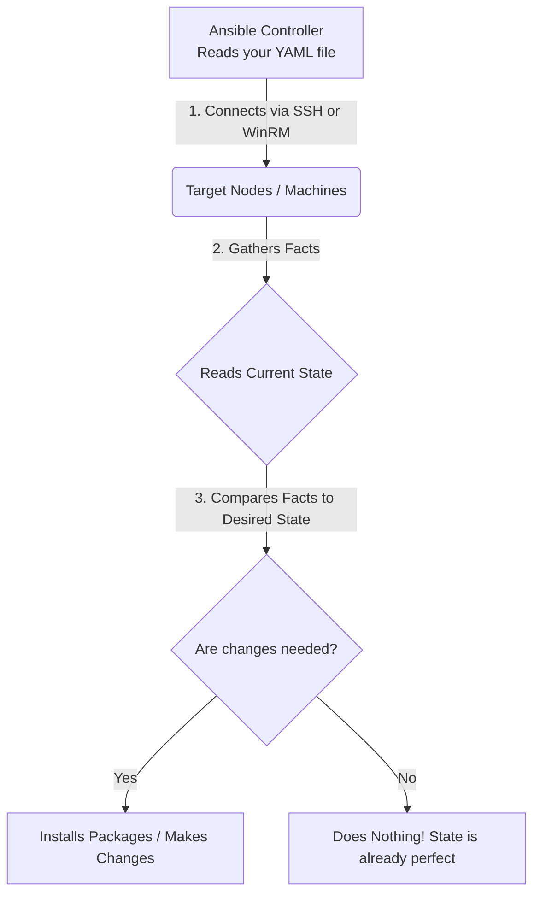

# Ansible Day 1: Introduction to Configuration Management

Welcome to a brand new DevOps pillar! We are moving away from Monitoring and stepping into the powerful world of **Automation and Configuration Management** with **Ansible**.

---

## 🤔 1. What is Configuration Management?

Imagine you just used **Terraform** to spin up 100 EC2 machines in AWS. 
Terraform's job is done. The infrastructure exists. But now what?

You need to:
1. Install Java, Python, and Git on all 100 machines.
2. Ensure the Apache Web Server service is started.
3. Create specific user accounts with specific permissions.
4. Schedule automated backups.

If you have 1 or 2 machines, you can just SSH in and type the commands manually. But if you have 100 machines, doing this manually is impossible. 

**Configuration Management** is the practice of automating these internal machine activities. 
**Ansible** is the industry-standard Configuration Management tool that automatically connects to your 100 machines and configures them simultaneously!

> [!TIP]
> **Terraform = Provisioner.** (It creates the physical servers).
> **Ansible = Configuration Management.** (It goes *inside* the servers and installs software).

---

## 🏗️ 2. The Ansible Architecture

How does Ansible actually work? You write a YAML file declaring your **Desired State** (e.g., *"I desire Apache to be installed on these 100 machines"*).

Ansible reads this file, connects to the machines, and does the work.

### The Flow of Execution


### Breaking Down the Architecture (Parent-Child Model):
1. **Parent-Child Relationship:** The Ansible Controller acts as the **Parent** machine, and all the target machines it manages are considered **Child** nodes.
2. **Connection:** The Parent connects to Linux child nodes using **SSH**, and Windows child nodes using **WinRM**.
3. **Gather Facts:** Before Ansible touches anything, the Parent gathers "facts" (reads the current configuration of the child machines).
4. **Compare & Execute:** It compares the current facts to your Desired State. If the machine already has Apache installed, Ansible does absolutely nothing! If Apache is missing, Ansible installs it. *(In interviews, this concept is called **Idempotency**).*

---

## 🥊 3. Ansible vs. Chef & Puppet (Interview Question)

Why is the entire industry using Ansible instead of older tools like Chef or Puppet? 

Interviewer: *"Compare Ansible with Chef or Puppet."*

> [!CAUTION]
> **Your Answer:**
> "Chef and Puppet are **Agent-based** and **Pull-based**. This means you have to physically install a Chef/Puppet Agent software on every single one of your 100 machines before you can even begin. Furthermore, to write configurations for them, you have to learn complex domain languages like Ruby or Python. 
> 
> **Ansible is vastly superior because:**
> 1. It is **Agentless**. You do not install *anything* on the target machines. It just uses native SSH/WinRM.
> 2. It is **Push-based**. The Ansible Controller pushes the configuration directly to the nodes.
> 3. It uses simple **YAML**, so you don't need to be a developer to use it."

> [!IMPORTANT]
> **The Golden Rule of Ansible:**
> Ansible is capable of connecting to and configuring *any* operating system (Windows or Linux). However, the **Ansible Controller itself MUST be installed on a Linux machine.** You cannot install the Ansible Controller on Windows.

---

## 🛠️ 4. Practical Lab: Installing the Ansible Controller

Let's do this practically! We need to install the Ansible Controller on a fresh Ubuntu Linux machine.

### Step 1: Create the Machine
Log into AWS and launch an EC2 instance using the **Ubuntu** AMI. 

### Step 2: Install Ansible
Ansible is built on Python, so we must install Python along with Ansible using the `apt` package manager (the "Playstore" for Ubuntu). 

> **Official Documentation Reference:** [Installing Ansible on Ubuntu](https://docs.ansible.com/projects/ansible/latest/installation_guide/installation_distros.html#installing-ansible-on-ubuntu)

Connect to your EC2 instance and run the following official commands:

```bash
# 1. Update the apt repository
sudo apt update -y

# 2. Install software-properties-common (Allows us to manage independent repositories)
sudo apt install software-properties-common -y

# 3. Add the official Ansible repository
sudo add-apt-repository --yes --update ppa:ansible/ansible

# 4. Install Ansible!
sudo apt install ansible -y

# 5. Verify the installation
ansible --version
```
*If you see the Ansible version print out, your Controller is officially ready to start managing hundreds of machines!*
