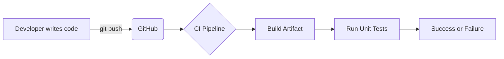
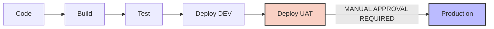
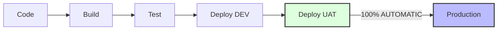
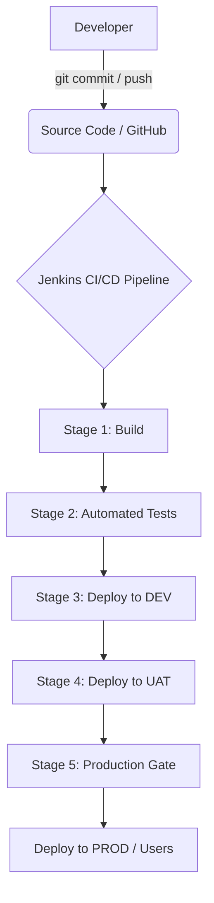
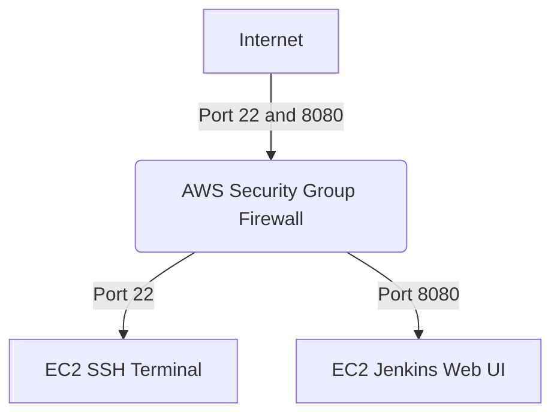

# Jenkins Day 1: Introduction to CI/CD and Jenkins Setup

Welcome to the beating heart of DevOps: **CI/CD and Jenkins!**

Today we learn how to take all the manual work out of software delivery. Instead of a developer begging an operations engineer to manually build and test their code, we build a **Pipeline** to do it automatically.

*(Note: "CI/CD" translates perfectly from your voice notes: Continuous Integration and Continuous Deployment/Delivery!)*

---

## 🔁 1. What is CI/CD?

CI/CD is a set of practices used to automate the entire lifecycle of an application, from the moment a developer writes code, to the moment it reaches the end user in production.

The main goal is to deliver software **faster, more reliably, and with less manual work**.

### 🧩 Continuous Integration (CI)
Continuous Integration focuses on the initial phases of the pipeline: **Integrating, Building, and Testing.**



Whenever a developer pushes code to Git (GitHub), the CI pipeline automatically:
1. Detects the new code.
2. Builds the code into an Artifact (like a `.jar` or Docker image).
3. Runs Automated Tests (Unit tests, Integration tests).

**Why do we need CI?**
Without CI, developers work in isolation. When they finally merge their code at the end of the month, everything breaks (Integration Hell). With CI, code is tested *every single time* they push, catching bugs instantly!

### The 5 Major Benefits of Continuous Integration
1. **Quickly detects problems:** If new code causes an issue, the pipeline flags it immediately.
2. **Faster error detection:** Bugs are found early, not at the end of the development cycle.
3. **More frequent delivery:** Code is always in a working state.
4. **Less manual work:** Developers stop wasting time manually building code.
5. **Saves development time:** Automation drastically speeds up the lifecycle.

**Easy Memory Trick:** `CI = Integrate (Build + Test)`

---

## 🚀 2. Continuous Delivery vs. Continuous Deployment (CD)

This is the most common interview question. Pay close attention!

Both extend the pipeline toward the delivery phase, taking the successfully tested artifact and deploying it to environments (DEV -> TEST -> UAT -> PROD). 

### Continuous Delivery
The application is automatically built, tested, and prepared so that it is **ready for production**, but the final push to Production requires a **Manual Approval** (e.g., a Release Manager clicking a button).



### Continuous Deployment
The application is automatically built, tested, and deployed straight to Production without ANY human intervention. If the automated tests pass, the code goes live immediately!



> [!IMPORTANT]
> **Golden DevOps Rule:**
> Continuous Delivery vs Continuous Deployment is **NOT** determined by DEV vs PROD environments. The distinction is entirely about **whether the final release requires a manual approval or is 100% automated.**
> - **Delivery:** Production is ready, but release requires approval.
> - **Deployment:** Successful changes automatically reach production.

### Feature Comparison Table
| Feature | Continuous Delivery | Continuous Deployment |
|---|---|---|
| Build | Automatic | Automatic |
| Testing | Automatic | Automatic |
| Production ready | Yes | Yes |
| Production deployment | Usually manual approval | Automatic |
| Human approval | May be required | Usually not required |
| Production release | Controlled/manual | Automatic |

---

## 🏭 3. Understanding the Pipeline and Artifacts

### The Complete CI/CD Flow
Here is the ultimate picture of how code travels from a developer's laptop to real users:



### The Pipeline
A CI/CD Pipeline is simply a sequence of automated **Stages**, exactly as pictured above!

### The Artifact
An artifact is the final output produced by the "Build" stage. It is the packaged version of the application that will be deployed to the servers.
- Examples: `.jar`, `.war`, `.zip`, Docker Image.

### Environments
A typical application is promoted through multiple environments:
- **DEV (Development):** Where initial automated tests run.
- **TEST:** Where deeper automated and manual QA testing occurs.
- **UAT (User Acceptance Testing):** Where the business or client tests the app to ensure it meets requirements.
- **PROD (Production):** The live environment with real users.

### Smoke Testing
After code is deployed to an environment (especially Production), **Smoke Tests** are executed. These are fast, high-level tests to verify that the application is basically working and healthy (e.g., "Is the login page loading?").

### Simple Real-World Example (E-Commerce)
Imagine we are developing an e-commerce website.
1. **Developer:** Writes code for a new payment feature.
2. **Git:** Developer commits and pushes the code.
3. **CI:** Jenkins detects the change, builds the code, and runs Unit Tests.
4. **Deploy:** Jenkins deploys the code to DEV.
5. **UAT:** The payment feature is tested by QA in UAT.
6. **Production:** If Continuous Delivery, it waits for Manual Approval. If Continuous Deployment, it automatically goes live to users!

---

## 🎩 4. What is Jenkins?

To build these pipelines, we need a tool. **Jenkins is an open-source automation server written in Java.**

Originally called *Hudson* (created at Sun Microsystems), it was renamed to Jenkins. It is the most widely used tool for executing CI/CD workflows.

### How does Jenkins work?
Think of Jenkins as an automation engine. It sits in the middle of your workflow, listening to GitHub. When GitHub gets new code, Jenkins automatically triggers the pipeline (Build -> Test -> Deploy).

### The Power of Plugins
Jenkins itself is just a bare engine. Its true power comes from **Plugins**. 
Plugins allow Jenkins to talk to almost any DevOps tool in existence (Git, Maven, Docker, AWS, Terraform, SonarQube, Slack).

### Alternative CI/CD Tools
While Jenkins is the most popular, other tools exist in the market:
- GitLab CI/CD
- GitHub Actions
- CircleCI
- Travis CI
- Harness
- Azure Pipelines
- AWS CodePipeline

---

## 🛠️ 5. Practical Lab: Installing Jenkins on AWS EC2

Let's build our own Jenkins server in the cloud!

### Step 1: Launch an EC2 Instance and Configure Security Group
1. Log in to AWS Console.
2. Launch a new EC2 instance (Amazon Linux 2023 or Ubuntu).
3. **Hardware Requirements:** Jenkins is heavy. Do not use a `t2.micro`! 
   - **Instance Type:** Use `t2.small` or `t3.small` (Requires at least 2GB of RAM).
   - **Storage:** Configure the EBS volume to have at least **4GB to 8GB** of storage space.

**What is a Security Group?**
An AWS Security Group acts as a virtual firewall for your EC2 instance. It controls which inbound and outbound network traffic is allowed to reach your server. 

You must configure two Inbound Rules for your Jenkins server:

1. **SSH Rule (For Terminal Access):**
   - **Type:** SSH
   - **Protocol:** TCP
   - **Port:** 22
   - **Purpose:** Allows remote terminal access to configure the server.

2. **Jenkins Rule (For Web UI Access):**
   - **Type:** Custom TCP
   - **Protocol:** TCP
   - **Port:** 8080
   - **Purpose:** Allows access to the Jenkins web interface.

> [!WARNING]
> **Production vs Development Security**
> For learning purposes, we set the Source to "Anywhere" (`0.0.0.0/0`) so you can access the UI easily. 
> In a real **production environment**, you should NEVER expose port 22 or 8080 to the entire internet. You must restrict the source to trusted IP addresses, or use a Bastion Host / VPN!



### Step 2: Connect and Install Dependencies
Connect to your EC2 instance via SSH and switch to root:
```bash
sudo su
```

Because Jenkins is written in Java, we must install Java first:
```bash
yum install java-17-amazon-corretto -y
java -version
```

### Step 3: Install Jenkins
Add the official Jenkins repository and import the security key:
```bash
sudo wget -O /etc/yum.repos.d/jenkins.repo https://pkg.jenkins.io/redhat-stable/jenkins.repo
sudo rpm --import https://pkg.jenkins.io/redhat-stable/jenkins.io-2023.key
```

Install the Jenkins package:
```bash
yum install jenkins -y
```

Start and enable the Jenkins service so it runs automatically:
```bash
systemctl start jenkins
systemctl enable jenkins
systemctl status jenkins
```

### Step 4: Unlock the Jenkins Web UI
Open your web browser and navigate to your EC2 instance's Public IP on port 8080:
```text
http://<your-ec2-public-ip>:8080
```

You will see a screen asking for the "Initial Admin Password". Jenkins locks the dashboard by default for security.

Go back to your terminal and run:
```bash
cat /var/lib/jenkins/secrets/initialAdminPassword
```
Copy that random string of text, paste it into the browser, and click **Continue**.

### Step 5: Final Setup
1. Click **"Install suggested plugins"** (Jenkins will download the most common plugins like Git and Pipeline).
Congratulations! You have successfully built a Jenkins CI/CD Automation Server from scratch!

---

## 💡 6. Master Interview & Roadmap Notes

### Networking Interview Questions
When Jenkins runs on a remote server, your browser makes an HTTP request to the server's public IP on port `8080`.

**Q: Why did you open port 8080 in the AWS Security Group?**
A: Jenkins runs on port 8080 by default, so I added an inbound TCP rule for port 8080 in the EC2 Security Group to allow access to the Jenkins web interface.

**Q: What is the default port of Jenkins?**
A: 8080.

**Q: How do you access Jenkins running on a remote server?**
A: `http://<server-public-ip>:8080`

**Q: Why do we use the IP address with port 8080?**
A: The IP address identifies the physical server, while port 8080 identifies the specific network service/application (Jenkins) listening on that server.

### One-Line Definitions for Interviews
- **Continuous Integration:** Automatically building and testing code changes whenever developers push to the repository.
- **Continuous Delivery:** Automatically preparing software so it's always ready for deployment, but requiring approval for the final release.
- **Continuous Deployment:** Automatically deploying successfully validated changes straight to production.
- **Jenkins:** An open-source automation server used to automate pipelines.
- **Pipeline:** A sequence of automated stages moving code from source control through build, test, and deploy.
- **Artifact:** The output produced by the build process (JAR, Docker Image).
- **Environment:** A separate setup where an app is developed, tested, or run (DEV, UAT, PROD).

### The Ultimate CI/CD Learning Roadmap
To master CI/CD from scratch, this is the exact path we will be following in this course:
- **Level 1 (Foundations):** Git, GitHub, version control, branching, merging.
- **Level 2 (CI/CD Fundamentals):** Pipelines, Stages, Artifacts, Delivery vs Deployment.
- **Level 3 (Jenkins Fundamentals):** Architecture, UI, Jobs, Plugins, Credentials, Agents/Nodes.
- **Level 4 (Jenkins Pipelines):** Freestyle vs Pipeline jobs, Jenkinsfile, Declarative vs Scripted, Environment Variables.
- **Level 5 (Integration):** Hooking Jenkins into Maven, Docker, SonarQube, AWS, Terraform.
- **Level 6 (Advanced CI/CD):** Multibranch pipelines, Webhooks, Blue/Green deployment, Canary deployment, Secrets management, Artifact repositories.
