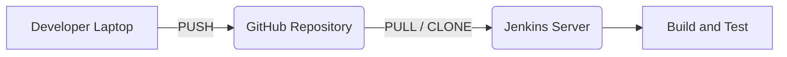

# Jenkins Day 2: GitHub Integration, Webhooks, & Freestyle Jobs

Welcome to Jenkins Day 2! Today we connect our automation server to the outside world. We are going to integrate Jenkins directly with GitHub so that every time a developer pushes code, Jenkins automatically pulls it, builds it, and tests it!

---

## 🏗️ 1. The Core Concept: Push vs. Pull

To understand CI/CD, you must understand the flow of code:



- **PUSH:** The developer creates code and *pushes* it up to the central repository (GitHub).
- **PULL:** Jenkins detects the new code and *pulls* it down into its own workspace to begin the build process.

### Pipeline Execution Flow Concept
To understand what is happening inside Jenkins, remember these simple relationships:
- `Pipeline ---> Build ---> Code`
- `Code ---> Execute ---> Output (Logs)`
- `Pipeline ---> Run ---> Execute`

> [!NOTE] 
> Jenkins does NOT store your code. GitHub stores the code. Jenkins is simply an engine that fetches the code to perform tasks on it. The **Default Path** for Jenkins on your Linux server is `/var/lib/jenkins`.

---

## 🛠️ 2. Prerequisite: Installing Jenkins & Git

If you are starting on a fresh EC2 instance, you must install Jenkins first. Run these exact commands to install Java and Jenkins automatically on Amazon Linux/RedHat:

```bash
# 1. Install Java 17
yum install java-17-amazon-corretto -y
java -version

# 2. Add Jenkins Repository and Keys
sudo wget -O /etc/yum.repos.d/jenkins.repo https://pkg.jenkins.io/redhat-stable/jenkins.repo
sudo rpm --import https://pkg.jenkins.io/redhat-stable/jenkins.io-2023.key

# 3. Install and Start Jenkins
yum install jenkins -y
systemctl status jenkins
systemctl start jenkins
systemctl status jenkins
```

### Installing Git on Jenkins
Before Jenkins can pull code from GitHub, the Jenkins server itself must have Git installed! If you forget this step, Jenkins will fail to clone your repositories.

Run this on your Jenkins EC2 instance terminal:
```bash
sudo yum install git -y
```

---

## 🚀 3. Creating Your First Pipeline (Public Repository)

Let's create a pipeline that connects to a **Public** GitHub repository.

1. Go to your Jenkins Dashboard.
2. Click **New Item** (Create Job).
3. **Name:** `MyFirstPipeline`
4. **Type:** Select **Freestyle project** and click OK.
5. **General Section:** Add a brief description.
6. **Source Code Management (SCM):**
   - Select **Git**.
   - **Repository URL:** Paste your public GitHub HTTPS URL. *(Note: Do NOT use the SSH URL for now, use HTTPS!)*
   - **Credentials:** Leave as `None` (Public repos do not require passwords).
   - **Branch Specifier:** Specify your branch (e.g., `*/main` or `*/master`).
7. Click **Save**.

### Running the Pipeline
- Click **Build Now** on the left menu.
- A new build number (e.g., `#1`) will appear in the Build History.

### Inspecting the Build
- **Console Output:** Click on the build number, then click **Console Output**. This is where you see the real-time logs. If a build fails, *always check the console logs first!*
- **Workspace:** Click **Workspace** to see the actual files Jenkins downloaded. 

**Behind the Scenes (Terminal):**
Jenkins stores all pulled code on the server. You can view it manually via SSH:
```bash
cd /var/lib/jenkins/workspace/MyFirstPipeline
ls -l
```

---

## 🔐 4. Connecting to a Private GitHub Repository

Public repos are easy, but in the real world, companies use **Private** repositories. Jenkins needs authorization to access them.

### Step A: Generate a GitHub Token
GitHub no longer allows you to use your standard account password for integrations. You must create a Personal Access Token (PAT).
1. Go to GitHub -> **Settings** -> **Developer settings** -> **Personal access tokens** -> **Tokens (classic)**.
2. Click **Generate new token**.
3. Select the `repo` scope (grants full control of private repositories).
4. Generate and **COPY the token**. (You will never see it again!).

### Step B: Create the Private Pipeline
1. Create a new Freestyle project: `MySecondPipeline`.
2. Under **Source Code Management**, select **Git**.
3. **Repository URL:** Paste the HTTPS URL of your *Private* repo.
4. **Credentials:** You will see an error in red text saying "Failed to connect". We must add our token!
   - Click **Add** -> **Jenkins**.
   - **Kind:** Username with password.
   - **Username:** Your GitHub username.
   - **Password:** Paste the GitHub Token you generated!
   - **ID:** `github-token` (a recognizable ID).
   - Click **Add**.
5. Select your newly created credential from the dropdown menu. The red error text will disappear!
6. Save and click **Build Now**.

---

## ⚡ 5. Automating the Build (Webhooks)

Right now, if a developer pushes code, Jenkins doesn't know about it unless you manually click **"Build Now"**. That is NOT automation! We need GitHub to instantly notify Jenkins the second new code arrives.

We do this using **Webhooks**.

### Step A: Configure the Webhook in GitHub
1. Go to your GitHub Repository -> **Settings** -> **Webhooks**.
2. Click **Add webhook**.
3. **Payload URL:** `http://<your-jenkins-public-ip>:8080/github-webhook/` *(Ensure you include the trailing slash!)*
4. **Content type:** `application/json`
5. Click **Add webhook**.
6. Refresh the page. If you see a green checkmark (✅), GitHub successfully pinged Jenkins!

### Step B: Configure Jenkins to Listen
1. Go to your Jenkins Pipeline configuration.
2. Scroll down to **Build Triggers**.
3. Check the box for: **"GitHub hook trigger for GITScm polling"**.
4. Save.

**The Result:** Push a code change to your GitHub repo from your laptop. Switch to your Jenkins tab and watch... the build will start completely automatically!

---

## ⏱️ 6. Alternative Automation: Poll SCM

What if your company firewall blocks Webhooks? You can use **Poll SCM**.

Instead of GitHub pushing a notification to Jenkins, Jenkins runs on a timer (like every 5 minutes) to ask GitHub: *"Do you have any new code?"*

- Under **Build Triggers**, check **Poll SCM**.
- Use **CRON Syntax** to define the schedule.
- **Example Scenarios:** 
  - `H/5 * * * *` (Poll every 5 minutes).
  - If your developers commit code between 10 AM and 5 PM, you can set a schedule to trigger a build at exactly 9:30 PM every night so the code is tested before the next morning.
- **Drawback:** It wastes resources asking GitHub constantly, even when no code has changed. Webhooks are always preferred!

---

## 🚑 7. Troubleshooting & Interview Scenarios

**Q: How is Git exactly integrated with Jenkins?**
**A:** "Jenkins is connected directly to a Git repository using the Git Plugin. When developers push their code to the repository, Jenkins is triggered (either via Webhook or Poll SCM) to retrieve the latest code. Jenkins then clones the repo into its local workspace and executes the configured pipeline steps, such as building and testing the application."

**Q: Your pipeline failed. What is the very first thing you do?**
**A:** "I will immediately open the **Console Output** logs for that specific build to identify the exact point of failure."

**Q: You see an `Authorization error` in the SCM logs. How do you fix it?**
**A:** "This means the Git credentials are wrong. I would verify that the GitHub Personal Access Token is active and correctly configured in the Jenkins Credentials manager."

**Q: The logs say `Couldn't find any revision to build`. What happened?**
**A:** "This is a Branch Name error. Jenkins is trying to pull a branch (like `master`) that doesn't exist in the repository (which might be using `main`). I will update the Branch Specifier in the Jenkins job configuration."
