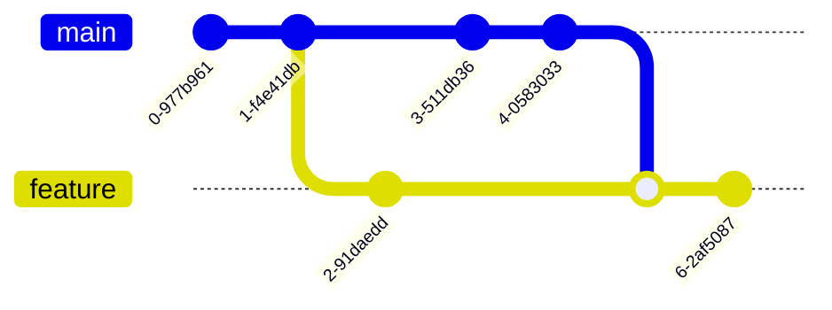
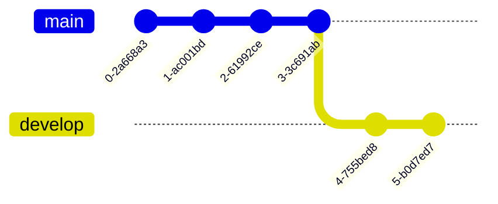

# 🔀 Git Mastery: Merge vs. Rebase (Zero to Hero)

Welcome to the ultimate guide on `git merge` and `git rebase`. These are the two ways to integrate changes from one branch into another. Understanding the difference between them is one of the most common and critical DevOps interview questions.

---

## 🎯 1. The Core Concept

**What is Rebase?**
`git rebase` is a command used to move or replay the commits of one branch on top of another branch. It is commonly used to update a development branch with the latest changes from the `main` or `master` branch.

Imagine you create a feature/develop branch off of `main`. While you are working on your feature branch, another developer finishes their work and pushes new commits to `main`. 

Now, your feature branch is **out of date**. You need to bring those new commits from `main` into your feature branch so your code doesn't conflict. 

You have two choices: **Merge** or **Rebase**.

### Easy Memory Trick
- **MERGE:** Combine histories together.
- **REBASE:** Replay my commits on top of another branch.

---

## 🔗 2. Git Merge (The Safe Way)

**Command:** `git merge main` (Run this while inside your feature branch).

### What it does:
Git takes the new commits from `main` and creates a **brand new "Merge Commit"** in your feature branch that ties the two histories together.

### The Flow:


### Pros:
- **Non-destructive:** It never changes existing history. It only adds a new commit.
- **Safe:** Because it doesn't rewrite history, it is the safest way to integrate code, especially on shared public branches.

### Cons:
- **Cluttered History:** Every time you merge, it creates a new "Merge Commit". If your team merges constantly, your git history looks like a messy spiderweb of merge commits, making it hard to read.

---

## ✂️ 3. Git Rebase (The Clean Way)

**Command:** `git rebase main` (Run this while inside your feature branch).

### What it does:
Git literally "unplugs" your feature branch, moves over to the very tip of the updated `main` branch, and plugs your feature branch back in there. It **rewrites history** to make it look like you created your feature branch *after* the new updates to `main`.

**What exactly happens?**
Suppose your commit history looks like this:
- **Master:** `c1 → c2 → c3 → c4`
- **Develop:** `c1 → c2 → c3 → d1 → d2`
*(Where c1, c2, c3 are common commits, c4 is new on master, and d1/d2 are your new work).*

When you run `git rebase master`, Git takes your `d1` and `d2` commits and replays them on top of `c4`. The final linear history becomes:
`c1 → c2 → c3 → c4 → d1' → d2'`

### The Flow:


### Why do we use Rebase?
1. To update a branch with the latest changes from master/main.
2. To keep Git history cleaner.
3. To maintain a linear history.
4. To avoid unnecessary and messy merge commits.

### Pros:
- **Perfectly Clean History:** You get a beautiful, straight, linear project history without any ugly "Merge Commits". 
- **Easy Debugging:** A linear history makes it much easier to track down exactly which commit caused a bug.

### Cons:
- **Destructive:** Rebase **rewrites history**. It literally creates brand new commit IDs for your feature commits. 
- **Dangerous on Public Branches:** NEVER rebase a public branch (like `main`) that other people are using. If you rewrite history that other developers have already downloaded, you will break their local repositories and cause massive conflicts!

---

## ⚖️ 4. The Golden Rule (When to use which?)

### Use `git rebase` when:
You are working alone on your **local private feature branch** and you want to pull in the latest changes from `main` to keep your branch up to date. This keeps your local history perfectly clean before you push.

### Use `git merge` when:
You are bringing a completed feature branch back into the public `main` branch, or when multiple people are working on the exact same branch. **Never rebase public branches!**

---

## 💻 5. Practical Lab (Zero to Hero)

Let's see the exact commands you run in the terminal.

### Scenario A: Merging `main` into your feature
```bash
# 1. Ensure you are on your feature branch
git checkout feature-login

# 2. Pull the latest code from remote main just in case
git fetch origin

# 3. Execute the merge
git merge origin/main

# 4. A text editor will pop up asking for a merge commit message. Save and exit.
# 5. Push your updated feature branch to GitHub
git push origin feature-login
```

### Scenario B: Rebasing your feature onto `main`
```bash
# 1. Ensure you are on your feature branch
git checkout feature-login

# 2. Pull the latest code from remote main
git fetch origin

# 3. Execute the rebase
git rebase origin/main

# 4. If there are conflicts, Git will pause. Fix the conflicting files in your code, then run:
git add .
git rebase --continue

# If you make a mistake and want to cancel the rebase entirely:
git rebase --abort

# 5. Because you REWROTE history, a normal push will fail! You MUST force push.
git push origin feature-login --force
```

### 🚨 The "Force Push" Warning
Notice that after a Rebase, you must run `git push --force`. This is because GitHub looks at your newly rewritten commit IDs and says, "Wait, these don't match what I have!". The force push tells GitHub to overwrite the remote history with your new clean linear history. 

*(Again, this is why you only rebase your personal local feature branches!)*

---

## 🎤 6. Master Interview Questions

**Q: What is Git Rebase?**
**A:** "Git rebase is a command used to move or replay the commits of one branch on top of another branch. It is commonly used to update a development branch with the latest changes from the main/master branch while maintaining a cleaner, linear history."

**Q: How do you handle conflicts during a Rebase?**
**A:** "When a conflict happens, the rebase process pauses. I would open my editor, fix the conflicting files, run `git add <file>`, and then run `git rebase --continue`. If things get too messy, I can always back out by running `git rebase --abort`."
