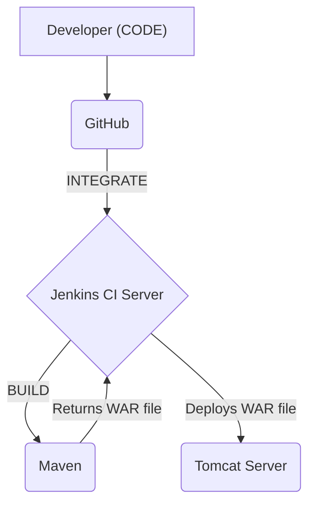

# Jenkins Day 4: Deploying a Java Application (End-to-End CI/CD)

Welcome to Jenkins Day 4! Today is a major milestone. We are going to build a complete, end-to-end CI/CD pipeline that pulls Java code from GitHub, builds it, packages it, and automatically deploys it to a live web server!

---

## 🏗️ 1. The CI/CD Architecture

Before writing pipelines, you must understand the architecture of what we are building. 
A complete pipeline flows through these stages: **`Code ---> Build ---> Test ---> Deploy`**

### Understanding the Tools
- **Git:** Stores your application code and tracks changes.
- **Maven:** Builds and manages Java projects by handling dependencies.
- **Jenkins:** Automates the CI/CD process by integrating code building, testing, and deployment.
- **Tomcat:** A popular server for hosting Java-based applications.

### The Visual Integration Flow
Based on the architecture diagram, here is how the tools interact to deploy code:




### Real-Time Scenario
Imagine a software team working on an e-commerce web application. Every time a developer updates the product catalog, they push the changes to GitHub. Jenkins automatically:
1. Pulls the updated code.
2. Builds the application using Maven.
3. Performs the unit test using Maven.
4. Deploys the new `.war` version to Tomcat.

*This process minimizes manual effort and ensures the application is always up-to-date.*

### 📦 Understanding Build Artifacts
When Maven runs a "Build", it performs three actions: `Compile -> Unit Test -> Package`.
The "Package" step bundles your code and dependencies into a single deployable file called an **Artifact**. Depending on your code, Maven generates different artifacts:
- **Plain Java Code** ➔ `.war` (Web Archive file)
- **Java + Spring Boot** ➔ `.jar` (Java Archive file)
- **Java + J2EE** ➔ `.ear` (Enterprise Archive file)

*(Note: If you use Python, React, or Node.js, the packaging process is entirely different!)*

---

## 🖥️ 2. Server Types in the Real World

In a real environment, applications are split across different types of servers. Imagine searching for `www.fb.com`:
1. **Web Servers (Apache HTTPD, Nginx, IIS):** You hit the web server first to get the static login page.
2. **App Servers (Tomcat, JBoss, GlassFish):** Once logged in, the App Server processes the dynamic logic (loading videos, chat logic).
3. **Database Servers (MySQL, MongoDB, Arango):** The App Server fetches your specific user data, mobile number, and pictures from the Database Server.

> [!IMPORTANT]
> **Interview Question:** Why do we use two different servers (one for Jenkins and one for Tomcat)?
> **Answer:** Separation of concerns and resource management! Jenkins is our **CI Server** (used only for building and testing code). Tomcat is our **Application Server** (used only for hosting the live application for users). If we ran both on the same server, heavy Jenkins builds could crash the live website, creating a terrible user experience.

---

## 🚀 3. Practical Lab Part 1: Jenkins & Maven Setup

### Step A: Provision the CI Server (Jenkins + Git)
If you are starting on a fresh EC2 instance today, you must install Jenkins and Git first! Run this exact script:

```bash
# 1. Install Java 17
yum install java-17-amazon-corretto -y
java -version

# 2. Add Jenkins Repository and Keys
sudo wget -O /etc/yum.repos.d/jenkins.repo https://pkg.jenkins.io/redhat-stable/jenkins.repo
sudo rpm --import https://pkg.jenkins.io/redhat-stable/jenkins.io-2023.key

# 3. Install Jenkins
yum install jenkins -y
systemctl start jenkins
systemctl enable jenkins
systemctl status jenkins

# 4. Install Git (Required for the pipeline)
yum install git -y
```

### Step B: Configure Maven in Jenkins
We don't manually install Maven on the Linux server. We use Jenkins Plugins to handle it so we don't face version compatibility issues!
1. Go to Jenkins Dashboard -> **Manage Jenkins** -> **Tools**.
2. Scroll down to **Maven installations** and click **Add Maven**.
3. **Name:** `mymaven`
4. Make sure "Install automatically" is checked.
5. Click **Save**.

### Step B: Create the Build Pipeline
1. Create a **New Item** (Freestyle Project) named `mydeployment`.
2. **Source Code Management:** Select Git and paste the repository URL: `https://github.com/SIVAGORAM/one.git`
3. **Branch:** Specify `*/master` (or main, depending on your repo).
4. **Build Steps:** Click **Add build step** -> **Invoke top-level Maven targets**.
5. **Maven Version:** Select `mymaven` (the one you just created).
6. **Goals:** Type `clean package`
   - *(Clean deletes old artifacts, Package compiles and runs unit tests to generate a new `.war` file).*
7. **Save** and click **Build Now**.

**Verify the Build:**
Check the **Console Output** to ensure Maven succeeded. Then click **Workspace** -> **target**. You will see your newly generated `.war` file sitting there!

---

## 🌐 4. Practical Lab Part 2: The Tomcat Server

Now we need a place to deploy that `.war` file. We need an Application Server!

### Step A: Provision the EC2 Instance
1. Launch a **NEW** EC2 instance in AWS.
2. **Instance Type:** `t3.micro` is fine for Tomcat.
3. **Security Group:** You can use the same security group you made for Jenkins (Port 22 and Port 8080 open).

### Step B: Install Tomcat via Shell Script
Connect to your new Tomcat EC2 server. We are going to create a bash script to install Tomcat automatically.

> [!TIP]
> **Important Link:** The script below downloads a specific version of Tomcat 9. If you ever need to find or download different versions of Tomcat, you can browse the official Apache archive here: [https://dlcdn.apache.org/tomcat/](https://dlcdn.apache.org/tomcat/)

```bash
vi appserver.sh
```
Paste the following commands into the file:
```bash
# Install Java
yum install java-17-amazon-corretto -y

# Download and Extract Tomcat 9
wget https://dlcdn.apache.org/tomcat/tomcat-9/v9.0.112/bin/apache-tomcat-9.0.112.tar.gz
tar -zxvf apache-tomcat-9.0.112.tar.gz

# Configure Tomcat Users and Permissions (sed commands to inject XML)
sed -i '56 a\<role rolename="manager-gui"/>' apache-tomcat-9.0.112/conf/tomcat-users.xml
sed -i '57 a\<role rolename="manager-script"/>' apache-tomcat-9.0.112/conf/tomcat-users.xml
sed -i '58 a\<user username="tomcat" password="admin@123" roles="manager-gui, manager-script"/>' apache-tomcat-9.0.112/conf/tomcat-users.xml
sed -i '59 a\</tomcat-users>' apache-tomcat-9.0.112/conf/tomcat-users.xml
sed -i '56d' apache-tomcat-9.0.112/conf/tomcat-users.xml

# Remove IP restrictions so we can access the Manager UI from anywhere
sed -i '21d' apache-tomcat-9.0.112/webapps/manager/META-INF/context.xml
sed -i '22d' apache-tomcat-9.0.112/webapps/manager/META-INF/context.xml

# Start Tomcat
sh apache-tomcat-9.0.112/bin/startup.sh
```
Save and exit the file (`:wq`). Then run the script:
```bash
sh appserver.sh
```

### Step C: Verify Tomcat
Go to your browser: `http://<tomcat-server-public-ip>:8080`. You should see the Tomcat default page!
Click on **Manager App** and log in using the credentials we injected via the script:
- **Username:** `tomcat`
- **Password:** `admin@123`

---

## 🚀 5. Practical Lab Part 3: Deploying from Jenkins to Tomcat

Now we connect the two servers. Jenkins needs to take the `.war` file it built and push it over the network to Tomcat.

### Step A: Install the Deploy Plugin
1. Go to Jenkins Dashboard -> **Manage Jenkins** -> **Plugins**.
2. Click **Available plugins** and search for: `Deploy to container`.
3. Select it and click **Install without restart**.

### Step B: Configure the Deployment Step
1. Go back to your `mydeployment` job and click **Configure**.
2. Scroll down to **Post-build Actions**.
3. Click **Add post-build action** -> **Deploy war/ear to a container**. *(If you don't see this, refresh the page so the plugin loads).*
4. **WAR/EAR files:** `target/*.war`
5. **Context path:** `ECOMERCE` *(This will be the URL path, e.g., `/ECOMERCE`)*
6. **Containers:** Click Add Container -> Select **Tomcat 9.x Remote**.
7. **Credentials:** Click **Add** -> Jenkins.
   - **Username:** `tomcat`
   - **Password:** `admin@123`
   - **ID:** `tomcat-creds`
   - Click Add, then select it from the dropdown.
8. **Tomcat URL:** Paste your Tomcat server URL (`http://<tomcat-server-public-ip>:8080`).
9. Click **Save** and click **Build Now**.

### Step C: The Final Result!
Once the build is successful, go back to your Tomcat Manager UI browser tab and refresh. 
You will see `/ECOMERCE` listed as a running application! Click on it, and you will see your live Java web application!

---

## 🔄 6. The Final Automation (Zero-Touch CI/CD)

Right now, you have to manually click "Build Now". To make this a true, zero-touch CI/CD pipeline:
1. Go to your GitHub repository and configure a **Webhook** pointing to your Jenkins Server.
2. In your Jenkins Job under **Build Triggers**, check **GitHub hook trigger for GITScm polling**.

**The True CI/CD Flow is now complete:**
A developer modifies code -> Pushes to GitHub -> Webhook triggers Jenkins -> Jenkins pulls code -> Maven runs `clean package` -> `.war` artifact is created -> Deploy to Container pushes it to Tomcat -> The live website updates automatically for users!
