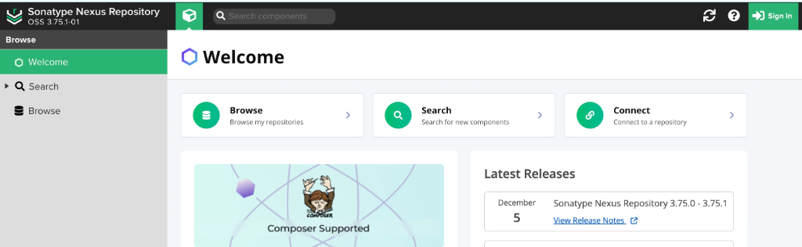
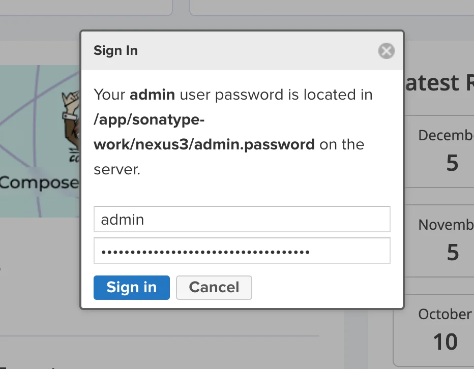
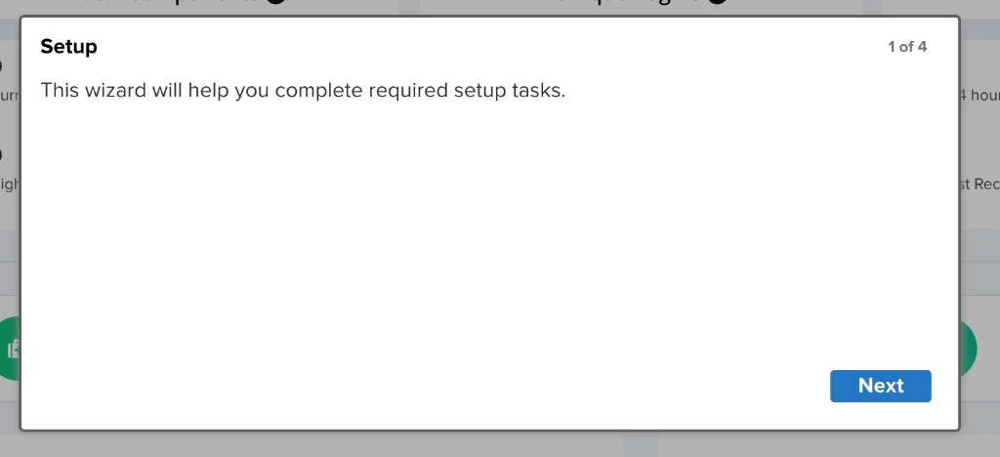
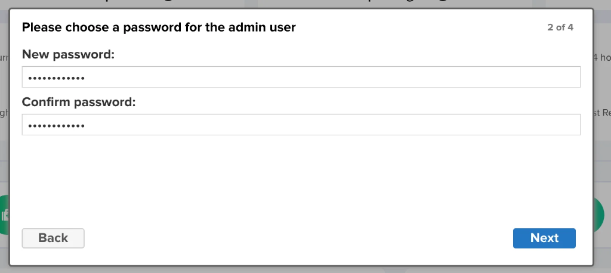
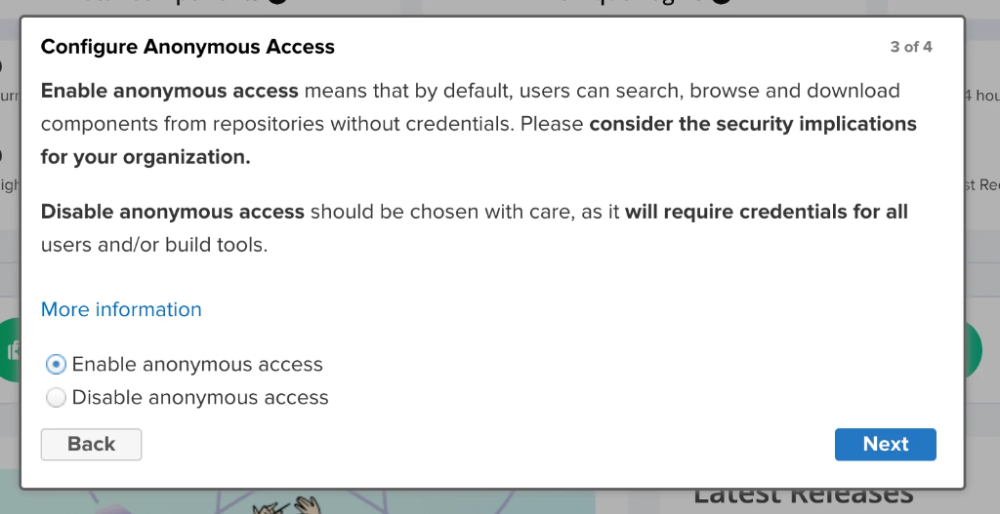
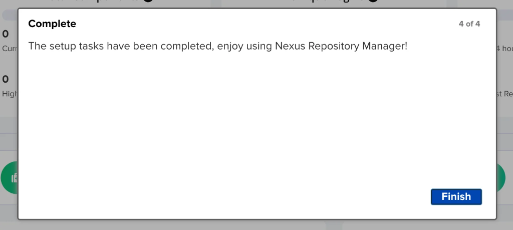
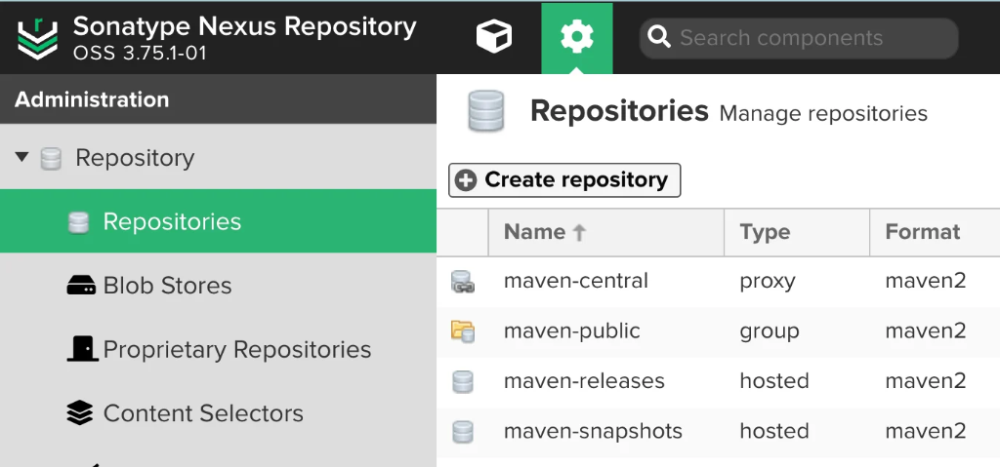
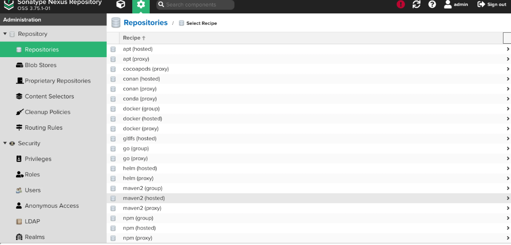

# Jenkins Day 6: Nexus Integration & Artifact Management (Zero to Hero)

Welcome to Jenkins Day 6! Today, we solve one of the biggest challenges in CI/CD: **How do we safely store our application versions so we can rollback if a deployment fails?**

---

## 🏗️ 1. The Rollback Problem

### The Scenario
Imagine your application server (Tomcat) is running `Version 1` (`v1`) of your application perfectly. Your developer updates the code to create `Version 2` (`v2`), and Jenkins automatically deploys it. 

Suddenly, `v2` crashes in production! The deployment failed. You need to immediately **rollback** to `v1`.

### The Question
Where is `v1`? When we run `mvn clean package`, Jenkins completely deletes the old target folder and overwrites it with the new build. If we don't store our generated artifacts (`.war` files) somewhere safe *before* we deploy them, we lose them forever!

### The Solution: Artifact Repositories
We need a dedicated server to store every single version of our `.war` files permanently. Popular tools for this include:
- **Nexus** (Sonatype)
- **JFrog Artifactory**
- **AWS S3**

Today, we are setting up a dedicated **Nexus Server**.

---

## 📦 2. What is Nexus?

Nexus is a powerful repository manager that helps store, manage, and retrieve build artifacts (like WAR, JAR, and Docker images). 

### Real-Time Scenario: The Banking Application
Imagine you are part of a DevOps team managing a multi-tier banking application. Without Nexus, you face severe issues:
- **Manual Handling:** Storing WAR files manually on local machines leads to lost files and inefficiencies.
- **Versioning Confusion:** It's impossible to track which specific version of the WAR file is currently deployed in production.
- **Security Risks:** Untracked storage increases the risk of data loss.

**How Nexus Fixes This:**
By integrating Jenkins with Nexus, every time Jenkins successfully builds a WAR file, it automatically pushes it to Nexus. Nexus assigns it a version number and locks it in a secure vault. If a bug is found in production, you can instantly pull the last stable version from Nexus and perform a swift rollback!

---

## 🖥️ 3. Practical Lab Part 1: Nexus Server Provisioning

Nexus is a heavy application. We must create a dedicated AWS EC2 instance specifically for it.

### Step A: Launch the EC2 Instance
- **Instance Type:** `t2.medium` (Minimum 2 CPUs & 4 GB RAM)
- **Storage:** 20 GB EBS Volume
- **Security Group:** Open Custom TCP **Port 8081** (Nexus Default Port).

### Step B: The Nexus Installation Script
Connect to your new instance and run the following commands exactly in order to install Java, download Nexus, create a dedicated user, and start the service:

```bash
# 1. Change Hostname for clarity
hostnamectl set-hostname "nexus"

# 2. Install Java 17 (Nexus Dependency)
yum install java-17-amazon-corretto -y

# 3. Create app directory and download Nexus
mkdir /app
cd /app
wget https://download.sonatype.com/nexus/3/nexus-3.86.2-01-linux-x86_64.tar.gz

# 4. Untar (Unzip) the file
tar -zxvf nexus-3.86.2-01-linux-x86_64.tar.gz

# 5. Create a dedicated Nexus user for security
useradd nexus

# 6. Change ownership of the folders to the new user
chown -R nexus:nexus nexus-3.86.2-01-linux sonatype-work

# 7. Switch to the nexus user
su - nexus

# 8. Start the Nexus Service
cd /app/nexus-3.86.2-01-linux/bin/
./nexus start

# 9. Verify it is running
./nexus status
```

---

## 🌐 4. Practical Lab Part 2: Nexus UI Configuration

Wait about 2 minutes for the heavy Nexus Java application to boot up. Then, open your browser and navigate to:
`http://<nexus-public-ip>:8081`

You will be greeted by the Nexus Welcome Screen:


### Step A: First Login & Setup Wizard
Click **Sign In** at the top right. It will prompt you for a username and password.
- **Username:** `admin`
- **Password:** You must fetch the initial security token from the server terminal!



Run this command on your Nexus EC2 instance to get the password:
```bash
cat /app/sonatype-work/nexus3/admin.password
```
Paste that token into the password box and click Sign in.

**Complete the Setup Wizard:**
1. Click **Next** to start the wizard.
   
2. Create a **New Password** for the admin account.
   
3. Select **Enable anonymous access** (This allows Jenkins to download artifacts easily without complex authentication for this lab).
   
4. Click **Finish**.
   

### Step B: The Nexus Dashboard
Once the setup is complete, you will be taken to your main Nexus Dashboard!


### Step C: Create a Repository
We need a specific "folder" (repository) inside Nexus to hold our Java WAR files.
1. Click the **Server Administration and Configuration** gear icon (top center/left).
   
2. Click **Repositories**.
   
3. Click **Create repository**.
4. Select the recipe: **maven2 (hosted)**.
   
5. **Name:** `myrepo`
6. **Deployment policy:** Change this to **Allow redeploy**.
7. Click **Create repository**.

---

## 🔗 5. Practical Lab Part 3: Jenkins to Nexus Integration

Now we must tell our Jenkins server to push the artifacts to Nexus after a successful build!

### Step A: Install the Nexus Plugin in Jenkins
1. Go to Jenkins -> **Manage Jenkins** -> **Plugins**.
2. Click **Available plugins**, search for **Nexus Artifact Uploader**, and install it.

### Step B: Create the Jenkins Pipeline
1. Create a new Freestyle job named `nexusjob`.
2. **Source Code Management:** Select Git and provide your GitHub repository URL and branch.
3. **Build Steps (Compile & Test):** Add an **Invoke top-level Maven targets** build step. Select your Maven version and enter Goal: `clean package`.
4. **Build Steps (Upload to Nexus):** Click **Add build step** and select **Nexus Artifact Uploader**. Fill out the exact details:
   - **Protocol:** `HTTP`
   - **Nexus URL:** `<nexus-public-ip>:8081`
   - **Credentials:** Click Add, select Jenkins, and enter your Nexus `admin` username and the new password you created in the wizard.
   - **GroupId:** Take this from your developer's `pom.xml`
   - **Version:** Take this from your `pom.xml`
   - **Repository:** `myrepo` (The exact name you created in Nexus)
   - **Artifacts:**
     - **ArtifactId:** Take this from your `pom.xml`
     - **Type:** `war`
     - **File:** `target/*.war` (or the exact name like `target/myweb-8.7.1.war`)

### Step C: Execute and Verify
Save the job and click **Build Now**.
If the build succeeds, Jenkins will compile the code, test it, package the `.war` file, and then *upload* it over the network to Nexus!

Go to your Nexus Dashboard, click **Browse**, click on `myrepo`, and you will physically see your `.war` file safely stored in the vault!

---

## 🔄 6. Deployment and Rollbacks

Now that your artifact is safely stored in Nexus, you can deploy it to Tomcat just like we did in Day 4 (using the `appserver.sh` script to build Tomcat and the `Deploy to container` plugin in Jenkins).

### How to Rollback Manually
If a developer pushes a bad update to GitHub, Jenkins will build it, store the bad `v2` in Nexus, and deploy it to Tomcat. The site crashes.
1. Go to Nexus and find the stable `v1` artifact.
2. Download the `v1 .war` file directly from the Nexus UI link.
3. SSH into your Tomcat server, stop the Tomcat service, delete the corrupted `v2` war file from the `webapps` folder, and manually place the `v1` file there.
4. Restart Tomcat. The site is instantly rolled back to the stable version!

*(Note: In an enterprise environment, we automate this rollback process rather than doing it manually, which we will learn later!)*
