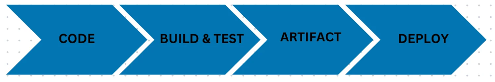
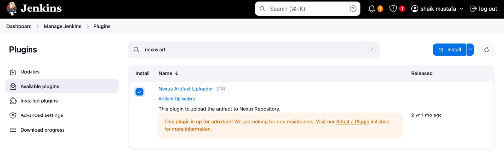
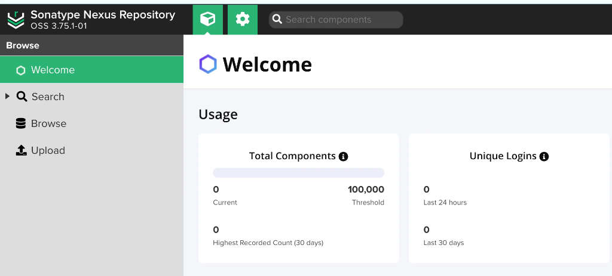

# Jenkins Day 8: Real-Time End-to-End CI/CD Pipeline (Zero to Hero)

Today's class is the absolute culmination of everything we've learned so far! We are taking all the individual tools we've mastered (Git, Maven, Nexus, Tomcat) and wiring them together into a **single, automated, real-time CI/CD Pipeline**.

By the end of this guide, you will be able to build and deploy an end-to-end enterprise application completely from scratch!

---

## 🏗️ 1. The Architecture and Flow

Our pipeline contains 4 distinct stages. Whenever a developer pushes code, Jenkins will automatically execute this entire sequence:



```text
Complete Flow
  Developer
      ↓
   GitHub
      ↓
┌─────────────┐
│    Code     │ → Git checkout
└─────────────┘
      ↓
┌─────────────┐
│    Build    │ → mvn clean package
└─────────────┘
      ↓
┌─────────────┐
│  Artifact   │ → Upload WAR to Nexus
└─────────────┘
      ↓
┌─────────────┐
│   Deploy    │ → Deploy WAR to Tomcat
└─────────────┘
```

### The 4 Stages Explained:
| Stage | Tool | Purpose |
|-------|------|---------|
| **Code** | GIT | Get the source code from GitHub |
| **Build & Test** | Maven | Compile the application and run unit tests |
| **Artifact** | Nexus | Upload and securely store the generated WAR file |
| **Deploy** | Tomcat | Deploy the WAR file to the live web server |

---

## 🚀 2. Phase 1: Infrastructure Setup (The 3 Servers)

To make this work in a real-time environment, we need strict separation of concerns. We must launch **3 separate EC2 Instances**:
1. **Jenkins Server**
2. **Nexus Server**
3. **Tomcat Server**

Log into your AWS console and launch the instances. Below are the exact scripts you can use to provision each server instantly.

### Server 1: Jenkins Installation Script
Connect to your Jenkins server and run:
```bash
# STEP-1: INSTALLING GIT
yum install git -y

# STEP-2: GETTING THE REPO (jenkins.io --> download -- > redhat)
sudo wget -O /etc/yum.repos.d/jenkins.repo https://pkg.jenkins.io/redhat-stable/jenkins.repo
sudo rpm --import https://pkg.jenkins.io/redhat-stable/jenkins.io-2023.key

# STEP-3: DOWNLOAD JAVA17 AND JENKINS
yum install java-17-amazon-corretto -y
yum install jenkins -y

# STEP-4: RESTARTING JENKINS
systemctl start jenkins.service
systemctl status jenkins.service
```
*(Access via browser: `http://<jenkins-ip>:8080`. Retrieve the admin password and install the suggested plugins.)*

### Server 2: Tomcat Installation Script
Connect to your Tomcat server and run:
```bash
yum install java-17-amazon-corretto -y
wget https://dlcdn.apache.org/tomcat/tomcat-9/v9.0.98/bin/apache-tomcat-9.0.98.tar.gz
tar -zxvf apache-tomcat-9.0.98.tar.gz

sed -i '56 a\<role rolename="manager-gui"/>' apache-tomcat-9.0.98/conf/tomcat-users.xml
sed -i '57 a\<role rolename="manager-script"/>' apache-tomcat-9.0.98/conf/tomcat-users.xml
sed -i '58 a\<user username="tomcat" password="admin@123" roles="manager-gui, manager-script"/>' apache-tomcat-9.0.98/conf/tomcat-users.xml
sed -i '59 a\</tomcat-users>' apache-tomcat-9.0.98/conf/tomcat-users.xml
sed -i '56d' apache-tomcat-9.0.98/conf/tomcat-users.xml

sed -i '21d' apache-tomcat-9.0.98/webapps/manager/META-INF/context.xml
sed -i '22d' apache-tomcat-9.0.98/webapps/manager/META-INF/context.xml

sh apache-tomcat-9.0.98/bin/startup.sh
```

### Server 3: Nexus Installation Script
Connect to your Nexus server and run:
```bash
yum install java-17-amazon-corretto -y
mkdir /app
cd /app
wget -O nexus.tar.gz https://download.sonatype.com/nexus/3/latest-unix.tar.gz
tar -zxvf nexus.tar.gz
mv nexus-* nexus
useradd nexus
chown -R nexus:nexus *

# Configure run_as_user
vim /app/nexus/bin/nexus.rc
sed -i '1s/.*/run_as_user="nexus"/' /app/nexus/bin/nexus.rc

# Start Nexus
./nexus/bin/nexus start
./nexus/bin/nexus status
```

---

## 🧩 3. Phase 2: Jenkins Configuration & Plugins

Now that our servers are running, we must configure Jenkins to talk to them.

1. Go to **Manage Jenkins** -> **Plugins** -> **Available plugins**.
2. Install the **Pipeline Stage View** plugin (This allows you to see the graphical representation of your stages).
3. Install the **Nexus Artifact Uploader** plugin.
   
4. Install the **Deploy to container** plugin. 
   *(Note: After installing the Deploy to Container plugin, you must restart your Jenkins server!)*

---

## ⚙️ 4. Phase 3: Tool and Repository Configuration

Before writing the pipeline, we must set up our tools just like we did in previous classes.

### Step A: Configure Maven in Jenkins
1. Go to **Manage Jenkins** -> **Tools**.
2. Scroll to the bottom and click **Add Maven**.
3. Name it `mymaven`, check "Install automatically", and Save.

### Step B: Create the Nexus Repository
1. Log into your Nexus server UI on port `8081`.
   
2. Go to **Server Administration** (gear icon) -> **Repositories** -> **Create repository**.
3. Select **maven2 (hosted)**.
4. Set the name to `myrepo` and change the deployment policy to **Allow redeploy**.
   

---

## 📝 5. Phase 4: The End-to-End Pipeline Script

We are finally ready! Go to Jenkins, click **New Item**, select **Pipeline**, and name it `newdeploy`.

### Using the Pipeline Syntax Generator
Do not memorize the syntax! Build your pipeline iteratively by generating the syntax, pasting it into your script, and clicking **Build Now** to test each stage:
1. **Git:** Click *Pipeline Syntax*, select `git`, paste the repo URL, and configure branches.
2. **Maven:** Go to Manage Jenkins, configure Maven, and then add the `Build` stage. Ensure stage names are different!
3. **Nexus Artifact Uploader:** Select this from the sample steps, and fill in the Protocol, Nexus URL, Credentials, GroupId (`in.javahome`), Version (`8.6.9`), Repository (`myrepo`), and ArtifactId (`myweb`).
4. **Deploy to Container:** Select the WAR file path (`target/*.war`), context path (`myapp`), add your Tomcat credentials, and enter the Tomcat URL.

### Initial Pipeline Script (Step 4)
Here is the first full iteration of the script utilizing all 4 tools:
```groovy
pipeline {
    agent any
    tools {
        maven "mymaven"
    }

    stages {
        stage('Code') {
            steps {
                git 'https://github.com/devops0014/one.git'
            }
        }
        stage ("Build") {
            steps {
                sh 'mvn clean package'
            }
        }
        stage ("Artifact") {
            steps {
                nexusArtifactUploader artifacts: [[artifactId: 'myweb', classifier: '', file: 'target/myweb-8.6.9.war', type: 'war']], credentialsId: 'nexus', groupId: 'in.javahome', nexusUrl: '54.227.157.176:8081', nexusVersion: 'nexus3', protocol: 'http', repository: 'myrepo', version: '8.6.9'
            }
        }
        stage ("Deploy") {
            steps {
                deploy adapters: [tomcat9(credentialsId: 'tomcat', path: '', url: 'http://54.156.87.218:8080')], contextPath: 'myapp', war: 'target/*.war'
            }
        }
    }
}
```

### The Final Updated Script
If you update your repository or credentials, your final script might look like this:

```groovy
pipeline {
    agent any

    tools {
        maven 'mymaven'
    }

    stages {
        stage("Code") {
            steps {
                git 'https://github.com/sivagorm/one.git'
            }
        }

        stage("Build") {
            steps {
                sh 'mvn clean package'
            }
        }

        stage("Artifact") {
            steps {
                nexusArtifactUploader artifacts: [[
                    artifactId: 'myweb',
                    classifier: '',
                    file: 'target/myweb-8.7.3.war',
                    type: 'war'
                ]],
                credentialsId: 'nexus3',
                groupId: 'in.javahome',
                nexusUrl: '3.95.167.97:8081',
                repository: 'nexus3',
                version: '8.7.3'
            }
        }

        stage("Deploy") {
            steps {
                deploy adapters: [tomcat9(
                    alternativeDeploymentContext: '',
                    credentialsId: 'appserver',
                    path: '',
                    url: 'http://44.200.104.186:8080/',
                    contextPath: 'myapp',
                    war: 'target/*.war'
                )]
            }
        }
    }
}
```

> [!IMPORTANT]
> **A Note on IPs and Credentials:** The exact Nexus/Tomcat IPs, credentials IDs, artifact names, group IDs, and versions in the script above are placeholders. **You MUST replace them** with the live IPs of your specific servers and the exact repository names you configured!

Save the script and click **Build Now**. Watch the Pipeline Stage View as it seamlessly checks out the code, builds the application, securely vaults the artifact in Nexus, and deploys the final live site to Tomcat!

---

## 🛠️ 6. Troubleshooting Guide

If your pipeline fails, do not panic! Check the Console Output and refer to this troubleshooting guide:

### Code Stage Errors
1. Git is not installed on the Jenkins server.
2. Incorrect repository configuration (Ensure you are using the correct HTTPS URL).
3. Incorrect branch configuration (e.g., specifying `master` when the branch is actually `main`).
4. Credentials validity errors (e.g., your GitHub personal access token has expired).

### Build Stage Errors
1. Missing `pom.xml` (You are running Maven in a directory without a Project Object Model).
2. Maven is not configured properly globally in your script. You must have:
   ```groovy
   tools {
       maven "mymaven"
   }
   ```
3. Typos in your shell command (e.g., `sh "mvn clean package"`).
4. Version compatibility issues with Maven and Java.

### Artifact (Nexus) Errors
1. Specifying the wrong Nexus version in the syntax generator (e.g., `nexus2` instead of `nexus3`).
2. HTTP vs HTTPS protocol mismatch.
3. Not using the live IP of the Nexus server (or the AWS Security Group port 8081 is closed).
4. Nexus credentials are incorrect or missing in Jenkins.
5. Incorrect WAR file location (`target/war` path is wrong or the file name changed).

### Deploy (Tomcat) Errors
1. Incorrect Tomcat URL (e.g., forgetting the port `8080` or HTTP prefix).
2. Invalid Tomcat credentials (The Tomcat user must have `manager-script` roles).
3. Incorrect path specified in the WAR deployment (`target/*.war` is usually safest to use).
