# Jenkins Day 9: Master-Slave Architecture & User Management

In the world of continuous integration and delivery (CI/CD), Jenkins stands as one of the most popular automation tools. One of the key features that make Jenkins powerful and scalable is its **Master-Slave Architecture**.

In this guide, we will delve into the concept, explain how it works, provide real-world scenarios to make it easier to understand, and implement it hands-on from zero to hero! We will also explore Jenkins User Management and security protocols.

---

## 🏗️ 1. What is the Master-Slave Architecture in Jenkins?

In real-time environments, we have 10-15 CI pipelines for various projects. If we run all these pipelines on a single Jenkins server, it will experience high loads, become extremely slow, and face severe performance issues. 

The **Master-Slave Architecture** is a distributed system setup in Jenkins where a master node delegates work to one or more slave nodes. This design allows Jenkins to handle large and complex build processes by distributing the load across multiple machines based on environments (e.g., Dev, Test, Prod).

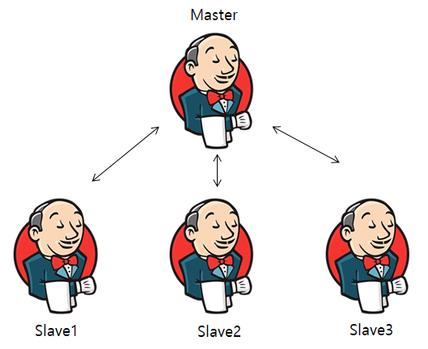

### Components of the Architecture

**The Master Node:**
- The central controller responsible for scheduling jobs.
- Maintains the build configurations, plugins, and user interfaces.
- Delegates tasks to slave nodes when necessary.

**The Slave Node:**
- A worker machine that performs tasks assigned by the master.
- Runs build jobs in its environment (e.g., Linux, Windows, macOS).
- Communicates with the master to send job statuses and logs.

---

## 🌍 2. Real-World Scenarios

### Scenario 1: Cross-Platform Builds
Imagine a software product that needs to run on multiple platforms: Windows, Linux, and macOS. You can configure Jenkins with a master node and three slave nodes, each running a different operating system. When a build is triggered, Jenkins distributes the workload to the appropriate slave based on the target platform:
- Windows builds run on the Windows slave.
- Linux builds run on the Linux slave.
- macOS builds run on the macOS slave.

### Scenario 2: High-Volume Builds
A large e-commerce company has multiple development teams working on various microservices. Each team triggers builds frequently, causing a bottleneck when all jobs are queued on a single master node. By setting up multiple slave nodes, Jenkins can distribute these builds across the slaves, significantly reducing build times:
- Microservice A’s build runs on Slave 1.
- Microservice B’s build runs on Slave 2.
- Microservice C’s build runs on Slave 3.

### Advantages of the Master-Slave Architecture
- **Scalability:** Add more slave nodes to handle increased workloads.
- **Flexibility:** Configure slaves with specific environments or tools.
- **Efficiency:** Parallel execution reduces build times.
- **Fault Tolerance:** If a slave fails, the master can redistribute tasks to other available slaves.

---

## ⚙️ 3. Setting Up a Master-Slave Configuration in Jenkins

### STEP 1: Launch 2 Instances
Go to your AWS Console and launch two EC2 instances using your Key-Pair. Name them `MASTER` and `SLAVE` (or `DEV`).
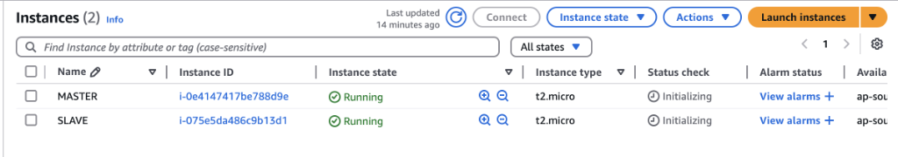

### STEP 2: Install Required Software
1. **On the Master Server:** Install Jenkins (refer to previous notes for the exact Jenkins installation script). Access the dashboard in your browser and login.

### STEP 3: Configure the Slave Node in Jenkins
1. Go to your Jenkins Dashboard -> **Manage Jenkins** -> **Nodes** (under System Configuration). Nodes or servers both are same. Alternatively, you can click "Set up an agent" directly from the dashboard.
   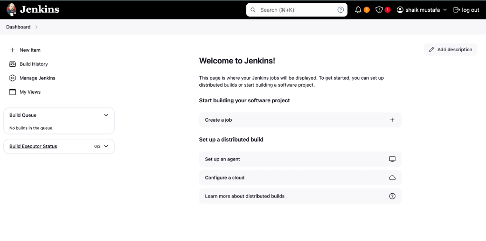
2. You will see the default `Built-In Node` (This is your Master server). Click on **+ New Node**.
   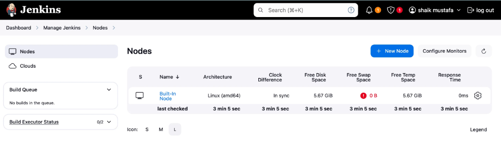
3. **Node Name:** `slave1` (or `dev`)
4. **Type:** Tick **Permanent Agent**.
   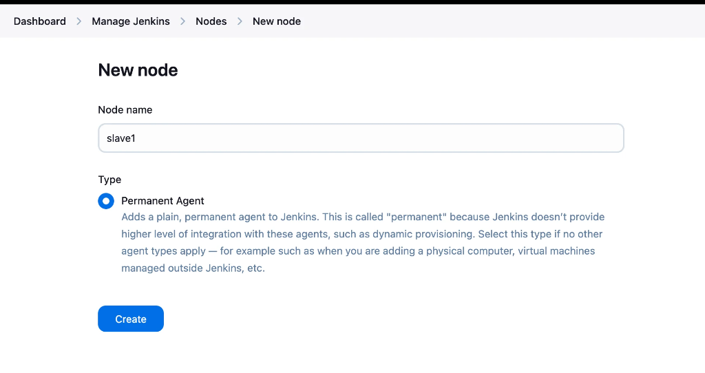
5. Click **Create** and fill in the configuration details:
   - **Number of executors:** `2` (If you give 2 parallel you can run 2 pipelines. Executors helps us to execute the number of pipelines at a time, you can execute 100 pipelines, it depends on your server capacity. Prefer to use 2 or 3).
   - **Remote root directory:** `/home/ec2-user/Jenkins` (This path is where to save all your data in your dev server, you don't have this path, you mentioned here so it will create automatically).
   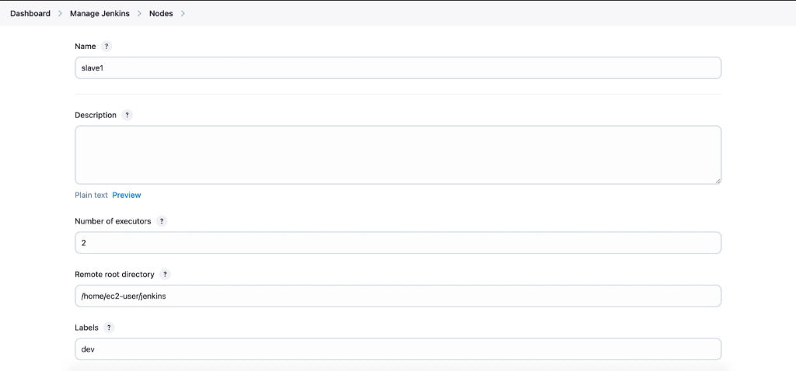
   - **Labels:** `dev`
   - **Usage:** Select `Only build jobs with label expressions matching this node`.
   - **Launch method:** `Launch agents via SSH`
   - **Host:** Enter the **Private IP** of your dev server. (You can give both public or private ip but whenever you stop and start the server the public ip changes but your private ip not changes so give private ip in host section).
   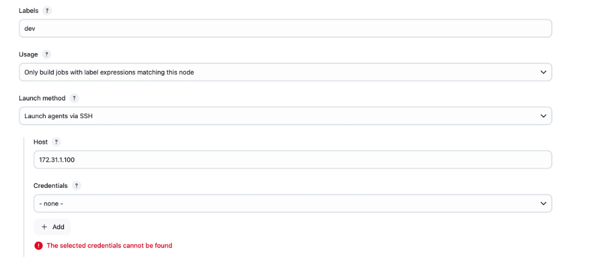
   - **Credentials:** Click *Add* -> *Jenkins* to provide the key-pair. 
     - **Domain:** `Global credentials`
     - **Kind:** `SSH Username with private key`
     - **ID:** `dev`
     - **Description:** `dev credentials`
     - **Username:** `ec2-user`
     - **Private Key:** Select *Enter directly* and paste the copied pem file data here and click on Add.
   - **Host Key Verification Strategy:** Select `Non verifying Verification Strategy` (because we already provide that credentials).
   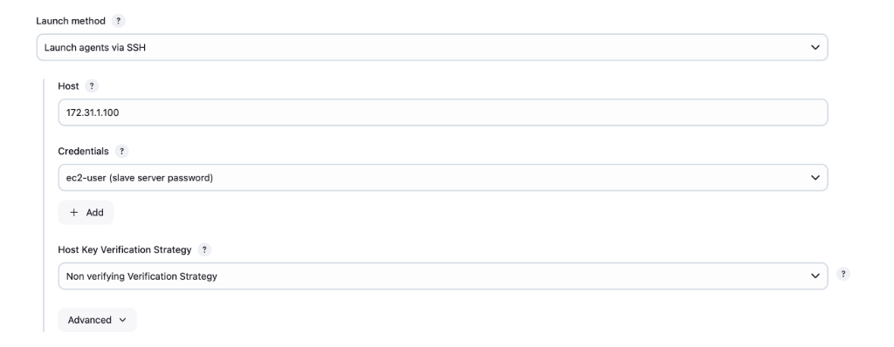
6. Click **Save**.

### 🛑 Troubleshooting Gotcha: Java is Required!
Right after clicking save, the node connection will fail! Why? **It failed because we need to install the java in our dev server**. You can see the console logs.
Go to your `dev` server terminal and run:
```bash
yum install java-17-amazon-corretto -y
```
Once installed, go back and check the node again. Your node will now launch and connect!
   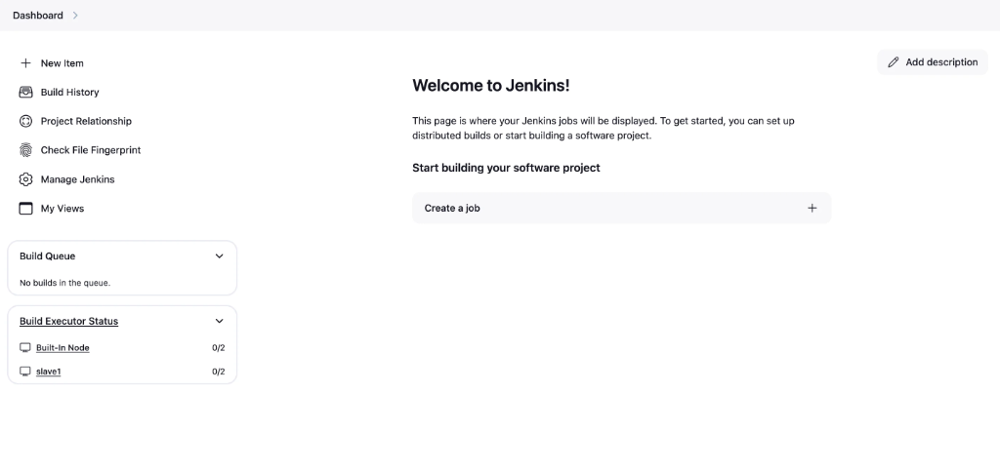

---

## 🚀 4. Running Jobs on the Slave Node

Now we have implemented the Master-Slave architecture. Let's execute jobs specifically on the `dev` slave!

### Method 1: Using Freestyle Jobs
1. Go to Jenkins Dashboard and click **New Item**.
2. Create a Freestyle project and name it `Job-1`.
   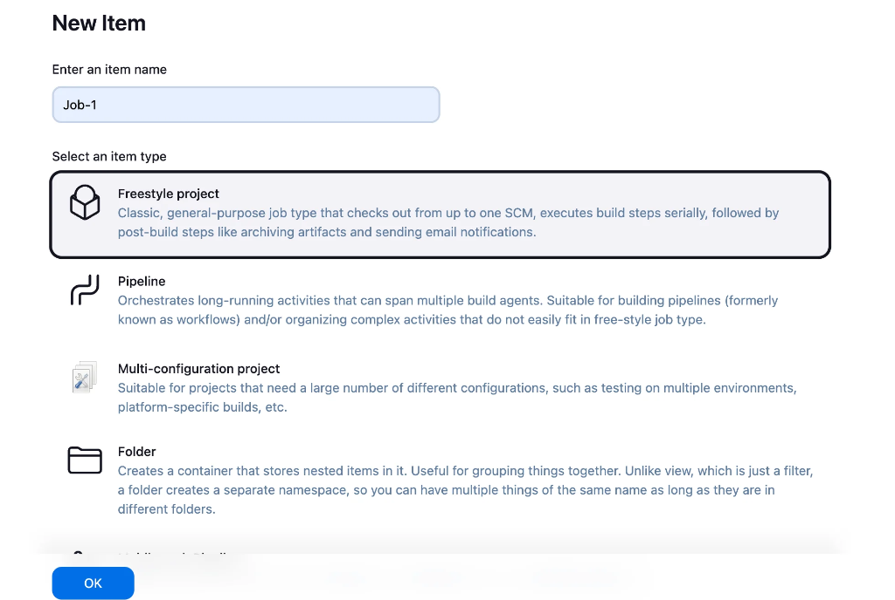
3. Configure your Git repository under the Source Code Management tab (give the repo url, select the master branch).
4. Under the **General** tab, check the box: **Restrict where this project can be run**.
5. **Label Expression:** Type `dev`. It will instantly confirm `label dev matched 1 node`.
   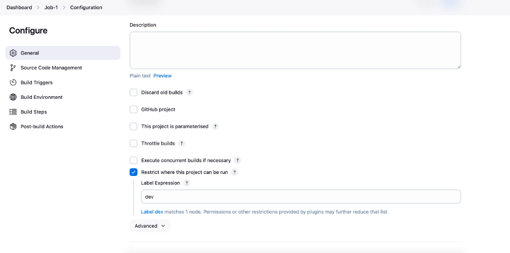
6. Click **Save** then **Build Now**. 

### 🛑 Troubleshooting Gotcha: Git is Required!
It gets failed because git is not installed in the dev server!
So go to the dev server and install git:
```bash
yum install git -y
```
Now click **Build Now** again.
   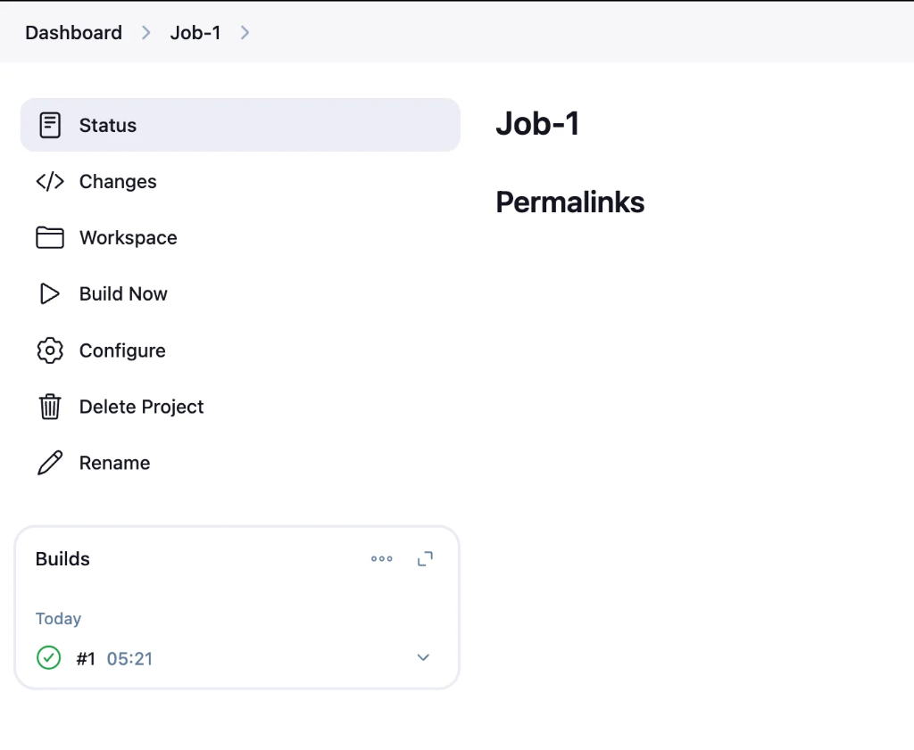

Open the Console Output. You will observe the job is executed remotely on `slave1`! You can also check the workspace path in the dev server, you can see the code.
   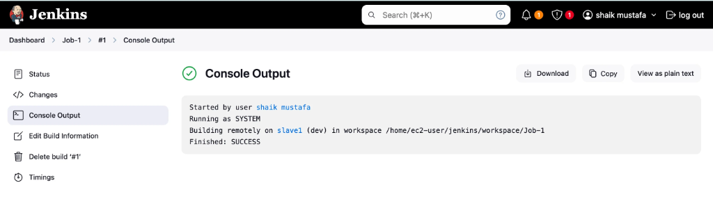

Now for the build we need Maven. Go to Tools -> add maven and save it. In build steps configure all this thing and save it, click on build now. Where we need to deploy this in dev server? In the dev server install the Tomcat and deploy it.

Now we done this in freestyle, lets do it in pipeline!

### Method 2: Using Pipeline as Code (Best Practice)
Instead of clicking through UI menus, you can explicitly target your node directly inside your Jenkinsfile script using the `agent` block:

```groovy
pipeline {
    agent {
        node {
            label 'dev'
        }
    }

    stages {
        stage("Code") {
            steps {
                git 'https://github.com/sivagorm/one.git'
            }
        }
        // Add Build, Test, Deploy stages here!
    }
}
```

---

## 🔒 5. Jenkins User Management & Security

In a real-time environment, the Jenkins dashboard is accessed by DevOps engineers, developers, testers, team leads, and managers. 

If everyone has Admin access, a junior developer might accidentally delete a production pipeline! To prevent this, we must enforce strict Role-Based Access Control (RBAC).

### Creating Users and Assigning Permissions
1. Go to **Manage Jenkins** -> **Manage Users** -> **Create User**.
2. Fill in the Username, Password, Full Name, and Email to create the account.
3. Next, go back to **Manage Jenkins** -> **Security**.
4. Under **Authorization**, select: **Project-based Matrix Authorization Strategy**.
5. Click **Add user or group**, type the exact username you just created, and assign them specific permissions (e.g., Read-Only access, or Build-Only access). Leave the Admin with full permissions!
6. Click **Save**. When that user logs in, they will only see what they are authorized to see.

### Emergency Admin Password Reset
If the admin user forgets the password, they usually go to the default user to update the password for the admin. But if the default user forgets the password, then how to reset? For this go to the terminal of your Jenkins server!

1. SSH into your **Jenkins Master** server terminal and navigate to the Jenkins directory:
   ```bash
   cd /var/lib/jenkins
   ls
   ```
2. You can see the `config.xml` file. Open it:
   ```bash
   vim config.xml
   ```
3. In the file, find the `<useSecurity>` tag. Keep that false instead of true:
   ```xml
   <useSecurity>false</useSecurity>
   ```
4. Save and continue. Whenever configuration is updated, restart the server:
   ```bash
   systemctl restart jenkins
   ```
5. Without credentials, now you can login to Jenkins! 
6. Now go to **Manage Jenkins**, click on **Security**, click on **Security Realm** and select: **Jenkins’ own user database**. Click Save.
7. Now go to **Manage Users**, select the user you want to make change password, go to security and update the password and save it!
