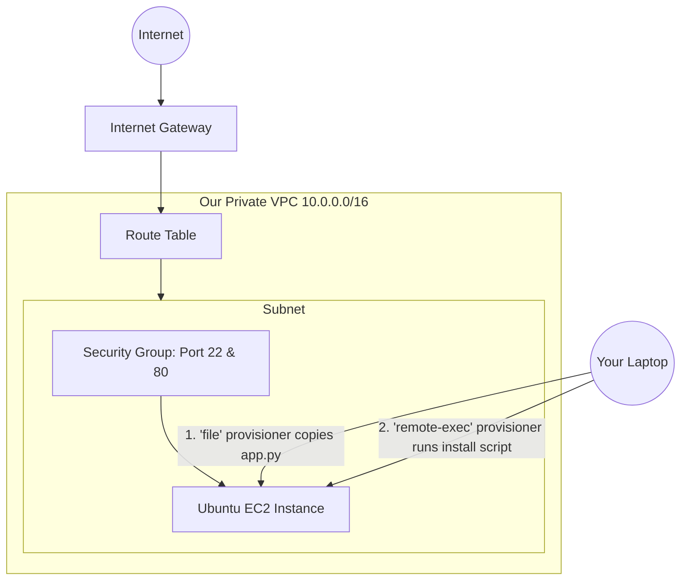

# Day 05: Terraform Provisioners (Zero to Hero)

Welcome to Day 05! Up until now, we've used Terraform to build the *outer shell* of our infrastructure (like EC2 instances and Networks). But what happens once the EC2 instance is actually built? How do we put our code inside it? How do we run installation scripts?

Today, we learn the most common real-world Terraform task: **Using Provisioners**. 
Provisioners allow us to dive *inside* the server we just built to transfer files and run terminal commands automatically!

---

## 🏗️ The Architecture We Are Building Today

Before we look at the code, let's visualize what we are actually building today. We aren't just building a server; we are building an entire isolated network, opening the firewall, and injecting a Python Flask application into the server!



---

## 🧠 Understanding Provisioners

Provisioners execute scripts on a local or remote machine as part of resource creation or destruction. There are 3 main types of provisioners:

### 1. `file` Provisioner
**What it does:** Copies files or folders from your local laptop into the newly created AWS EC2 instance.
**Real-World Scenario:** You wrote a Python web app (`app.py`) on your laptop, and you need to upload it to your new production server.
```hcl
  provisioner "file" {
    source      = "app.py"  # The file on your laptop
    destination = "/home/ubuntu/app.py"  # Where to save it on the AWS server
  }
```

### 2. `remote-exec` Provisioner
**What it does:** Logs into your new AWS EC2 instance via SSH and runs terminal commands exactly as if you were typing them yourself.
**Real-World Scenario:** Your server was just born. It is completely empty. You use `remote-exec` to tell it to run `sudo apt update` and install Python!
```hcl
  provisioner "remote-exec" {
    inline = [
      "sudo apt-get install -y python3-pip",
      "sudo pip3 install flask",
      "sudo python3 app.py &", # The '&' runs the app in the background!
    ]
  }
```

### 3. `local-exec` Provisioner
**What it does:** Runs terminal commands on *your local laptop* (the machine where you ran `terraform apply`).
**Real-World Scenario:** After Terraform builds the server, you want your laptop to automatically print the server's new IP address into a local text file for your records.
```hcl
  provisioner "local-exec" {
    command = "echo 'Server built successfully!' > status.txt"
  }
```

---

## 🚀 Step-by-Step Execution Guide

Let's build the architecture shown in the diagram above and deploy our Python app!

### Step 1: Create an SSH Key on your Laptop
Because Terraform needs to log into the AWS server to copy files and run commands, it needs an SSH key!
Open your terminal and run:
```bash
ssh-keygen -t rsa
```
*(Just press Enter to accept all the default locations).* This creates a lock (`id_rsa.pub`) and a key (`id_rsa`) on your computer.

### Step 2: The Python App (`app.py`)
In the `Day-05` folder, we created a file called `app.py`. This is a tiny Flask web server that just prints "Hello, Terraform!" to the screen. Terraform will copy this file to AWS.

### Step 3: Configure the Infrastructure (`main.tf`)
Open `main.tf`. This file is massive because it builds the *entire* network from scratch (VPC, Subnet, Gateway, Route Table, Security Group, and the EC2 server).

**⚠️ IMPORTANT CHANGES YOU MUST MAKE IN `main.tf`:**
Look for the `# CHANGE THIS` comments in the file!
1. **Key Pair Name:** Change `key_name = "terraform-demo-abhi"` to a unique name.
2. **AMI ID:** Ensure the AMI ID matches a valid **Ubuntu** image in your specific AWS Region (e.g., `us-east-1`).
3. **SSH Paths:** If you are on Windows, your SSH key path might look like `"C:/Users/YourName/.ssh/id_rsa.pub"`. Make sure the paths in `file("~/.ssh/id_rsa.pub")` and `file("~/.ssh/id_rsa")` are correct for your laptop!

### Step 4: Run the Automation!
Once your `main.tf` is updated, run the magic commands:
```bash
terraform init
terraform apply -auto-approve
```

### What happens next?
1. Terraform talks to AWS and builds the VPC, Network, and Server.
2. Terraform grabs your SSH key and securely logs into the new server.
3. The `file` provisioner uploads `app.py`.
4. The `remote-exec` provisioner installs Python, Flask, and turns on the web server!

### Step 5: Verify!
Go to your AWS Console, find the new EC2 instance, copy its **Public IP Address**, and paste it into your web browser. You will see your Python website live on the internet! 

*(Note: Don't forget to run `terraform destroy` when you are done so AWS doesn't charge you!)*
