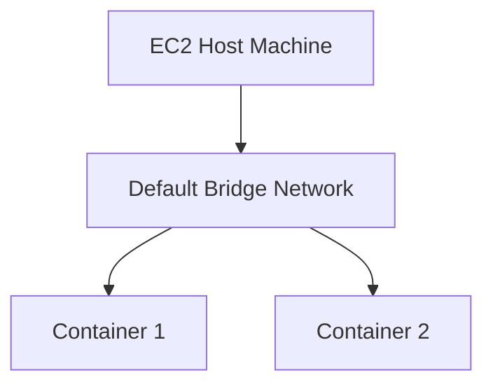
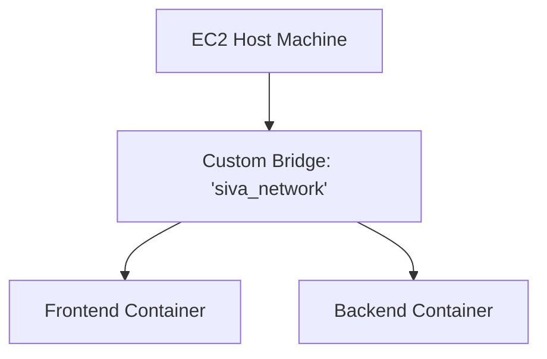
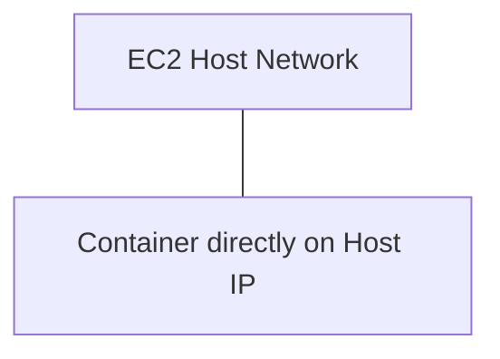
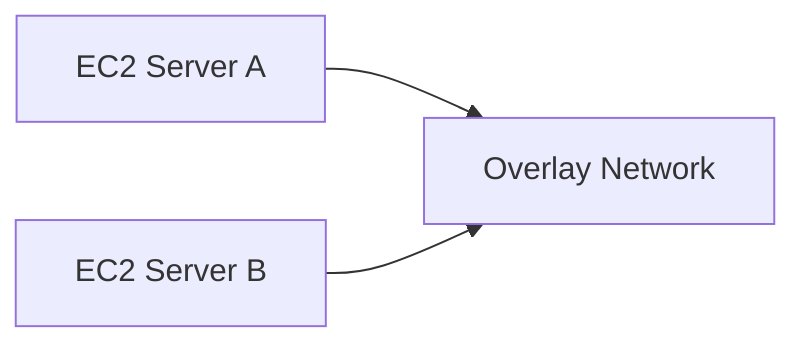

# Day 08: Docker Networking (Zero to Hero)

Welcome to Day 08! Today we tackle a critical DevOps concept: **Networking**. 

Think of a school. You have multiple different classrooms. If a student in Classroom A wants to talk to a student in Classroom B, there needs to be a hallway connecting them.
In Docker, your containers are the students. If Container A (a frontend web server) needs to talk to Container B (a backend database), they need a secure hallway. **Docker Networking provides that hallway.**

---

## 🌐 1. The 6 Types of Docker Networks

There are 6 primary network drivers in Docker. While we mostly use Bridge and Custom Bridge networks, you must know all 6 for interviews.

### 1. Bridge Network (The Default)
When you install Docker, it automatically creates a default network called `bridge`. If you start a container without specifying a network, it connects to this bridge.
*   **Use Case:** Simple, standalone containers that need to talk to each other on the same host machine.


### 2. Custom Bridge Network (Best Practice)
Instead of using the default bridge, you create your own isolated bridge network (e.g., `my_network`). 
*   **Use Case:** Highly recommended for production. Unlike the default bridge, custom bridges allow containers to talk to each other using their names (Automatic DNS resolution) instead of just IP addresses!


### 3. Host Network
Removes network isolation entirely. The container uses the exact same IP and networking stack as the EC2 Host machine.
*   **Use Case:** When you need absolute maximum network performance and no port-mapping overhead.


### 4. None Network
Total isolation. The container has no access to the outside world, no access to the host, and no access to other containers.
*   **Use Case:** Extremely high-security containers that only perform local computations (like a secure password hashing script).


### 5. Overlay Network
Connects multiple Docker daemons across *different* physical EC2 machines.
*   **Use Case:** Used in Docker Swarm or Kubernetes to allow a container on Server A to talk to a container on Server B.


### 6. Macvlan Network
Assigns a physical MAC address to a container, making it look like a physical device on your local network.
*   **Use Case:** Legacy applications that expect to be directly connected to a physical network router.

---

## 🛠️ 2. Hands-On: Exploring the Default Bridge

Let's see the default behavior of Docker networking.

1. **List all networks on your machine:**
   ```bash
   sudo su
   docker network ls
   ```
   *(You will see `bridge`, `host`, and `none` exist by default).*

2. **Start a container without defining a network:**
   ```bash
   docker run -d --name c1 ubuntu /bin/bash -c "while true; do echo hello; sleep 8; done"
   ```

3. **Inspect the default bridge:**
   ```bash
   docker inspect bridge
   ```
   *If you scroll down to the "Containers" section of the output, you will see `c1` is secretly attached to this network and has been assigned a private IP address!*

*(Before moving to the next section, delete `c1` using `docker rm -f c1`).*

---

## 🏗️ 3. Hands-On: Creating a Custom Bridge Network

If we want containers to talk to each other easily using their names, we MUST create a Custom Bridge.

1. **Create the custom network:**
   ```bash
   docker network create --driver bridge siva
   ```
   *(Run `docker network ls` and you will see `siva` is now in the list!)*

2. **Launch two containers inside the `siva` network:**
   ```bash
   docker run -d --name frontend --network siva ubuntu /bin/bash -c "while true; do echo hello; sleep 8; done"
   docker run -d --name backend --network siva ubuntu /bin/bash -c "while true; do echo hello; sleep 8; done"
   ```

3. **Test the communication using container names!**
   Let's log into the `frontend` container and try to ping the `backend` container.
   ```bash
   docker exec -it frontend /bin/bash
   
   # Ubuntu containers don't have the 'ping' command by default, let's install it:
   apt update
   apt install iputils-ping -y
   
   # Now, ping the backend using its NAME:
   ping backend
   ```
   *Success! The Custom Bridge network automatically resolves the name `backend` to its private IP address. This is why we use Custom Bridges in the real world!*

*(Type `exit` to leave the frontend container).*

---

## 🚀 4. Advanced Practical: Connecting Different Networks

What if we have two completely different networks (`net1` and `net2`), and a container in `net1` desperately needs to talk to a container in `net2`? 

By default, they are totally isolated. Let's fix that by creating a **Common Network**.

**Step 1: Create the two isolated networks**
```bash
docker network create net1
docker network create net2
```

**Step 2: Launch a container in each network**
```bash
docker run -d --name N1 --network net1 ubuntu /bin/bash -c "while true; do echo hello; sleep 8; done"
docker run -d --name N2 --network net2 ubuntu /bin/bash -c "while true; do echo hello; sleep 8; done"
```
*(Right now, `N1` and `N2` absolutely cannot talk to each other).*

**Step 3: Create the Common Bridge**
```bash
docker network create common
```

**Step 4: Connect the containers to the Common Bridge**
We will literally plug a new network cable into both containers dynamically!
```bash
docker network connect common N1
docker network connect common N2
```

**Step 5: Test the Connection**
```bash
docker exec -it N1 /bin/bash
apt update && apt install iputils-ping -y

ping N2
```
*Success! Because they both share the `common` network, the ping works perfectly.*

**Step 6: Prove the Isolation**
While still inside `N1`, press `Ctrl+C` to stop the ping. Leave the terminal open.
Open a **second terminal** to your EC2 instance and run:
```bash
docker network disconnect common N1
```
Go back to your first terminal (inside `N1`) and try to `ping N2` again.
*Failure! It hangs. The connection has been severed.*

You have now mastered Docker Networking! You understand how to isolate containers and how to securely bridge them together.
