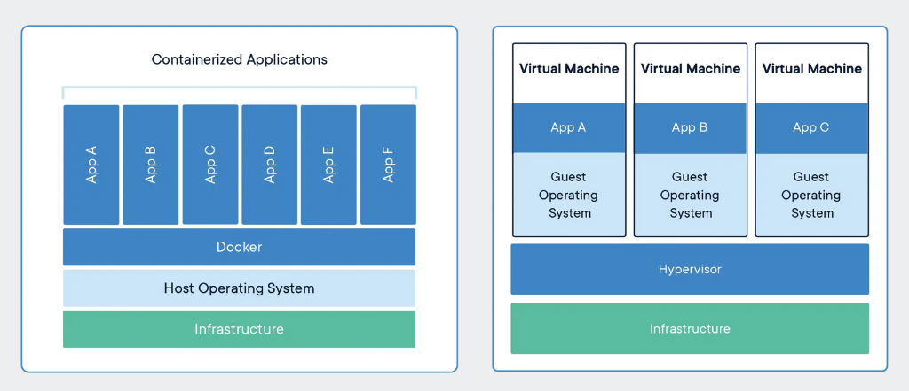
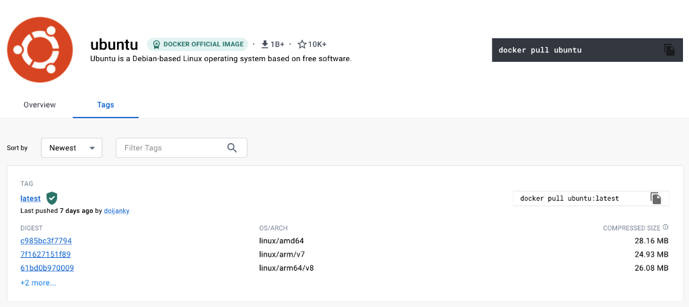
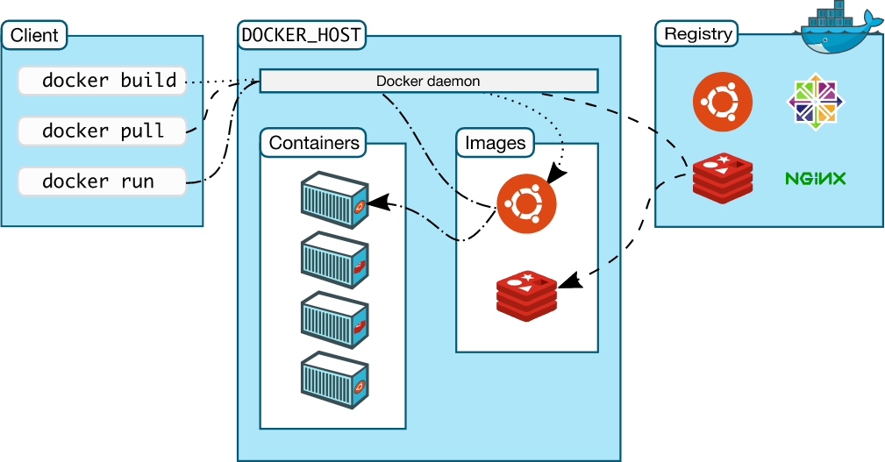
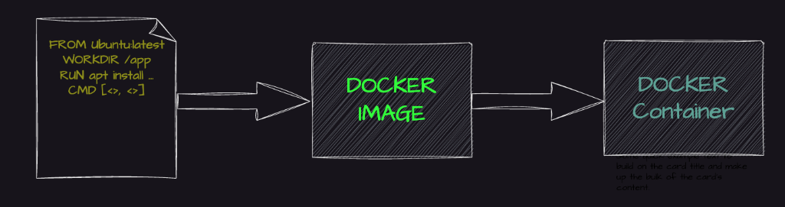

# Day 09: The Grand Recap (Architecture, Lifecycle & Deep Dive)

Welcome to Day 09! Today we are taking a step back to look at the massive picture. We are going to deeply review the architecture of Docker, how it compares to legacy systems, and summarize the entire lifecycle of a container from code to cloud.

This document serves as your ultimate cheat sheet for Docker architecture interviews!

---

## 📦 1. Containers vs Virtual Machines (VMs)

Let's start with the most common interview question: *What exactly is a container?*

A container is a bundle of your **Application**, the **Application libraries**, and the **minimum system dependencies** required to run it.



### Key Differences
1. **Resource Utilization:** Containers share the host operating system kernel, making them incredibly lighter and faster than VMs. VMs require a massive, full-fledged Guest OS and a hypervisor, making them heavily resource-intensive.
2. **Portability:** Containers are designed to run seamlessly on any system with a compatible host OS. VMs are restricted because they need a compatible hypervisor to run.
3. **Security:** VMs provide a higher level of absolute security because each VM is completely isolated with its own OS. Containers provide slightly less isolation because they share the underlying Host OS.
4. **Management:** Containers are lightning-fast to start, destroy, and manage compared to slow, heavy VMs.

---

## 🪶 2. Why are Containers so Lightweight?

Containers are tiny because they use **containerization technology** to share the host's kernel. They do not include a full operating system. They only pack what is absolutely necessary.

Let's look at a real example. Below is a screenshot of the official Ubuntu base image for Docker. Notice the size? **It's just ~28 MB!**
On the contrary, a standard Ubuntu VM image is close to **2.3 GB**. The container is nearly 100 times smaller!



### What does the Container Base Image actually contain?
- `/bin`: Binary executables (like `ls`, `cp`).
- `/sbin`: System binary executables.
- `/etc`: Configuration files.
- `/lib`: Library files for the executables.
- `/usr` & `/var`: User utilities and variable data (logs).

### What does the Container borrow from the Host OS?
If the container is so small, how does it function? It heavily borrows resources from your EC2 Host machine:
- **The File System:** Accessed via Bind Mounts (Volumes).
- **Networking Stack:** Connectivity is provided by the host.
- **System Calls:** The host's kernel handles all CPU, memory, and I/O requests.
- **Namespaces:** Provides isolated environments for the container's processes.
- **Cgroups (Control Groups):** Limits how much CPU/RAM the container is allowed to consume.

*Note: Even though it borrows from the host, it is completely isolated. Crashing the container will not crash the host!*

---

## 🧠 3. Docker Architecture

**Containerization** is the *concept*. **Docker** is the *tool* that implements that concept.



Looking at the diagram above, the **Docker Daemon** is the absolute brain of the operation. If the Docker Daemon is killed, Docker is brain dead!

### Terminology Checklist
- **Docker Daemon (`dockerd`):** The brain running on the host. It listens for API requests and manages images, containers, and networks.
- **Docker Client (`docker`):** The terminal interface you type commands into. It sends your commands directly to the Daemon.
- **Docker Registry:** The storage vault for images (like Docker Hub).
- **Dockerfile:** The blueprint script used to automate image building.
- **Images:** Immutable, read-only templates.
- **Containers:** The alive, running processes spun up from Images.

---

## 🔄 4. The Docker Lifecycle

There are three primary commands that define the entire Docker Lifecycle:



1. `docker build` $\rightarrow$ Builds an Image from a Dockerfile.
2. `docker run` $\rightarrow$ Spins up an active Container from that Image.
3. `docker push` $\rightarrow$ Pushes the custom Image to a Registry (Docker Hub) to share it with the world.

---

## 🛠️ 5. Practical Walkthrough: From Installation to DockerHub

Let's run through an entire end-to-end flow to cement this lifecycle!

### Step 1: Install and Grant Access
On your Ubuntu EC2 instance:
```bash
sudo apt update
sudo apt install docker.io -y
```

**CRITICAL STEP:** Many beginners forget to start the daemon and grant their user permissions!
```bash
# Ensure the brain is running
sudo systemctl start docker
sudo systemctl status docker

# Add your user to the Docker group (so you don't need 'sudo' every time)
sudo usermod -aG docker ubuntu
```
*(Note: You must log out and log back into your EC2 terminal for the permission change to take effect).*

Test it:
```bash
docker run hello-world
```

### Step 2: Login to Docker Hub
```bash
docker login
# Enter your username (e.g., abhishekf5) and password
```

### Step 3: Clone Code and Build the Image
```bash
git clone https://github.com/iam-veeramalla/Docker-Zero-to-Hero
cd Docker-Zero-to-Hero/examples

# Build the image using the Dockerfile in that folder
docker build -t abhishekf5/my-first-docker-image:latest .
```

Verify it was built:
```bash
docker images
```

### Step 4: Run the Container
```bash
docker run -it abhishekf5/my-first-docker-image
```
*(You will see "Hello World" print out from the container!)*

### Step 5: Push to the Cloud
Share your masterpiece with the world!
```bash
docker push abhishekf5/my-first-docker-image
```

Congratulations! You have officially mastered the architecture, mechanics, and complete lifecycle of Docker!
