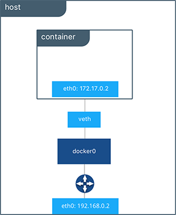
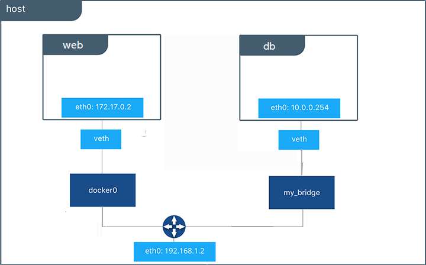
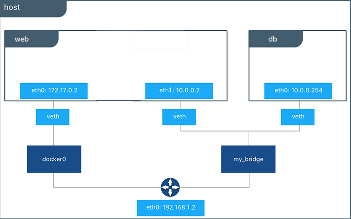

# Day 08: Docker Networking (Zero to Hero)

Networking allows containers to communicate with each other and with the host system. Containers run isolated from the host system by default, and need a specific network configuration to talk to the outside world, or other internal containers.

By default, Docker provides multiple network drivers. You can list the available networks out of the box using:

```bash
docker network ls
```

**Output:**
```text
NETWORK ID          NAME                DRIVER
xxxxxxxxxxxx        none                null
xxxxxxxxxxxx        host                host
xxxxxxxxxxxx        bridge              bridge
```

---

## 🌉 1. Bridge Networking

This is the default network mode in Docker. It creates a private, internal network between the host machine and the containers, allowing containers to communicate with each other and with the host system safely.



### Creating a Custom Bridge Network

If you want to secure your containers and completely isolate them from the default bridge network, you can create your own custom bridge network. This is highly recommended for production applications!

```bash
docker network create -d bridge my_bridge
```

Now, if you list the docker networks again, you will see your new custom network:

```bash
docker network ls
```

**Output:**
```text
NETWORK ID          NAME                DRIVER
xxxxxxxxxxxx        bridge              bridge
xxxxxxxxxxxx        my_bridge           bridge
xxxxxxxxxxxx        none                null
xxxxxxxxxxxx        host                host
```

### Isolating Containers

This new network can be attached to containers when you spin them up using the `--net` flag. 

```bash
docker run -d --net=my_bridge --name db training/postgres
```

This way, you can run multiple containers on a single host platform where one container is attached to the default network, and the other is attached to your custom `my_bridge` network. 

Because they are on different networks, **these containers are completely isolated and cannot talk to each other.**



### Bridging the Gap (Dynamic Connections)

However, Docker networks are highly dynamic. You can at any point in time attach a container to the `my_bridge` network to enable communication on the fly, without needing to restart the container!

```bash
docker network connect my_bridge web
```

Once connected, the `web` container can now securely communicate with the `db` container!



---

## 🏠 2. Host Networking

This mode allows containers to share the host system's network stack directly, bypassing Docker's network isolation entirely.

To attach a host network to a Docker container, you use the `--network="host"` option when running the container. When you use this option, the container has access to the host's network stack, and shares the host's network namespace. This means that the container will use the **exact same IP address and network configuration as the host machine itself!**

```bash
docker run --network="host" <image_name> <command>
```

> [!WARNING]
> Keep in mind that when you use the host network, the container is **less isolated** from the host system, and has access to all of the host's network resources. This can be a security risk, so use the host network with extreme caution.

Additionally, not all Docker image and command combinations are compatible with the host network, so it's important to check the image documentation or run the image with the `--network="bridge"` option (the default network mode) first to see if there are any compatibility issues.

---

## 🌍 3. Overlay Networking

This mode enables communication between containers across **multiple Docker host machines**, allowing containers to be connected to a single logical network even when they are running on entirely different physical or virtual servers. This is heavily used in clustering tools like Docker Swarm and Kubernetes!

---

## 🖥️ 4. Macvlan Networking

This mode allows a container to appear on the physical network as a physical host rather than as a container. It assigns a unique MAC address to the container, making it look like a physical hardware device on your network. This is useful for legacy applications that expect to be directly connected to the physical network router.
