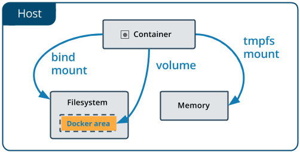

# Docker Volumes (Zero to Hero)

## ⚠️ The Problem Statement

It is a very common requirement to **persist data** in a Docker container beyond the lifetime of the container itself (like a database needing to save its records permanently). However, by default, the file system of a Docker container is entirely **ephemeral**. When the container dies or is deleted, all the data inside it is wiped out completely.

## 🛠️ The Solution

Docker solves this data persistence problem in two primary ways:

1. **Docker Volumes** (Managed by Docker)
2. **Bind Mounts** (Managed by the Host OS)

---

## 📦 1. Docker Volumes

Volumes aim to solve the persistence problem by providing a safe way to store data on the host machine's file system, entirely separate from the container's internal file system. This ensures that the data persists even if the container is destroyed and recreated.



### Managing Volumes

Volumes are fully managed by Docker and can be created using the `docker volume` command. 

To create a new, isolated volume:
```bash
docker volume create <volume_name>
```

### Mounting Volumes to a Container

Once a volume is created, you can attach (mount) it to a container using the `-v` or `--mount` flag when running a `docker run` command.

**Example:**
```bash
docker run -it -v <volume_name>:/data <image_name> /bin/bash
```
*How it works:* This command maps the Docker-managed volume `<volume_name>` to the `/data` directory inside the container. Any file written to the `/data` folder inside the container will actually be saved permanently in the volume on the host file system!

---

## 📂 2. Bind Mounts (Host Directory Mount)

Bind mounts solve the exact same problem but in a completely different way.

Instead of having Docker manage a hidden volume folder, a **Bind Mount** allows you to explicitly pick a specific directory from your host operating system (like `/home/ubuntu/my_code`) and mount it directly into the container.

Bind mounts share the exact same behavior as volumes, but they are specified using an explicit **host path** instead of a volume name.

**Example:**
```bash
docker run -it -v <host_path>:<container_path> <image_name> /bin/bash
```

---

## ⚖️ Key Differences: Volumes vs. Bind Mounts

| Feature | Docker Volumes | Bind Mounts |
| :--- | :--- | :--- |
| **Management** | Managed entirely by the Docker API. | Managed manually by the Host OS User. |
| **Flexibility** | Highly flexible. Can be backed up, migrated between hosts, and shared easily. | Less flexible. Tied to the specific directory structure of the current host machine. |
| **Best Use Case**| Complex use cases where you need Docker to safely manage and isolate persisted data (e.g., Databases). | Simple use cases where you need to quickly map a local folder to a container (e.g., Live-reloading source code). |

In a nutshell: **Bind Mounts** are appropriate for simple tasks where you want to mount a local directory into a container, while **Volumes** are the industry standard for production use cases where you need strict control over the data being persisted.
