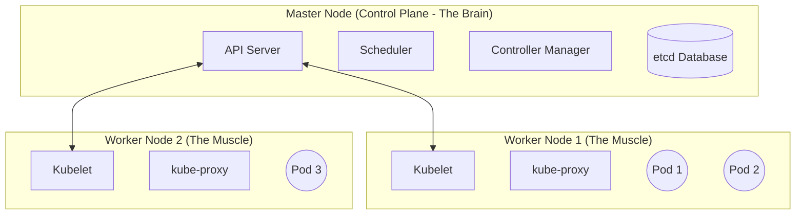

# Day 02: Kubernetes Architecture & Installation (Zero to Hero)

Before we start typing commands, we must understand exactly *how* Kubernetes works under the hood. In enterprise interviews, architects will test your knowledge of the Control Plane and Worker Nodes.

##  1. What is a Kubernetes Cluster?
A **Cluster** is simply a group of servers (virtual machines or physical machines) that are connected together to run containerized applications. 

In Kubernetes, a cluster is split into two distinct roles: **Master Nodes** and **Worker (Slave) Nodes**.



###  The Master Node (Control Plane)
The Master Node is the manager. It never runs your application directly. Its only job is to manage the cluster, make decisions, create Pods, and monitor the health of the Worker nodes. 
- *Whatever the Master Node says, the Worker Nodes must follow!*

> [!TIP]
> **Interview Question: What happens if the Master Node crashes?**
> In a real-time production environment, we NEVER have just one Master Node. We use **High Availability (HA)**. We configure a **Primary Master Node** and multiple **Secondary Master Nodes**. The secondary nodes are constantly syncing data with the primary. If the Primary Master crashes, a Secondary Master instantly takes over automatically!

###  The Worker (Slave) Node
The Worker Node is where your actual application lives. It receives instructions from the Master Node (e.g., "Start 3 Nginx containers") and executes them using the local Docker Daemon.

---

##  2. What is a Pod?
You might hear people say, *"A pod is just a container."* This is partially true, but we need to be exact for interviews!

In Docker, you run a Container. 
In Kubernetes, **you cannot run a container directly.** 
Instead, Kubernetes wraps your container inside a logical boundary called a **Pod**. 
- A Pod is the smallest deployable unit in Kubernetes.
- Usually, there is a 1:1 relationship (One Pod contains One Container).
- The Master Node is responsible for creating, deleting, and managing Pods.

---

##  3. How to Setup a Kubernetes Cluster
There are two primary ways to create a Kubernetes cluster:

### A. Self-Managed Clusters (Free, but manual)
You rent raw EC2 instances, and you are responsible for installing and configuring Kubernetes on them yourself. 
- **Minikube:** A specialized testing tool that runs both the Master Node and the Worker Node on a *single machine*. (Perfect for learning, terrible for production).
- **Kubeadm / KIND / KOPS:** Enterprise tools that allow you to set up a true multi-node cluster (One Master machine, and multiple separate Worker machines).

### B. Managed Clusters (Costly, but effortless)
You do not create the Master Node. The Cloud Provider manages the entire Control Plane for you. You just click a button, and you instantly have a production-ready cluster.
- **AWS:** EKS (Elastic Kubernetes Service)
- **Azure:** AKS (Azure Kubernetes Service)
- **GCP:** GKE (Google Kubernetes Engine)

---

##  Lab 1: Installing Minikube (Self-Managed)
To practice Kubernetes locally, we will use Minikube. 
*(Reference Blog: [Installing Minikube on Ubuntu](https://medium.com/@areesmoon/installing-minikube-on-ubuntu-20-04-lts-focal-fossa-b10fad9d0511))*

**Prerequisites:** 
1. Log into AWS Console and launch an EC2 Instance.
2. OS: **Ubuntu 20.04 or 22.04**
3. Instance Type: **t2.medium** *(Minikube strictly requires at least 2 vCPUs and 4GB RAM).*
4. Connect to your instance via MobaXterm or SSH.

**Step 1: Switch to Root & Update**
```bash
sudo su
apt update -y
```

**Step 2: Install Docker**
*(Kubernetes needs a container runtime to actually run the containers!)*
```bash
apt install docker.io -y
systemctl start docker
systemctl enable docker
systemctl status docker
```

**Step 3: Install `kubectl` (The Kubernetes CLI)**
*(This is the tool we use to talk to the Master Node)*
```bash
curl -LO "https://dl.k8s.io/release/$(curl -L -s https://dl.k8s.io/release/stable.txt)/bin/linux/amd64/kubectl"
install -o root -g root -m 0755 kubectl /usr/local/bin/kubectl
kubectl version --client
```

**Step 4: Install Minikube**
```bash
curl -LO https://storage.googleapis.com/minikube/releases/latest/minikube-linux-amd64
install minikube-linux-amd64 /usr/local/bin/minikube
```

**Step 5: Start the Cluster**
Because we are running as root on a raw EC2 instance, we must tell Minikube to use the Docker driver with root privileges:
```bash
minikube start --driver=docker --force
```
Congratulations! You now have a working Kubernetes cluster on a single EC2 instance!

---

##  Lab 2: Introduction to AWS EKS (Managed)
If you are deploying to production on AWS, you will use EKS. 
*(Reference Blog: [Setup Kubernetes Cluster on Amazon EKS](https://medium.com/@mudasirhaji/setup-kubernetes-cluster-on-amazon-eks-56cbbadace04))*

Instead of manually installing Master nodes, you use the official AWS `eksctl` tool from your terminal. 

**Step 1: Install AWS CLI**
You need the AWS CLI to authenticate your terminal with your AWS Account.
```bash
curl "https://awscli.amazonaws.com/awscli-exe-linux-x86_64.zip" -o "awscliv2.zip"
sudo apt install unzip -y
unzip awscliv2.zip
sudo ./aws/install
```

**Step 2: Configure AWS Credentials**
*(You will need your AWS IAM Access Key and Secret Key!)*
```bash
aws configure
```

**Step 3: Install `kubectl`**
```bash
curl -LO "https://dl.k8s.io/release/$(curl -L -s https://dl.k8s.io/release/stable.txt)/bin/linux/amd64/kubectl"
sudo install -o root -g root -m 0755 kubectl /usr/local/bin/kubectl
```

**Step 4: Install `eksctl`**
*(This is the magical tool that builds the cluster for you)*
```bash
curl --silent --location "https://github.com/weaveworks/eksctl/releases/latest/download/eksctl_$(uname -s)_amd64.tar.gz" | tar xz -C /tmp
sudo mv /tmp/eksctl /usr/local/bin
eksctl version
```

**Step 5: Create the Production Cluster**
*Note: EKS charges you ~$72/month just for the Master Node, plus the cost of the EC2 Worker Nodes. Do not run this command unless you intend to pay for it!*
```bash
# This single command tells AWS to build a highly available Master Node, 
# and provision two t3.medium EC2 instances as Worker Nodes!
eksctl create cluster \
  --name my-production-cluster \
  --region us-east-1 \
  --nodegroup-name standard-workers \
  --node-type t3.medium \
  --nodes 2 \
  --nodes-min 1 \
  --nodes-max 3
```

With EKS, AWS handles the backups, the database (`etcd`), and the Master Node scaling automatically!

