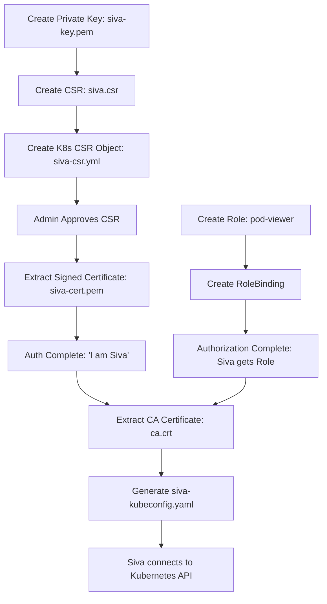

# Day 18: RBAC & User Authentication

Welcome to Day 18! If you have multiple teams (Dev, QA, Prod) working on the same Kubernetes cluster, you cannot give everyone full Administrator access. If a junior developer accidentally deletes the Production Namespace, your company is in massive trouble!

Just like AWS has IAM (Identity and Access Management), Kubernetes has **RBAC (Role-Based Access Control)**.

Today, we learn how to create a restricted User from scratch, define exactly what they can do, and give them a Kubeconfig file to log in.

---

## 🔐 1. The Core RBAC Concepts

Before we create a user, you must understand the two halves of RBAC: **Roles** and **RoleBindings**.

### Role vs ClusterRole (WHAT can you do?)
A Role defines the actual permissions.
- **Role:** Permissions restricted to **ONE specific Namespace** (e.g., "Can read Pods in the Dev namespace only").
- **ClusterRole:** Permissions across the **ENTIRE Cluster** (e.g., "Can read Pods in Dev, QA, and Prod").

*(Important: Creating a Role does NOT give anyone access. It is just a floating rulebook).*

### RoleBinding vs ClusterRoleBinding (WHO can do it?)
A Binding is the glue. It takes a Role, and assigns it to a User.
- **RoleBinding:** Attaches a `Role` to a User inside a specific Namespace.
- **ClusterRoleBinding:** Attaches a `ClusterRole` to a User across the entire cluster.

**The Golden Rule:**
- **Role** = "WHAT are the permissions?"
- **RoleBinding** = "WHO gets these permissions?"

---

## 🧑‍💻 2. The Complete End-to-End User Access Flow

Unlike AWS, Kubernetes does not have a "Create User" button. We have to manually generate Cryptographic Keys, get them signed by Kubernetes, attach RBAC rules, and generate a Kubeconfig file.

Let's onboard a new developer named **Siva**. We want Siva to only be able to view Pods in the `dev` namespace.

### Step 1: Authentication (Who is Siva?)
First, we create a Private Key and a Certificate Signing Request (CSR) for Siva on our local machine.

```bash
# 1. Generate Siva's Private Key
openssl genrsa -out siva-key.pem 2048

# 2. Generate the CSR (This tells Kubernetes the username is "siva")
openssl req -new -key siva-key.pem -out siva.csr -subj "/CN=siva"

# 3. Base64 Encode the CSR so Kubernetes can read it
cat siva.csr | base64 | tr -d '\n'
```

*Copy the massive Base64 string that outputs from the last command.*

Now, open `siva-csr.yml` (provided in this folder) and paste that Base64 string into the `request:` field.

```bash
# 4. Submit the CSR to Kubernetes
kubectl apply -f siva-csr.yml

# 5. Check the status (It will say 'Pending')
kubectl get csr

# 6. The Cluster Admin approves the request
kubectl certificate approve siva-csr

# 7. Check the status again (It will now say 'Approved,Issued')
kubectl get csr

# 8. Extract the newly signed Certificate
kubectl get csr siva-csr -o jsonpath='{.status.certificate}' | base64 --decode > siva-cert.pem
```
**Result:** We now have `siva-key.pem` and `siva-cert.pem`. Siva officially exists in Kubernetes!

### Step 2: Authorization (What can Siva do?)
Right now, Siva exists, but he has zero permissions. Let's give him access to read Pods in the `dev` namespace.

```bash
# 1. Create the Namespace
kubectl create namespace dev

# 2. Apply the Role (Check role.yml)
kubectl apply -f role.yml

# 3. Apply the RoleBinding (Check rolebinding.yml)
kubectl apply -f rolebinding.yml
```

### Step 3: Generating the Kubeconfig (How does Siva connect?)
Siva needs a `kubeconfig` file to give to his `kubectl` CLI so it knows how to talk to the cluster.

```bash
# 1. Get the Cluster's API Server URL and copy it:
kubectl config view --raw -o jsonpath='{.clusters[0].cluster.server}'

# 2. Extract the Cluster's CA Certificate:
kubectl config view --raw -o jsonpath='{.clusters[0].cluster.certificate-authority-data}' | base64 --decode > ca.crt

# 3. Build the Kubeconfig file piece by piece!
# (Replace <URL> below with the URL from step 1)

kubectl config --kubeconfig=siva-kubeconfig.yaml set-cluster my-cluster --server=<URL> --certificate-authority=ca.crt

kubectl config --kubeconfig=siva-kubeconfig.yaml set-credentials siva --client-certificate=siva-cert.pem --client-key=siva-key.pem

kubectl config --kubeconfig=siva-kubeconfig.yaml set-context siva-context --cluster=my-cluster --user=siva --namespace=dev
```

### Step 4: Testing Siva's Access!
Before we give Siva the file, we can test it using the context we just created!

```bash
# 1. Set the active context to Siva's context
kubectl config --kubeconfig=siva-kubeconfig.yaml use-context siva-context

# 2. Test fetching pods
kubectl --kubeconfig=siva-kubeconfig.yaml get pods -n dev
```

We can also use `auth can-i` to verify exactly what permissions Kubernetes is granting him under the hood:

```bash
# Test 1: Can Siva read pods in Dev? (Expected: yes)
kubectl --kubeconfig=siva-kubeconfig.yaml auth can-i get pods -n dev

# Test 2: Can Siva DELETE pods in Dev? (Expected: no)
kubectl --kubeconfig=siva-kubeconfig.yaml auth can-i delete pods -n dev

# Test 3: Can Siva read pods in the Default namespace? (Expected: no)
kubectl --kubeconfig=siva-kubeconfig.yaml auth can-i get pods -n default
```

---

## 🗺️ 3. The Big Picture (How Everything Connects)

If you get lost, always remember the "Big Three" concepts of Access Management:

1. **Certificate** (Authentication) = *WHO ARE YOU?* -> "I am Siva."
2. **Role + RoleBinding** (Authorization) = *WHAT CAN YOU DO?* -> "Siva can get/list pods in Dev."
3. **Kubeconfig** (Connection) = *HOW DO YOU CONNECT?* -> "API Server + CA + Certificate + Key."



---

## 🧠 4. Zero-to-Hero Bonus: Interview Gotchas
If you want to ace a senior-level Kubernetes interview, you must understand the deep architecture of RBAC and Kubeconfigs. Here are three massive concepts you need to know:

> [!CAUTION]
> **Gotcha 1: Kubernetes does NOT have a "User" database!**
> You might wonder why we had to use complex OpenSSL certificates to create Siva instead of just running `kubectl create user siva`. 
> That is because **Kubernetes does not manage humans!** It offloads human authentication to external systems (like Certificates, AWS IAM, or Active Directory). 
> However, Kubernetes *does* manage robot users (called **ServiceAccounts**). Humans use Users; Pods and CI/CD pipelines use ServiceAccounts!

> [!TIP]
> **Gotcha 2: Kubeconfig Contexts (`use-context`)**
> A `kubeconfig` file is incredibly powerful. It does not just hold one user for one cluster. A single `kubeconfig` file can hold 10 different Clusters, 10 different Users, and map them together using **Contexts**. 
> In a real DevOps job, you will use `kubectl config use-context prod-cluster` to instantly switch your CLI terminal from talking to the Dev environment, to talking to the Production environment!

> [!IMPORTANT]
> **Gotcha 3: The God-Mode File (`admin.conf`)**
> When you first build a Kubernetes cluster, it generates a file at `/etc/kubernetes/admin.conf`. 
> **Never share this file with anyone!** This is the master God-mode kubeconfig. It completely bypasses all RBAC restrictions and gives whoever holds it full Administrator control over the entire cluster. Always generate restricted CSR-based Kubeconfigs (like we did in the lab above) for your developers!
