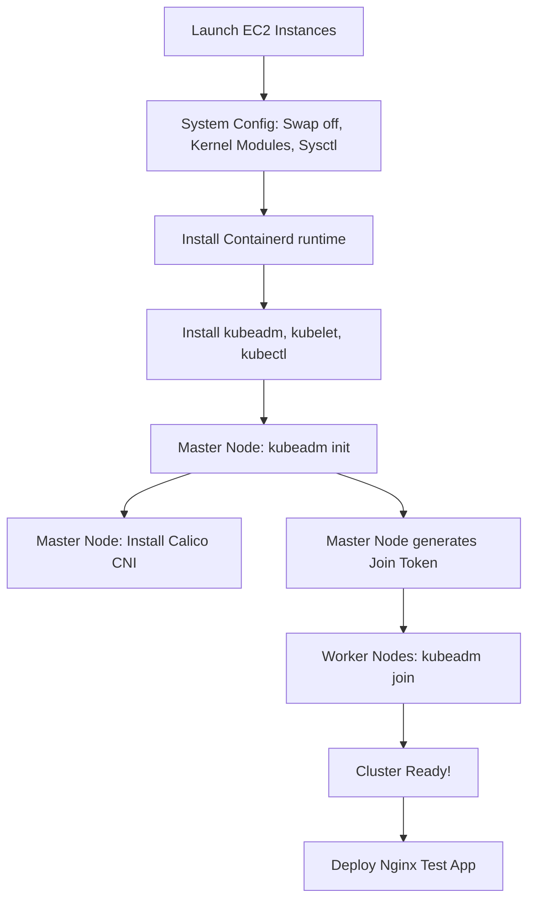

# Day 19: Kubernetes Architecture & Kubeadm Cluster Setup

Welcome to Day 19! Today is a massive milestone. We are transitioning from using a pre-built cluster to understanding the deep **Architecture of Kubernetes**, and then we are going to build our own self-managed multi-node cluster from scratch using **kubeadm**!

---

## 🏗️ 1. Ways to Setup Kubernetes

Before jumping in, you should know there are multiple ways to set up Kubernetes:
1. **Single Node (Local):** `minikube` (Great for local testing, but not for production).
2. **Multi-Node (Self-Managed):** 
   - `kubeadm`: Open-source tool managed by the K8s community (We are using this today!).
   - `kops`: Another popular open-source tool.
   - `kind`: Kubernetes IN Docker.
3. **Managed Cloud Services:** AWS EKS, Google GKE, Azure AKS (Used heavily in Production).

---

## 🏛️ 2. Kubernetes Architecture

Kubernetes is a distributed system. It is physically split into two types of machines:
1. **Master Node (The Control Plane):** The brain that makes all the decisions.
2. **Worker Nodes (Slaves):** The brawn that actually runs your containers.

### The "Family" Analogy (Understanding the Master Node)
Imagine a family with a Father, Mother, Brother, and Sister. The Father is the head of the family. He listens to requests and decides what needs to be done. 
- The Father has **Ears** to hear requests.
- He writes things down in a **Notebook** so he doesn't forget.
- When he gets too busy, the Mother (the **Supervisor**) checks the notebook and assigns tasks.

Let's translate this to Kubernetes Master Node components!

| Component | Family Analogy | What it actually does |
| :--- | :--- | :--- |
| **API Server** | The Father's "Ears" | The central gateway. Every `kubectl` command you run is received by the API Server first. It exposes the Kubernetes API. |
| **ETCD** | The Father's "Notebook" | A highly available Key-Value database. It stores the absolute truth and state of your cluster. If a pod is requested, it is written in ETCD. |
| **Controller Manager** | The Mother (Supervisor) | It constantly watches ETCD. If ETCD says "We need 5 replicas" but only 3 are running, the Controller Manager notices the gap and triggers the creation of 2 more. |
| **Scheduler** | The Family Planner | When a new Pod needs to be created, the Scheduler analyzes all the Worker Nodes (checking CPU/RAM) and decides exactly which Node gets the Pod. |

### The Worker Node Components
Once the Master Node decides a Pod needs to be created, it sends the order to the Worker Node.

| Component | What it actually does |
| :--- | :--- |
| **Kubelet** | The "Captain" of the Worker Node. It talks to the API server, receives instructions, and makes sure the containers are running and healthy. |
| **Container Runtime** | The engine that physically pulls and runs the images (e.g., `containerd`, Docker, CRI-O). Kubelet tells the runtime to start the container. |
| **Kube-Proxy** | The networking agent. It assigns IP addresses to Pods and ensures that services can route traffic to the correct Pods. |

### What Each CLI/Build Tool Does
When we build the cluster, we will use several specific tools:
- **`kubeadm`**: Bootstraps and creates the cluster (`kubeadm init`, `kubeadm join`).
- **`kubelet`**: Runs on Master AND Workers. Its job is to make sure Pods assigned to its node are actually running.
- **`kubectl`**: Your command-line tool to communicate with the API Server (`kubectl get pods`, etc).
- **`containerd`**: The container runtime we are using.
- **`Calico`**: Provides Pod networking + Network policy. Without a CNI like Calico, nodes remain `NotReady`.

### 🏗️ Complete AWS Architecture Visualization
Before we start, here is what our EC2 setup will physically look like:
```text
AWS VPC
|
+-------------------------------------------------+
|                                                 |
|    Control Plane              Worker Node 1     |
|      t2.medium                  t2.medium       |
|                                                 |
|     Kubernetes                  Kubernetes      |
|     API Server                  kubelet         |
|     Scheduler                   containerd      |
|     Controller                  Calico          |
|                                                 |
|          |                          |           |
|          +------------+-------------+           |
|                       |                         |
|                 Worker Node 2                   |
|                   t2.medium                     |
|                                                 |
|                   kubelet                       |
|                   containerd                    |
|                   Calico                        |
|                                                 |
+-------------------------------------------------+
```

---

## 🚀 2. Setting Up a Self-Managed Cluster (Kubeadm)

In production, you usually use a managed service like AWS EKS. But for lower environments (or to truly master Kubernetes), you build a self-managed cluster. We will use **kubeadm**, the official open-source community tool.

### The Big Picture Flow:


---

## 🛠️ Step-by-Step Kubeadm Lab (Zero to Hero)

### Step 1: AWS Infrastructure Setup
1. Launch **3 EC2 Instances** using **Ubuntu LTS**.
   - **Master Node:** `t2.medium` (Minimum 2 CPU, 2GB RAM required!)
   - **Worker Node 1:** `t2.medium`
   - **Worker Node 2:** `t2.medium`

2. **Security Groups:** 
   For a learning lab, keep all three instances in the same VPC/subnet. Create one Security Group for all nodes:
   ```text
   Internet
      |
      | TCP 22
      v
   +----------------------+
   | Kubernetes SG        |
   |                      |
   |   Master             |
   |   Worker 1           |
   |   Worker 2           |
   |                      |
   | Nodes communicate    |
   | with each other      |
   +----------------------+
   ```
   At minimum, you need `TCP 22` (SSH), `TCP 6443` (API Server), `TCP 10250` (Kubelet), and `TCP 30000-32767` (NodePort). 
   For the control-plane node, Kubernetes also strictly uses these specific ports:
   - `TCP 2379-2380` (etcd client API)
   - `TCP 10257` (kube-controller-manager)
   - `TCP 10259` (kube-scheduler)
   
   *(For a lab, allowing All Traffic between the nodes inside the SG is easiest).*

3. **Disable Source/Destination Check:** 
   In AWS EC2 Console -> Select instance -> Actions -> Networking -> Change source/destination checks -> Stop.
   *Do this for all 3 nodes because Calico networking depends on it!*

*SSH into all 3 machines (e.g., `10.0.1.10` for Master, `10.0.1.11` and `10.0.1.12` for workers).*

### Step 2: System Preparation (Run on ALL 3 Nodes!)

```bash
# 1. Set Hostnames to avoid confusion
sudo hostnamectl set-hostname master   # Run on Master
sudo hostnamectl set-hostname worker1  # Run on Worker 1
sudo hostnamectl set-hostname worker2  # Run on Worker 2

# 2. Update Ubuntu
sudo apt-get update -y && sudo apt-get upgrade -y
sudo apt-get install -y curl ca-certificates gpg apt-transport-https

# 3. Disable Swap (Crucial! Kubelet will crash if swap is on)
sudo swapoff -a
sudo sed -i '/ swap / s/^\(.*\)$/#\1/g' /etc/fstab

# Check that swap is actually 0B:
free -h

# 4. Load Kernel Modules
cat <<EOF | sudo tee /etc/modules-load.d/k8s.conf
overlay
br_netfilter
EOF
sudo modprobe overlay
sudo modprobe br_netfilter

# Check that modules are loaded:
lsmod | grep overlay
lsmod | grep br_netfilter

# 5. Configure Network Routing (Sysctl)
cat <<EOF | sudo tee /etc/sysctl.d/k8s.conf
net.bridge.bridge-nf-call-iptables  = 1
net.bridge.bridge-nf-call-ip6tables = 1
net.ipv4.ip_forward                 = 1
EOF
sudo sysctl --system

# Check that ip_forward is set:
sysctl net.ipv4.ip_forward
# Expected: net.ipv4.ip_forward = 1
```

### Step 3: Install Container Runtime & Kubernetes (Run on ALL 3 Nodes!)

```bash
# 1. Install Containerd
sudo apt-get install -y containerd

# Check containerd version:
containerd --version

# 2. Configure Containerd to use SystemdCgroup
sudo mkdir -p /etc/containerd
containerd config default | sudo tee /etc/containerd/config.toml
sudo sed -i 's/SystemdCgroup \= false/SystemdCgroup \= true/g' /etc/containerd/config.toml
sudo systemctl restart containerd
sudo systemctl enable containerd
sudo systemctl status containerd

# 3. Install Kubernetes Repositories (v1.36)
sudo mkdir -p -m 755 /etc/apt/keyrings
curl -fsSL https://pkgs.k8s.io/core:/stable:/v1.36/deb/Release.key | sudo gpg --dearmor -o /etc/apt/keyrings/kubernetes-apt-keyring.gpg
echo 'deb [signed-by=/etc/apt/keyrings/kubernetes-apt-keyring.gpg] https://pkgs.k8s.io/core:/stable:/v1.36/deb/ /' | sudo tee /etc/apt/sources.list.d/kubernetes.list

# 4. Install Kubeadm, Kubelet, and Kubectl
sudo apt-get update
sudo apt-get install -y kubelet kubeadm kubectl
sudo apt-mark hold kubelet kubeadm kubectl
sudo systemctl enable kubelet

# Verify Installation and Versions
kubeadm version
kubectl version --client
kubelet --version
sudo systemctl status kubelet
# You should see the v1.36 versions.
```

### Step 4: Initialize the Master Node (Run ONLY on MASTER!)

```bash
# 1. Initialize the cluster!
sudo kubeadm init --pod-network-cidr=192.168.0.0/16

# IMPORTANT: At the end of the output, copy the `kubeadm join` command!

# 2. Configure kubectl for your user
mkdir -p $HOME/.kube
sudo cp -i /etc/kubernetes/admin.conf $HOME/.kube/config
sudo chown $(id -u):$(id -g) $HOME/.kube/config

# 3. Check the nodes (It will say NotReady because we lack a network)
kubectl get nodes
```

### Step 5: Install Calico Network Plugin (Run ONLY on MASTER!)
Without a CNI (Container Network Interface), your nodes cannot communicate. We use **Calico** (v3.32).

```bash
# 1. Install the Calico Operator
kubectl create -f https://raw.githubusercontent.com/projectcalico/calico/v3.32.2/manifests/v1_crd_projectcalico_org.yaml
kubectl create -f https://raw.githubusercontent.com/projectcalico/calico/v3.32.2/manifests/tigera-operator.yaml

# 2. Create the Installation file
cat <<EOF > calico-installation.yaml
apiVersion: operator.tigera.io/v1
kind: Installation
metadata:
  name: default
spec:
  calicoNetwork:
    ipPools:
    - blockSize: 26
      cidr: 192.168.0.0/16
      encapsulation: VXLANCrossSubnet
      natOutgoing: Enabled
    nodeSelector: all()
EOF

# 3. Apply it
kubectl apply -f calico-installation.yaml

# 4. Wait for Calico pods to spin up, then check nodes again!
# You can watch them spin up in real-time:
watch kubectl get pods -n calico-system
# Press CTRL+C when they are all 'Running'

kubectl get nodes
# The Master Node should now be 'Ready'!
```

### Step 6: Join the Workers (Run on WORKER 1 & WORKER 2!)
Paste the join command you copied during Step 4.

```bash
# If you lost the command, run this on the MASTER to get a new one:
# kubeadm token create --print-join-command

# Run on Worker 1 and Worker 2:
sudo kubeadm join <MASTER_PRIVATE_IP>:6443 --token <TOKEN> --discovery-token-ca-cert-hash sha256:<HASH>
```

### Step 7: Verify the Cluster (Run on MASTER!)
```bash
# Check all nodes
kubectl get nodes -o wide

# You should see:
# master   Ready    control-plane   10.0.1.10
# worker1  Ready    <none>          10.0.1.11
# worker2  Ready    <none>          10.0.1.12
```
**🎉 CONGRATULATIONS! Your multi-node cluster is alive!**

### Step 8: Test the Application Deployment!
Now that the cluster is ready, let's make sure scheduling actually works by deploying NGINX using YAML!

1. **Create the Deployment YAML:**
   ```bash
   cat <<EOF > nginx.yaml
   apiVersion: apps/v1
   kind: Deployment
   metadata:
     name: nginx
   spec:
     replicas: 3
     selector:
       matchLabels:
         app: nginx
     template:
       metadata:
         labels:
           app: nginx
       spec:
         containers:
         - name: nginx
           image: nginx:latest
           ports:
           - containerPort: 80
   EOF
   kubectl apply -f nginx.yaml
   ```

2. **Check the pods:**
   ```bash
   kubectl get deployments
   kubectl get pods -o wide
   # Notice that Kubernetes schedules Pods onto worker1 and worker2!
   ```

3. **Create the NodePort Service YAML:**
   ```bash
   cat <<EOF > nginx-service.yaml
   apiVersion: v1
   kind: Service
   metadata:
     name: nginx-service
   spec:
     type: NodePort
     selector:
       app: nginx
     ports:
       - port: 80
         targetPort: 80
         nodePort: 30080
   EOF
   kubectl apply -f nginx-service.yaml
   ```

4. **Access it in your browser!**
   ```bash
   # Make sure AWS Security Group allows TCP 30080 from your IP!
   # http://<WORKER_PUBLIC_IP>:30080
   ```
*If you see the NGINX Welcome page, your cluster is 100% fully functional!*

**The Complete Network Flow you just tested:**
`Internet ↓ AWS EC2 ↓ NodePort 30080 ↓ Kubernetes Service ↓ Pod ↓ Nginx`

---

## 📁 3. Important File Locations & Troubleshooting
If something goes wrong in your cluster, you need to know exactly where the cluster files live.

### The File Tree Structure
Think about the cluster architecture and where files are stored like this:

```text
MASTER
│
├── /etc/kubernetes/admin.conf
│   └── (Administrator kubectl access)
│
├── /etc/kubernetes/pki/
│   └── (All root cluster certificates)
│
├── /etc/kubernetes/manifests/
│   ├── etcd.yaml
│   ├── kube-apiserver.yaml
│   ├── kube-controller-manager.yaml
│   └── kube-scheduler.yaml
│
└── kubelet

WORKER
│
├── kubelet
├── containerd
└── Calico
```

### The 3 Most Important Commands
Never forget these!
```bash
# 1. MASTER: Initialize cluster
sudo kubeadm init --pod-network-cidr=192.168.0.0/16

# 2. MASTER: Generate a new Join Token
kubeadm token create --print-join-command

# 3. WORKER: Join the cluster
sudo kubeadm join <MASTER-IP>:6443 --token <TOKEN> --discovery-token-ca-cert-hash sha256:<HASH>
```

### Troubleshooting & Cheat Sheet
| Problem / Action | Command |
| :--- | :--- |
| **Worker node refuses to join** | Run `nc -vz <MASTER_PRIVATE_IP> 6443` from worker. If it fails (`Worker X Master:6443`), check AWS Security Group. |
| **Worker node previously failed join** | Run `sudo kubeadm reset -f` followed by `sudo systemctl restart kubelet` on the worker before trying to join again. |
| **Check Calico Health** | `kubectl get tigerastatus` and `kubectl get pods -n calico-system` |
| **Check Control Plane Pods** | `kubectl get pods -n kube-system` (You should see `etcd-master`, `kube-apiserver-master`, etc). |
| **Check all Pods everywhere** | `kubectl get pods -A` |
| **Check Deployments / Services** | `kubectl get deployments` and `kubectl get svc` |
| **Check Cluster APIs** | `kubectl cluster-info` |
| **Check everything in namespace** | `kubectl get all` |
| **Describe a node's details** | `kubectl describe node <node-name>` |
| **I want to see deep pod details** | `kubectl describe pod <pod-name>` |
| **I want to see application logs** | `kubectl logs <pod-name>` |

---

## 💯 4. The END-TO-END Flow To Remember
This is the absolute most important flowchart for your DevOps notes. If you can memorize this sequence, you will master cluster creation.

```text
1. CREATE EC2
   ↓
2. CONFIGURE SECURITY GROUP
   ↓
3. SET HOSTNAMES
   ↓
4. DISABLE SWAP
   ↓
5. LOAD KERNEL MODULES
   ↓
6. CONFIGURE SYSCTL
   ↓
7. INSTALL CONTAINERD
   ↓
8. CONFIGURE SYSTEMD CGROUP
   ↓
9. INSTALL kubeadm, kubelet, kubectl
   ↓
10. MASTER: kubeadm init
   ↓
11. CONFIGURE kubectl
   ↓
12. INSTALL CALICO
   ↓
13. MASTER BECOMES READY
   ↓
14. GENERATE JOIN COMMAND
   ↓
15. WORKER1: kubeadm join
   ↓
16. WORKER2: kubeadm join
   ↓
17. kubectl get nodes
   ↓
18. ALL NODES = READY
   ↓
19. CREATE DEPLOYMENT
   ↓
20. CREATE SERVICE
   ↓
21. TEST APPLICATION
   ↓
22. KUBEADM CLUSTER READY 🎉
```

---

## 🧠 5. Zero-to-Hero Bonus: Interview Gotchas

When an interviewer asks you about cluster architecture, they want to see if you have actually built one yourself or if you just read a textbook. Memorize these points to prove your authenticity:

> [!CAUTION]
> **Gotcha 1: "What Network Plugin (CNI) do you use?"**
> Never say "I just use standard Kubernetes networking." Kubernetes doesn't come with networking natively! You must tell the interviewer: *"We use **Calico** (or Flannel) to implement our pod networking and network policies, ensuring secure communication between the master and slave nodes."*

> [!TIP]
> **Gotcha 2: "What happens if Swap is enabled?"**
> If an interviewer asks what happens if you forget to run `swapoff -a`, tell them: *"The `kubelet` service will instantly crash and fail to start. Kubernetes strictly requires swap to be disabled so it can accurately guarantee CPU and Memory limits for the Pods!"*

> [!IMPORTANT]
> **Gotcha 3: "What versions did you use?"**
> To prove your genuineness, have your exact stack versions memorized for interviews:
> - **Kubernetes Version:** v1.36
> - **Calico CNI Version:** v3.32
> - **Container Runtime:** `containerd` (Do not say you used Docker Engine directly, as Docker Shim was deprecated in K8s v1.24!)
> - **Infrastructure Tooling:** Terraform **v1.5+** for EC2 provisioning, Ansible **v2.14+** for Kubeadm configuration management.

---
### 📚 Official Documentation References
*(Save these links for your own research)*
- [Kubernetes — Installing kubeadm](https://kubernetes.io/docs/setup/production-environment/tools/kubeadm/install-kubeadm)
- [Kubernetes — Creating a cluster with kubeadm](https://kubernetes.io/docs/setup/production-environment/tools/kubeadm/create-cluster-kubeadm)
- [Kubernetes — Container runtimes](https://kubernetes.io/docs/setup/production-environment/container-runtimes)
- [Calico — Kubernetes installation](https://docs.tigera.io/calico/latest/getting-started/kubernetes/quickstart)
- [Calico — AWS networking](https://docs.tigera.io/calico/latest/reference/public-cloud/aws)
