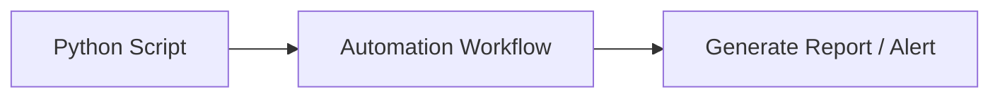
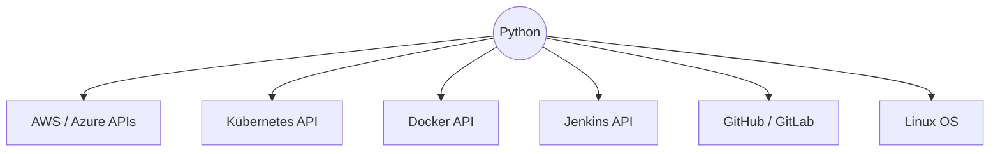

# Python Day 01: Introduction, Installation & Configuration

Welcome to **Python for DevOps**! 🐍 

While DevOps tools like Docker, Jenkins, and Kubernetes are incredibly powerful, **Python** is the "glue" that binds them all together. In today's cloud-native world, mastering Python will elevate you from a standard SysAdmin to an advanced DevOps Automation Engineer.

---

## 1. Introduction to Python

Python is a high-level, interpreted, general-purpose programming language known for its simple syntax, readability, and massive ecosystem of libraries.

In DevOps, Python is commonly used for:
- **Cloud/API Integration:** Interacting with AWS, Azure, GCP programmatically.
- **Infrastructure Automation:** Writing custom deployment scripts.
- **Configuration Management:** Generating and parsing JSON/YAML dynamically.
- **Log Processing & Monitoring:** Scraping metrics and generating reports.
- **Writing Utilities:** Building custom CLIs and internal tools.

### Why Python?
Instead of manually performing repetitive tasks (Login → Check files → Run commands → Collect output → Generate report), you can write a Python script to handle the entire workflow seamlessly from start to finish.



---

## 2. Python in DevOps Architecture

Python can interact directly with nearly every tool in the DevOps ecosystem through native libraries and REST APIs:



This makes Python the absolute best choice when your DevOps automation becomes too complex for a simple Bash script.

---

## 3. Installing Python

Python is cross-platform and can be installed on Linux, Windows, and macOS.

To verify if Python is installed on your machine, run the following in your terminal:
```bash
python --version
# OR
python3 --version
```
**Example output:** `Python 3.x.x`

*(Note: The exact command depends on your OS and how Python was installed).*

---

## 4. Setting Up the Development Environment

You can write Python programs using almost any text editor or IDE:
- **VS Code (Recommended for DevOps)**
- PyCharm
- IntelliJ IDEA
- Vim / Nano (Terminal)

For learning Python for DevOps, **VS Code + Terminal** is the absolute best and simplest setup.

A Python file is simply a text file that uses the `.py` extension (e.g., `hello-world.py`).

### 4.1. Package Management (`pip`) & `requirements.txt`
As a DevOps engineer, you won't write everything from scratch. You will use external **libraries** (packages) to interact with AWS, Kubernetes, Jenkins, etc.
Python uses a tool called `pip` (Python Package Installer) to download these libraries.
```bash
# Example: Installing the AWS SDK for Python
pip install boto3
```
> [!TIP]
> **DevOps Best Practice:** Always track your project's dependencies in a `requirements.txt` file so other engineers (and your CI/CD pipelines) can install the exact same packages.
> ```bash
> # Generate the requirements file
> pip freeze > requirements.txt
> 
> # Install from the requirements file
> pip install -r requirements.txt
> ```

### 4.2. Virtual Environments (`venv`)
> [!IMPORTANT]
> **DevOps Best Practice:** Never install Python packages globally on your OS! Doing so can break native system tools (like `yum` or `apt` on Linux) that rely on specific Python versions.

Always use a **Virtual Environment** to isolate your project's dependencies:
```bash
# 1. Create a virtual environment named 'myenv'
python3 -m venv myenv

# 2. Activate it (Linux/Mac)
source myenv/bin/activate
# OR on Windows: myenv\Scripts\activate

# 3. Now it is safe to install packages!
pip install boto3
```

### 4.3. Security Best Practice: Environment Variables
> [!WARNING]
> **Never hardcode secrets** (like AWS keys, database passwords, or API tokens) directly into your `.py` files. If you push hardcoded secrets to GitHub, your accounts can be compromised in minutes!

Instead, a DevOps engineer passes secrets to Python securely using **Environment Variables**.
```python
import os

# BAD: Hardcoding a secret
api_token = "12345-super-secret-token"

# GOOD: Reading from the environment
api_token = os.environ.get("MY_API_TOKEN")
```
Before running the script, you set the variable in your terminal:
```bash
export MY_API_TOKEN="12345-super-secret-token"
python my_script.py
```

### 4.4. Source Control Best Practice: `.gitignore`
Since DevOps workflows rely entirely on Git and CI/CD, it is absolutely critical that you **never** commit your massive virtual environment directories, compiled bytecode, or local environment files into your repository.

Always create a `.gitignore` file in your Python project directory with at least these entries:
```text
# Virtual Environments
myenv/
venv/
env/

# Python Cache
__pycache__/
*.pyc

# Secrets / Local Environment Variables
.env
```

---

## 5. Shell Scripting vs Python

Both Shell scripting (Bash) and Python are crucial in DevOps. The golden rule is choosing the right tool for the specific task.

### When to Use Shell Scripting
Shell is best for tasks closely related to the Operating System and executing Linux commands.
1. **System Administration:** Managing files, directories, stopping/starting services, user management.
2. **Command-Line Interactions:** Piping outputs of commands like `df -h`, `systemctl`, `grep`, `awk`.
3. **Rapid Prototyping:** Small, one-time sequential tasks.

*Example of a good Shell task:*
```bash
#!/bin/bash
echo "Starting backup"
mkdir -p backup
cp *.log backup/
echo "Backup completed"
```

### When to Use Python
Python becomes necessary when automation requires complex logic, API integrations, structured data parsing, or robust error handling.
1. **Complex Logic:** Loops, conditions, dictionaries, and classes.
2. **API Integration:** Creating users via the AWS API, manipulating Kubernetes pods via the K8s Python Client.
3. **Cross-Platform:** A Python script runs seamlessly on Windows, Linux, and macOS.
4. **Error Handling:** Using `try/except` blocks to prevent the entire script from crashing if one server is unreachable.
5. **Advanced Data Processing:** Parsing complex JSON/CSV reports.

*Example of a good Python task:*
```python
try:
    # Complex logic hitting an API here
    print(10 / 0)
except Exception as error:
    print(f"Something went wrong: {error}")
```

### Quick Comparison Summary

| Feature | Shell Scripting | Python |
| :--- | :--- | :--- |
| **Best For** | Command-line OS tasks | Complex automation & logic |
| **Integrations** | Linux utilities | APIs, Cloud SDKs (boto3) |
| **Data Processing** | Simple text (`grep`, `awk`) | Advanced data (`JSON`, `YAML`, Pandas) |
| **Error Handling** | Exit codes (`$?`) | Structured (`try/except`) |
| **Platform** | Linux / Unix | Cross-Platform (Windows, Mac, Linux) |

> [!TIP]
> **The Golden Rule:** 
> Simple Linux CLI task ➡️ **SHELL**
> Complex logic, APIs, or JSON parsing ➡️ **PYTHON**

---

## 6. Your First Python Program

Let's write your very first Python script!

1. Create a file named `hello-world.py`.
2. Add the following code:
```python
print("Hello, World!")
```
3. Open your terminal and run it:
```bash
python hello-world.py
# OR
python3 hello-world.py
```

**Output:**
```
Hello, World!
```

### Understanding the Code:
- `print()` is a built-in Python function used to display information onto the screen/terminal.

### 6.1. Executing Like a Shell Script (The Shebang)
In DevOps, you often want to run a Python script exactly like a Bash script (e.g., `./hello-world.py` instead of `python3 hello-world.py`). 

To do this, add a **Shebang** (`#!`) to the very first line of your script to tell the Linux OS which interpreter to use:
```python
#!/usr/bin/env python3
print("Hello, World!")
```
Then, give the file execute permissions in Linux/macOS:
```bash
chmod +x hello-world.py
./hello-world.py
```

*(Note: The actual executable Python file `hello-world.py` is included in this repository folder!)*
