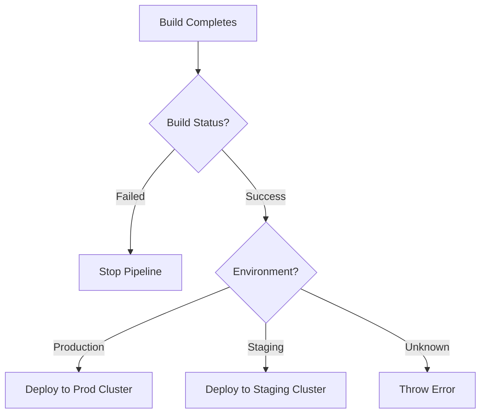

# Python Day 07: Conditional Handling for DevOps

Welcome to **Day 07**! As a DevOps engineer, you are constantly writing automation scripts that need to make decisions. 

- *Should I deploy this code?* -> **Only if** the tests passed.
- *Should I trigger an alert?* -> **Only if** CPU is > 80%.
- *Where should this run?* -> **If** environment is `prod`, run in AWS. **Else**, run locally.

Python handles all of these decisions using **Conditional Statements**: `if`, `elif`, and `else`.

---

## 1. The `if` Statement
The `if` statement executes a block of code **only** if a specific condition evaluates to `True`.

### Syntax & Indentation
Python does not use curly brackets `{}` to define code blocks. It relies entirely on **indentation** (usually 4 spaces) and a colon `:`.

```python
cpu_usage = 85

# Correct Indentation
if cpu_usage > 80:
    print("WARNING: High CPU usage detected!")
```

> [!CAUTION]
> **IndentationError:** If you forget to indent the `print` statement, Python will crash. Code structure relies on this visual spacing!

---

## 2. The `else` Statement
The `else` block executes when the `if` condition is `False`. It acts as the fallback or default action.

```python
service_status = "stopped"

if service_status == "running":
    print("Service is healthy.")
else:
    print("ALERT: Service is down. Attempting restart...")
```

---

## 3. The `elif` Statement (Else If)
What if you have more than two possibilities? `elif` allows you to check additional conditions. 

**Execution Flow Rule:** Python checks conditions from top to bottom. As soon as it finds the *first* `True` condition, it executes that block and completely skips the rest!

```python
# DevOps Environment Router
environment = "staging"

if environment == "production":
    print("Connecting to AWS Production VPC...")
elif environment == "staging":
    print("Connecting to AWS Staging VPC...")
elif environment == "development":
    print("Connecting to Local Docker Cluster...")
else:
    print("ERROR: Unknown environment provided.")
```

### Advanced DevOps: The `match` / `case` Statement (Python 3.10+)
If you have a massive list of `elif` statements checking the exact same variable (like the environment router above), modern Python provides a cleaner way called **Pattern Matching** (similar to a `switch` statement in other languages).

```python
environment = "staging"

match environment:
    case "production":
        print("Deploying to Prod")
    case "staging":
        print("Deploying to Staging")
    case "development":
        print("Deploying to Dev")
    case _:
        # The underscore acts as the 'else' fallback
        print("Unknown environment")
```

---

## 4. Combining Conditions (`and` / `or`)
Building on what we learned in Day 06, we can combine multiple checks into a single `if` statement.

```python
environment = "production"
tests_passed = True

# Both must be true
if environment == "production" and tests_passed:
    print("Production Deployment Approved ✅")
elif environment == "production" and not tests_passed:
    print("Deployment Blocked: Tests failed ❌")
else:
    print("Non-production deployment.")
```

### DevOps Best Practice: Implicit Booleans (Truthiness)
In DevOps, you frequently need to check if a list of servers is empty, or if an API returned an empty string. Instead of checking the length, Senior Python Engineers use **Truthiness**.
Empty lists `[]`, empty strings `""`, and `None` evaluate to `False` automatically!

```python
failed_servers = [] # An empty list

# ❌ Junior DevOps Way
if len(failed_servers) == 0:
    print("All servers are healthy!")

# ✅ Senior DevOps Way
if not failed_servers:
    print("All servers are healthy!")
```

---

## 5. Nested `if` Statements
Sometimes, you need to check a condition *inside* another condition. This is called nesting.

```python
build_status = "success"
environment = "production"

# Outer Condition
if build_status == "success":
    print("Build passed. Checking environment rules...")
    
    # Inner (Nested) Condition
    if environment == "production":
        print("Executing critical production deployment.")
    else:
        print("Executing standard non-production deployment.")
        
else:
    print("Build failed. Stopping pipeline.")
```

---

## 6. The Ultimate DevOps Mental Model
When designing a CI/CD pipeline script, visualize your `if/elif/else` blocks as a flowchart:



---

## 🧑‍💻 Practice Exercises
We have provided a practice script named `day07_conditionals.py`. It contains 5 real-world DevOps scenarios covering:
1. Basic Number validation
2. Environment Routing
3. Server Health monitoring
4. CI/CD Deployment decision matrices
5. Disk Usage thresholds

Run the script locally to watch how Python makes decisions!
